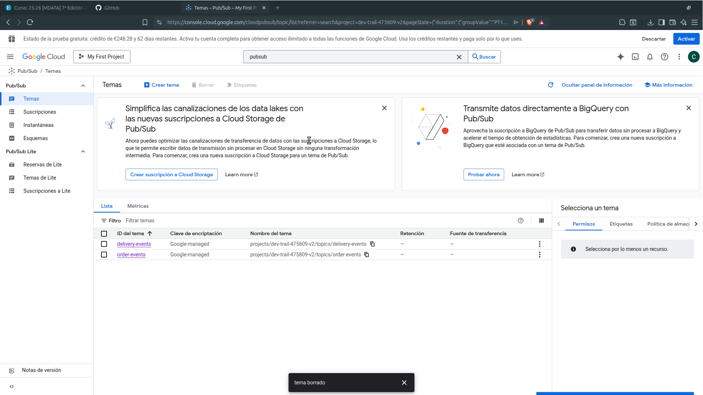

# Entregable End2End GCP Almacenamiento. Carlos Beltrán

Se parte de la siguiente imagen para la infraestructura. 

Se ha utilizado Terraform para el despliegue de los recursos y se han utilizado:

- Dos maquinas virtuales

- Dos tópicos con sus suscripciones

- Una instancia de Cloud SQL

- Dos datasets, delivery_bronze y orders_bronze

- Un subtópico en el topico de delivery para publicar en BigQuery

