# Entregable End2End GCP Almacenamiento. Carlos Beltrán

Se parte de la siguiente imagen para la infraestructura.

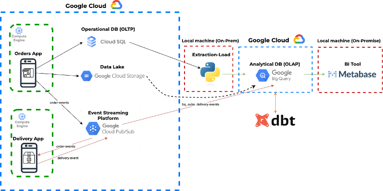

## SETUP

Se ha utilizado Terraform para el despliegue de los recursos y se han utilizado:

- 1 service account creada desde la cong¡sola de GCP

- 2 maquinas virtuales

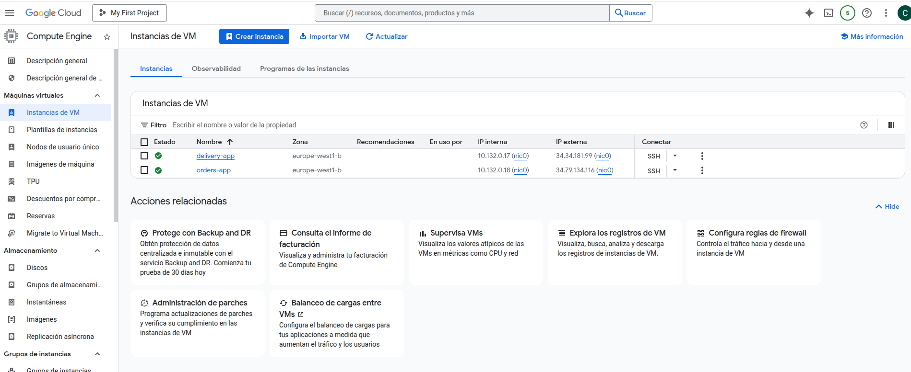

- 3 tópicos con sus suscripciones

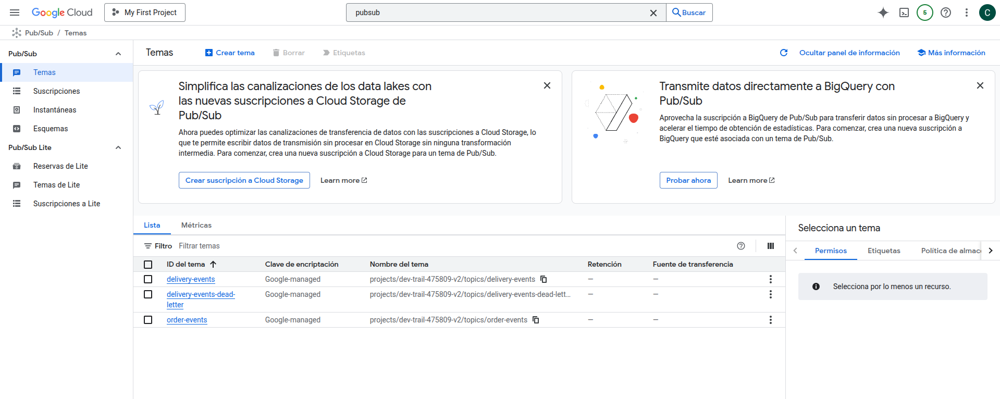

- 1 instancia de Cloud SQL

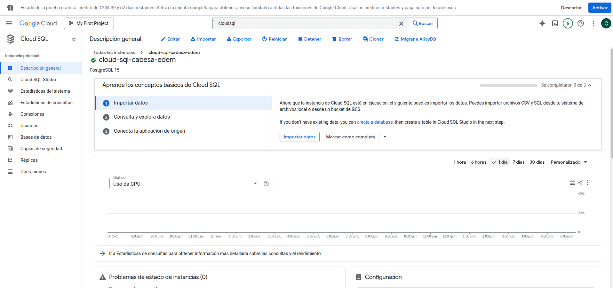

- 2 datasets, delivery_bronze y orders_bronze

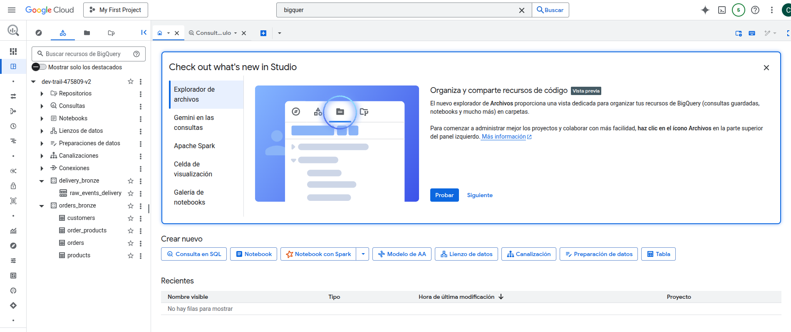

- 1 bucket de cloud storage par el data lake

- Las sentencias sql para crear las tablas de dbt se ejecutan en el archivo main.tf

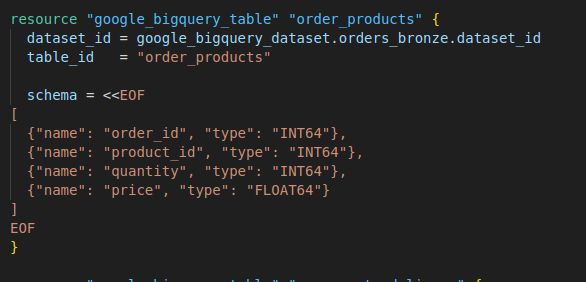

## Envio de datos

Se han enviado datos a través de la maquina virtual de orders-app

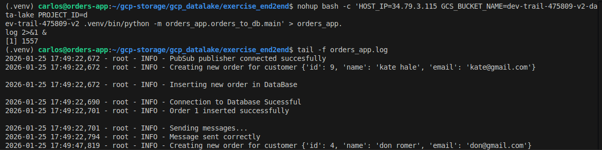

y delivery-app

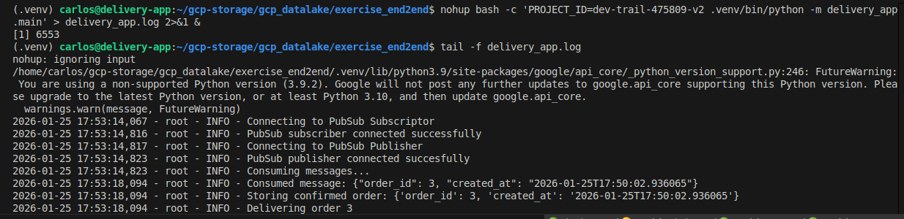

Los datos que se envian se guardan en la base de datos de Cloud SQL

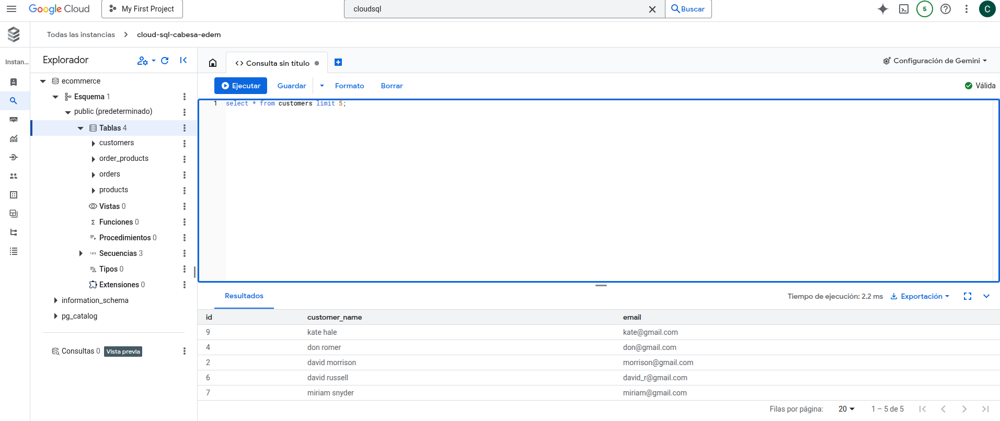

Los datos que se envian se guardan tambien en el bucket del data lake

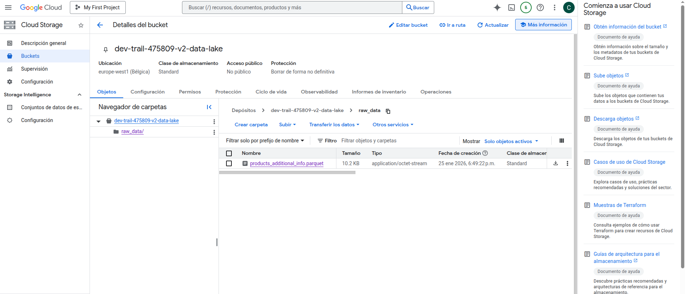

Los datos que se envian se pueden ver como llegan a los topicos de pubsub

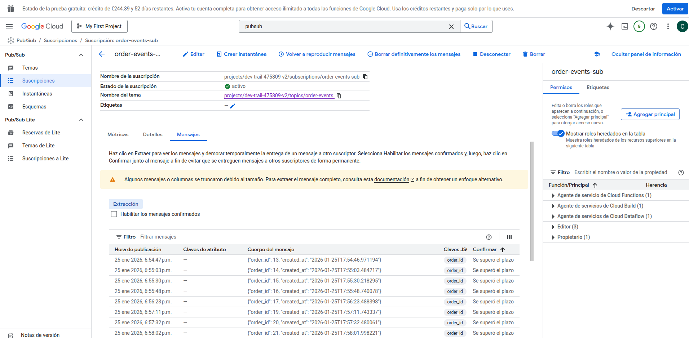

De manera local, se transforman los registros para dbt y poder verlos en BigQuery

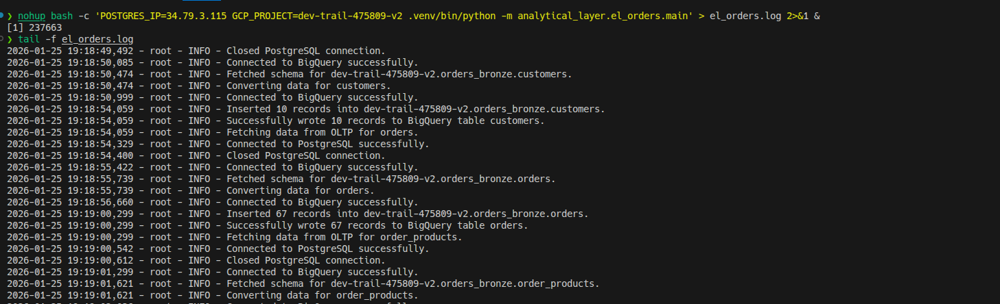

Si vamos a BigQuery, podemos ver los datos transformados

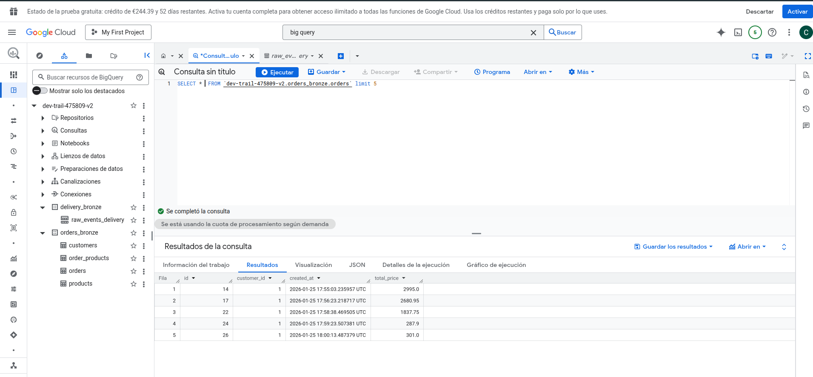

## Metabase

Una vez tenemos el contenedor de metabase y creamos nuestra cuenta tenemos acceso a la pagina principal

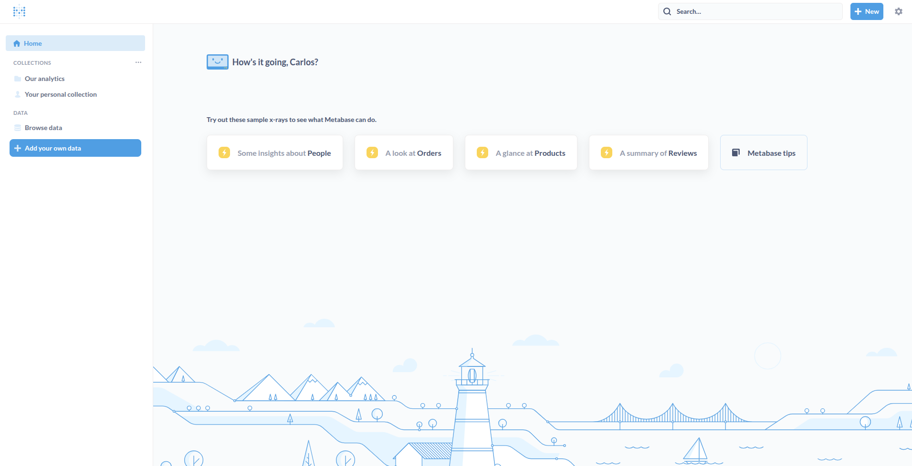

Tenemos que añadir la base de datos de BigQuery, para ello, primero es necesario ir al servicio de Service account de la consola de Google, elegir la service account que se ha creado en el terraform y crear una clave

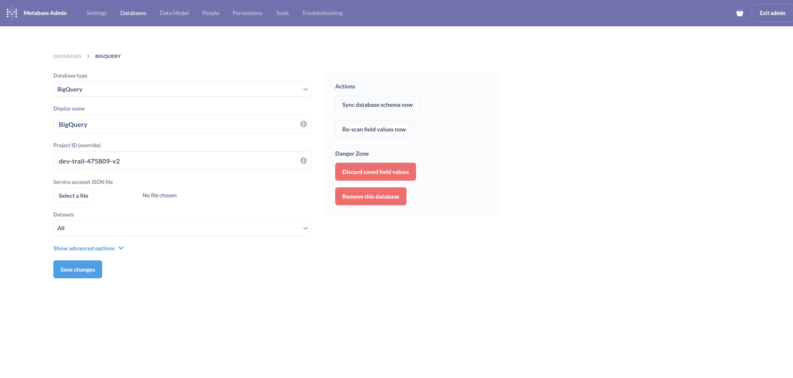

En la pantalla principal podemos añadir nuevas "preguntas" a BigQuery, por ejemplo de la tabla orders_bronze podemos ver las ordenes

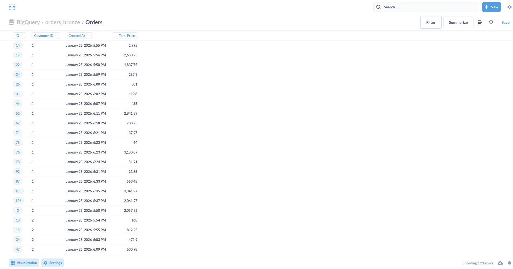

Podemos hacer varias "preguntas" o consultas a BigQuery para crear un dashboard

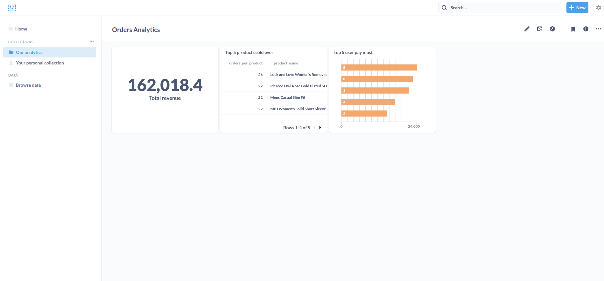

