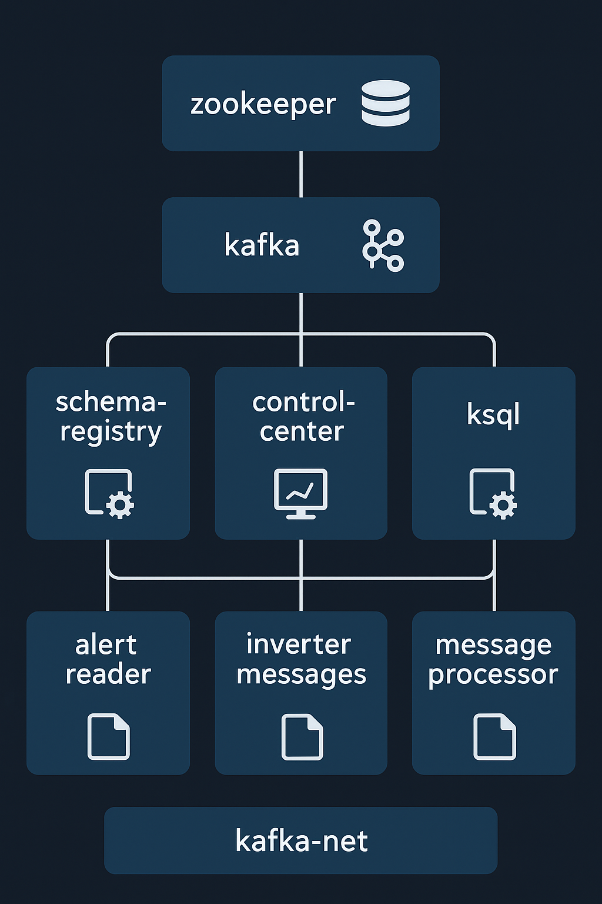
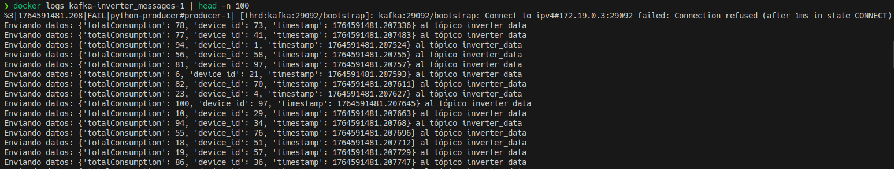
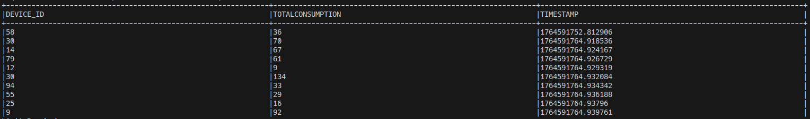
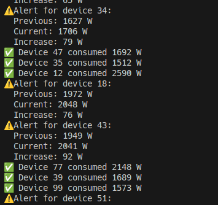
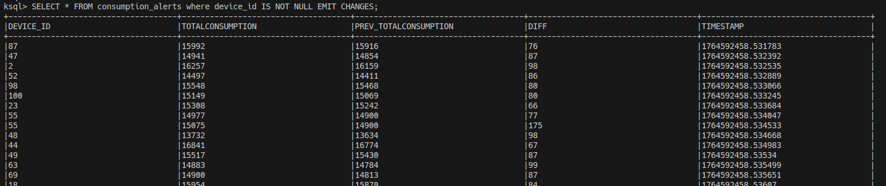

#Consideraciones:
- Si se quiere ejecturar el entorno habrá que ejecutar:
    1. ```docker compose up -d```
    2. ```docker exec -it ksql-cli ksql http://ksql:8088```
    3. Ejecutar por consola las sentencias sql de [init.sql](../ksql/init.sql)

# Use of case
En una empresa tienen una gran cantidad de inversores que reportan el consumo de cada inversor cada cierto tiempo.
Se quiere controlar que no pasen de cierto limite, por ejemplo 50 vatios, esto supondría un problema para los inversores de la empresa.

# Dataset selected
Se ha optado por utilizar un [script](./inverterMessages.py) para crear los mensajes que se enviarán al tópico de kafka

# Final architecture implemented
Esta es la estructura final utilizada



Se ha optado por 
- Zookeeper: Para coordinar y gestionar los brokers.
- Kafka Broker: Recibe, almacena y distribuye mensajes.
- Schema Registry: Servicio de Confluent para gestionar esquemas Avro/JSON/Protobuf.
- Control Center (opcional): Dashboard web para visualizar y administrar
- KSQL Server: Servidor del motor ksqlDB, un lenguaje SQL para Kafka
- KSQL CLI: Shell interactiva para conectarse al servidor KSQL
- inverter messages: crea los mensaje de los inversores
- message processor (opcional): Comprueba aquellos mensajes del tópico que superen los 50 vatios respecto al mensaje anterior. en este caso también lo hace ksql
- alert reader (opcional): Script de python que muestra por consola los mensajes que tengan un valor mayor a 50 vatios, esto supondría un problema para los inversores de la empresa.

En el archivo [init.sql](../ksql/init.sql) están las sentencias sql que permiten hacer los streams de ksql

# Example of the json

```
{
    'totalConsumption': 183, 
    'device_id': 28, 
    'timestamp': 1764589193.311439
}
```

# Evidences
1. Ingestion
    - Envío de la información:



2. Processing with a Consumer
   - Proceso de los mensajes con python

1. KSQL
   - Proceso de los mensajes con ksql



