# Arquitectura End-to-End de Datos: E-commerce en Google Cloud (GCP)

Este repositorio contiene el código, las configuraciones y la documentación del despliegue de una plataforma de datos integral. El proyecto cubre desde la ingesta de datos transaccionales hasta la creación de dashboards estratégicos para la toma de decisiones.

---

## Acceso al Proyecto
* **Repositorio de Código:** https://github.com/celiiasarrio/proyecto-e2e-gcp-storage-edem
* **Tecnologías:** Google Cloud (Compute Engine, BigQuery), dbt, Docker, Metabase, PostgreSQL.

---

## 1. Visión General de la Arquitectura

El proyecto implementa una arquitectura de **Data Lakehouse** organizada en capas (Medallion Architecture) para transformar datos brutos en insights de negocio.

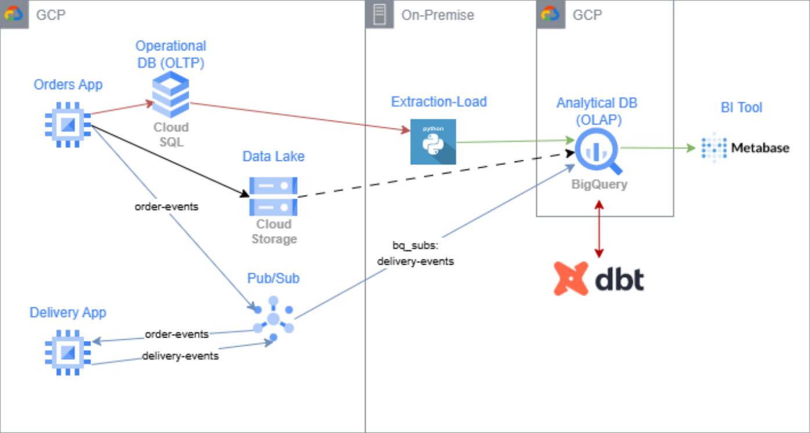

---

## 2. Aprovisionamiento Automatizado (Terraform)

Para la gestión de la infraestructura, se ha adoptado el paradigma de Infraestructura como Código (IaC) mediante Terraform. Este enfoque permite centralizar la definición de recursos en archivos de configuración, garantizando que el entorno en la nube sea consistente, escalable y fácilmente reproducible en caso de desastre.

### 2.1. Persistencia del Estado (Bucket)

Con el fin de gestionar de forma segura el ciclo de vida de los recursos y permitir el trabajo colaborativo, se configuró un bucket de Google Cloud Storage (GCS). Esto asegura que el archivo de estado (terraform.tfstate) esté protegido y sincronizado, evitando conflictos durante el despliegue.

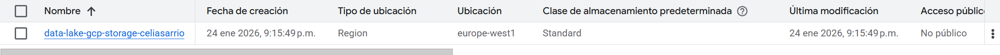

### 2.2. Identidad y Gestión de Accesos (IAM)

Para permitir una comunicación fluida y segura entre los diferentes recursos de la nube, se ha implementado una Service Account específica. Este componente actúa como la identidad digital del proyecto, permitiendo que las instancias de Compute Engine interactúen con servicios clave como Pub/Sub, Cloud Storage y BigQuery bajo el principio de "mínimo privilegio".

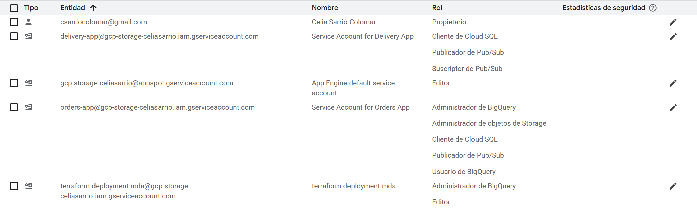

### 2.3. Aprovisionamiento de la Arquitectura de Cómputo

Una vez validada la configuración mediante el ciclo de vida de Terraform (init, plan y apply), el sistema despliega de forma automática los recursos de cómputo necesarios. El núcleo de la infraestructura se basa en dos instancias de Compute Engine, cada una con una responsabilidad definida dentro del ecosistema:

1. **Máquinas virtuales (Compute Engine):**
* `orders-app`: Servidor de aplicación de ventas.
* `delivery-app`: Servidor de logística y envíos.

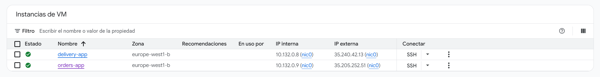


2. **Capa de Mensajería (Pub/Sub):**
* `order-events`: Topic para notificar nuevos pedidos.
* `delivery-events`: Topic para notificar cambios de estado en envíos.

topics: 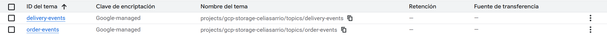
suscripciones: 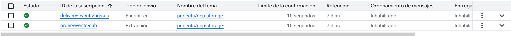

3. **Capa de Datos Operacional (Cloud SQL):**
* Instancia PostgreSQL (`operational-db-v2`) optimizada para transacciones (OLTP).
* Base de datos: `ecommerce`.

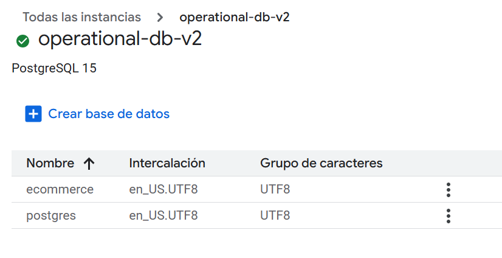

4. **Capa de Datos Analítica (BigQuery):**
* Datasets creados: `orders_bronze` y `delivery_bronze`.
* Tablas vacías preparadas para la ingesta.
* **Suscripción BigQuery:** Se configura un "sink" automático (`delivery-events-bq-sub`) que vuelca los mensajes de Pub/Sub directamente a la tabla `raw_events_delivery`.

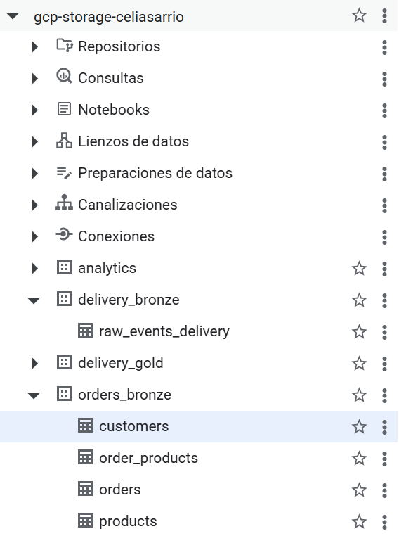

---

## 3. Implementación del Entorno Operativo y Transaccional

En esta etapa, se procedió a la activación de los servicios que dan soporte a la actividad diaria del E-commerce. El objetivo principal fue configurar un entorno capaz de simular un flujo constante de pedidos y envíos, integrando las aplicaciones con la base de datos operativa.

### 3.1. Definición del Modelo de Datos Relacional (OLTP)

Una vez disponible la instancia de Cloud SQL, se procedió a la creación del esquema de base de datos para soportar la carga transaccional. Se diseñó una estructura relacional normalizada que garantiza la integridad de la información mediante el uso de claves primarias y foráneas. Las entidades principales desplegadas fueron:

* Identificación: `customers` y `products`.
* Transaccionalidad: `orders` y `order_products`, vinculadas para mantener la trazabilidad completa de cada compra.

Este esquema permite que cada pedido esté correctamente asociado a un cliente y a sus respectivos productos, evitando duplicidades y asegurando la consistencia del negocio.

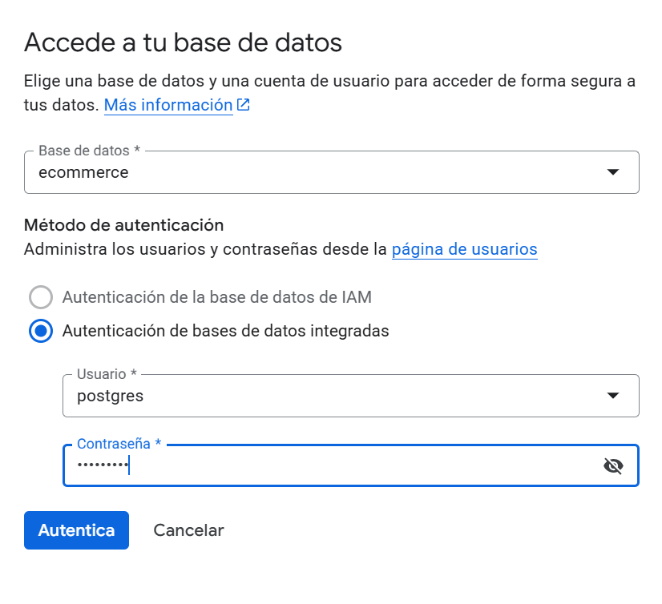
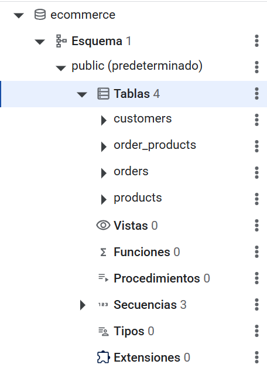

### 3.2. Despliegue de Servicios y Lógica de Negocio

Para dar vida al ecosistema, se procedió a la configuración de los entornos de ejecución en las máquinas virtuales. Se utilizaron entornos virtuales de Python (venv) para garantizar el aislamiento de las dependencias y la estabilidad de las aplicaciones. El flujo operativo se divide en dos componentes críticos:

* **Servicio de Órdenes (Orders App)**: Actúa como el productor del sistema. Su función es doble: persiste la información transaccional en Cloud SQL y, simultáneamente, emite señales en tiempo real al tópico de Pub/Sub para notificar la creación de nuevos pedidos.

* **Servicio de Logística (Delivery App)**: Funciona como un consumidor inteligente que permanece a la escucha de los eventos de pedidos. Al detectar una notificación, activa de forma automática la generación de eventos logísticos para trazar el envío.

Evidencia de la actividad del sistema: Mediante la monitorización de los logs y las métricas de Pub/Sub, se validó que los mensajes fluyen correctamente entre los distintos servicios, confirmando la integración total de la arquitectura.

Resultado en la UI de BigQuery: 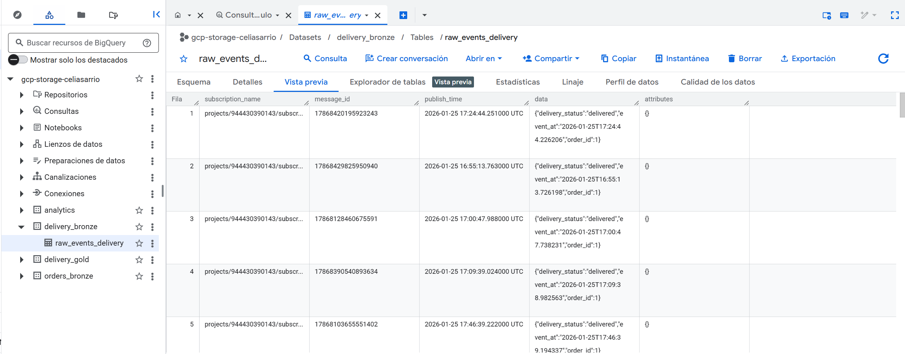
Resultado en la UI de CloudSQL: 
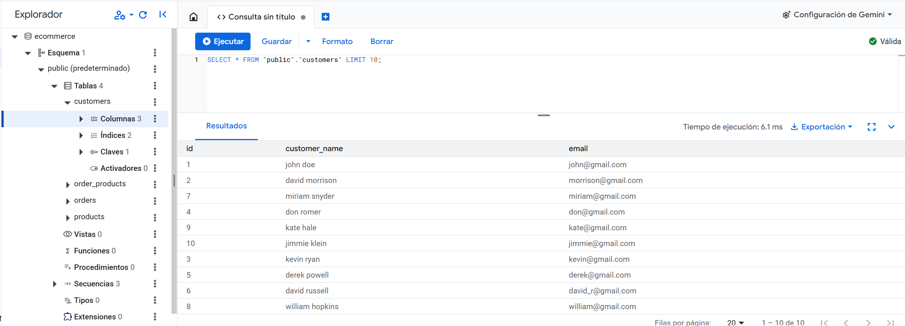 
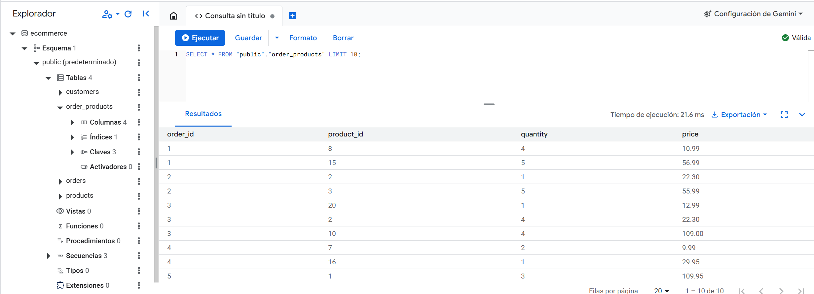 
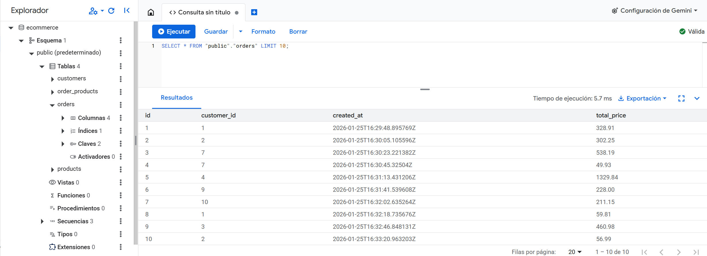
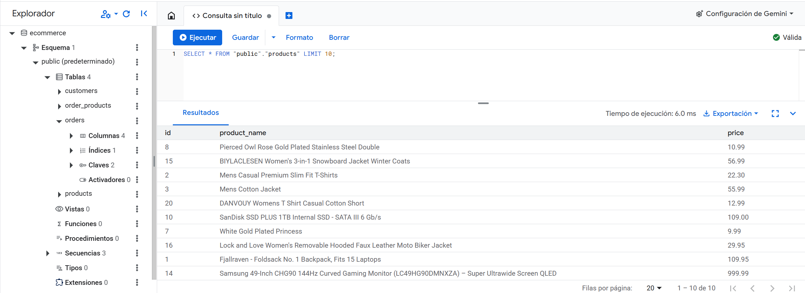

---

## 4. Pipeline de Ingesta y Consolidación (Extract & Load)

Para centralizar la información en nuestro Data Warehouse (BigQuery), se ha diseñado una estrategia de ingesta dual que permite capturar tanto el histórico como la actividad del momento en la capa Bronze:

1. **Captura de Eventos en Streaming**: Los eventos logísticos provenientes de delivery-events se vuelcan de forma automática y en tiempo real a BigQuery. Esto se logra mediante una suscripción tipo "push" que minimiza la latencia entre la generación del evento y su disponibilidad para análisis.
   
2. **Sincronización Batch (Replicación EL)**: Se implementó un proceso de extracción y carga (EL) desarrollado en Python. Este pipeline se encarga de replicar de forma masiva el estado de las tablas relacionales de PostgreSQL hacia el entorno analítico, asegurando que la foto del negocio esté completa.

### 4.1. Integración de Fuentes Externas

Además de los datos operacionales, el sistema se enriquece con fuentes semiestructuradas. Se configuró una Tabla Externa para mapear archivos en formato Parquet almacenados en Cloud Storage. Esta técnica permite consultar datos volumétricos sin necesidad de moverlos físicamente, optimizando el rendimiento y los costes.

Resultado de la Fase: La capa Bronze queda plenamente operativa, albergando el histórico de transacciones, el flujo de eventos en vivo y la metadata externa, listos para ser transformados.

### 4.2. Consolidación del Repositorio Analítico (Bronze Layer)

Tras la ejecución de los procesos de carga, el ecosistema de BigQuery alcanza su estado operativo inicial. En este punto, la capa Bronze actúa como una "Single Source of Truth" (Fuente única de verdad) que unifica tres tipologías de datos críticas para el análisis:

* **Flujo en Tiempo Real**: Persistencia continua de eventos logísticos a través de la integración nativa con Pub/Sub.
* **Snapshot Histórico**: Replicación íntegra de la base de datos operacional (pedidos, clientes y catálogo).
* **Metadata Enriquecida**: Conexión directa con información técnica de productos vía tablas externas (raw_additional_products_info).

La confirmación de que el pipeline de ingesta ha sido exitoso se observa en la volumetría de las tablas, las cuales ya presentan datos poblados y listos para la fase de modelado.

Estado de la Capa Bronze: 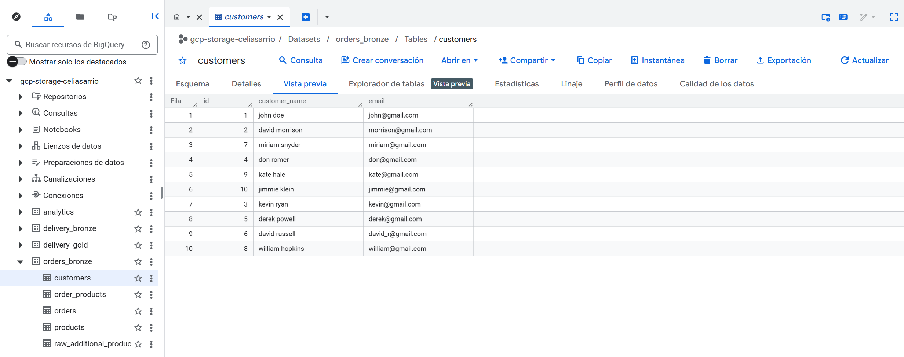

---

## 5. Ingeniería de Datos y Refinado con dbt

Una vez consolidada la capa de datos brutos, es necesario transformar esa información para que sea legible y útil para el negocio. Para este proceso de refinado, se ha integrado dbt (data build tool), permitiendo aplicar una lógica de ingeniería de software (modularidad y versionado) sobre el almacén de datos.

### 5.1. Entorno de Desarrollo y Conectividad

El proyecto se estructuró para garantizar una conexión fluida entre la lógica de transformación y el motor de procesamiento:

* **Estructura**: Inicialización del proyecto bajo estándares de dbt.
* **Seguridad y Perfiles**: Configuración del archivo profiles.yml para establecer el túnel de comunicación con BigQuery en la región europe-west1, utilizando credenciales seguras.
* **Reutilización**: Implementación de macros y modelos base para estandarizar las consultas SQL.

### 5.2. Estrategia de Modelado y Estructura de Datasets

Se ha seguido una filosofía de modelado por capas, organizando los scripts SQL de forma modular. dbt automatiza la creación y gestión de los datasets en BigQuery, organizando la salida en áreas lógicas que facilitan el gobierno del dato:

* **Estructura Organizada**: Creación de esquemas diferenciados (como analytics, delivery y orders) para separar las responsabilidades de cada dominio de datos.
* **Modularidad**: El uso de prefijos personalizados permite identificar de forma clara el origen y el propósito de cada conjunto de tablas transformadas.


1. **Capa de Enriquecimiento Gold (Logística)**

* **Modelo**: `expanded_delivery_events`.
* **Lógica**: Reconstrucción integral de la trazabilidad de los envíos mediante el cruce de eventos atómicos.
* **Estrategia**: Se materializó como una Vista (View). Esta decisión permite que Metabase consulte los datos en tiempo real, garantizando que el estado del envío esté siempre actualizado sin incurrir en costes de almacenamiento redundantes.

Visualización del modelo en BigQuery: 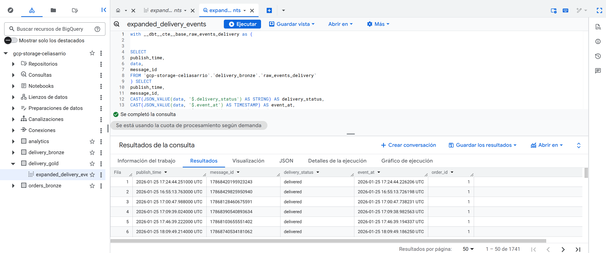

2. **Capa Analytics (Valor de Negocio)**

Esta capa está diseñada para alimentar los dashboards de forma eficiente, por lo que se optó por la materialización de Tablas físicas para maximizar la velocidad de respuesta:

* `top_5_product_expenses`: Calcula la rentabilidad por producto cruzando el volumen de ventas con el catálogo de precios. Es una métrica crítica para identificar los generadores de ingresos.
* `orders_per_customer`: Consolida la frecuencia de compra por usuario, permitiendo identificar a los clientes más fieles.

Resultado en la UI:
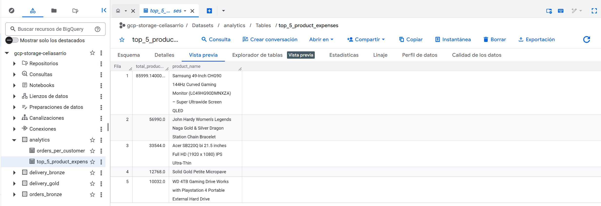

---

## 6. Capa de Visualización e Insights con Metabase

La etapa final del proyecto consiste en transformar las tablas analíticas en decisiones de negocio. Para ello, se integró Metabase como herramienta de BI, permitiendo una exploración visual e interactiva de los datos procesados en la capa Gold.

### 6.1. Orquestación del Servicio de BI

Se optó por un despliegue basado en contenedores **Docker**, lo que facilita la portabilidad y rapidez de ejecución del servicio. Mediante esta configuración, Metabase se conecta de forma segura a **BigQuery**, extrayendo la información sin necesidad de mover los datos fuera del entorno analítico.

```bash
docker-compose up -d 

```

### 6.2. Dashboard de Monitorización Estratégica

Se ha consolidado un panel de control interactivo que permite supervisar el rendimiento del E-commerce mediante tres indicadores clave (KPIs):

* **Top 5 Product Expenses (Gráfico de Donut)**: Este visual permite identificar los artículos que generan el mayor volumen de gasto acumulado. Destaca el Samsung 49-Inch CHG90 como el producto líder, representando un 43.14% del total, seguido por productos como el set de joyería de John Hardy. Este análisis es fundamental para entender qué productos del catálogo tienen mayor peso financiero.


* **Orders Per Customer (Gráfico de Barras)**: Un análisis de la distribución del gasto por cliente que permite identificar a los perfiles de mayor valor (High-Value Customers). En el gráfico se observa que usuarios como Kevin Ryan y Don Romer lideran el volumen de compra, superando los 30.000 y 40.000 en precio total respectivamente.

Resultado Final: 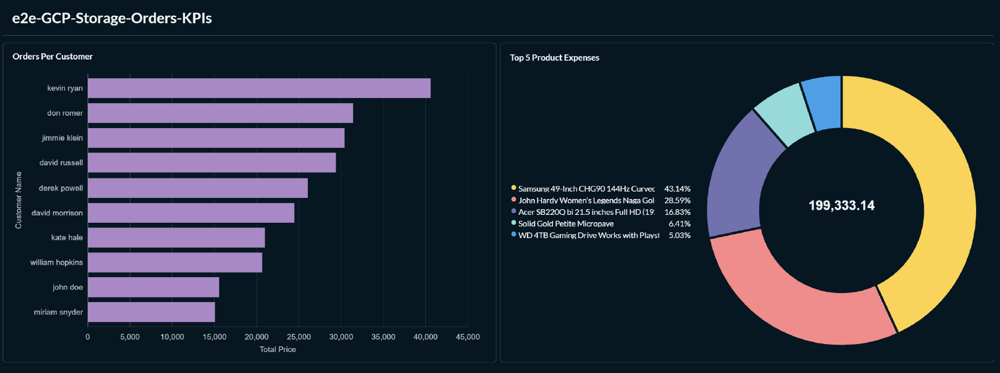
