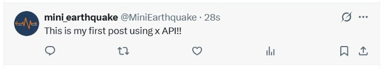
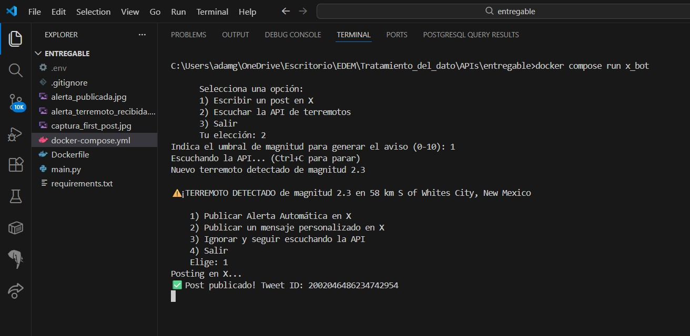

# X API Publisher and Earthquake Monitor

## Use Case
Esta aplicación monitorea los terremotos registrados alrededor del mundo, y permite al usuario definir un umbral de magnitud para recibir notificaciones cuando un seismo supera dicho umbral. La información proviene del USGS (United States Geological Survey).

Una vez detectado un evento por encima del umbral, el script ofrece las opciones siguientes para que el usuario escoja:
- Publicar de forma totalmente automática una alerta en la cuenta de X, incluyendo los datos ubicación y magnitud: 
  
- Escribir y publicar posts totalmente personalizados en la cuenta:
  

## Configuración inicial

1. Crea un archivo llamado .env en la misma carpeta que este documento.
2. Escribe tus claves de X dentro del archivo .env con el siguiente formato:

X_API_KEY=tu_clave
X_API_SECRET=tu_secreto
X_ACCESS_TOKEN=tu_token
X_ACCESS_TOKEN_SECRET=tu_token_secreto

## Cómo ejecutar la aplicación

Para iniciar el programa de forma interactiva, abre la terminal en la carpeta del proyecto y ejecuta:

*docker-compose run earthquake_bot*

## Opciones del Menú

AL iniciar la applicación, el usuario debe escoger entre las sigientes opciones:

1. Escribir un post en X
   Te permite redactar un mensaje y publicarlo directamente en tu perfil, siempre que esté dentro del umbral de caracteres (1-280)
   

2. Escuchar la API de terremotos
   Inicia el modo de vigilancia automática:
   - Te pedirá que definas una magnitud para filtrar las alertas (0-10).
   - Escuchará la API de terremotos cada minuto.
   - Si detecta un terremoto que supera esa magnitud, detendrá la espera y te mostrará estas opciones:
     1) Publicar la alerta automática con los datos del seísmo.
     2) Escribir tu propio mensaje personalizado.
     3) Ignorar este evento y seguir escuchando.
     4) Salir.

3. Salir
   Cierra la aplicación y detiene el contenedor.

## Ejemplo E2E: 
