En este fichero documento como se ha creado cada uno de los recursos usados en el ejercicio e2e de GCP Storage propuesto durante las clases de EDEM.
Todos los elementos se han creado dentro del proyecto "gcp-storage-e2e-terraform" en GCP. 

## Imagen de VM

Primero he creado una imagen de máquina llamada "e2e-vm-image" que nos servirá para generar las VM instances posteriores. 
Esta imagen la he creado a través de la consola, y es de una maquina e2-micro ubicada en europe-west1.

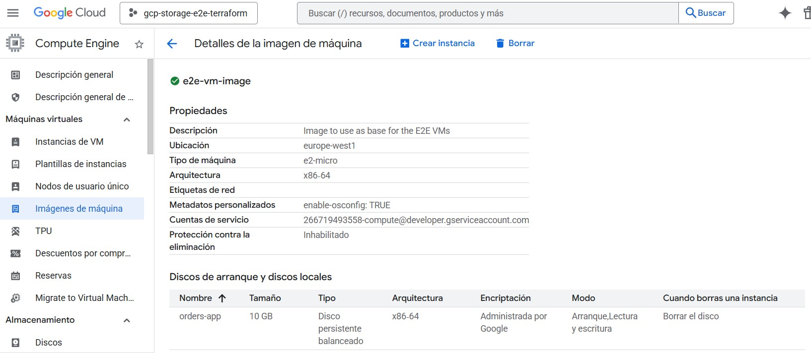

## VM Instance (Orders App)

Una vez creada la imagen de máquina, he pasado a crear las dos instancias de VM con Terraform:

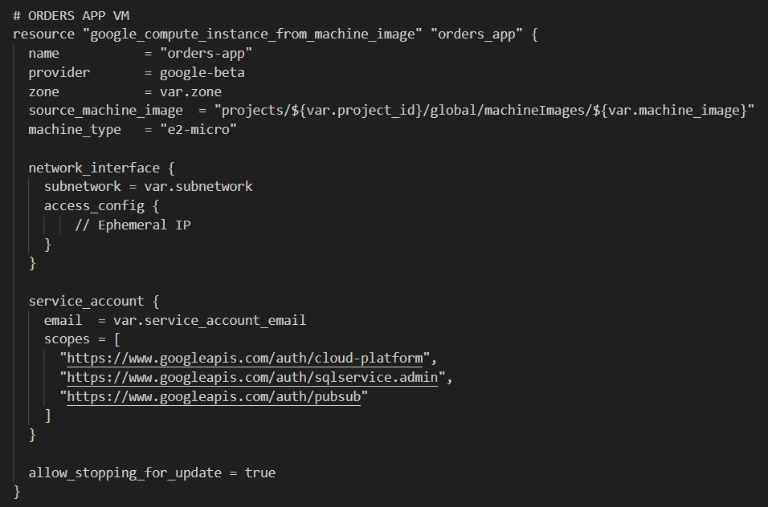

Tanto el project id como el nombre de la imagen se han declarado como variables definidas en terraform.tfvars
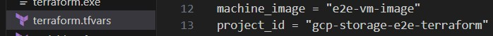

## VM Instance (Delivery App)

Después pasamos a desplegar la Instancia de Delivery App desde terrafrom con la misma imagen:

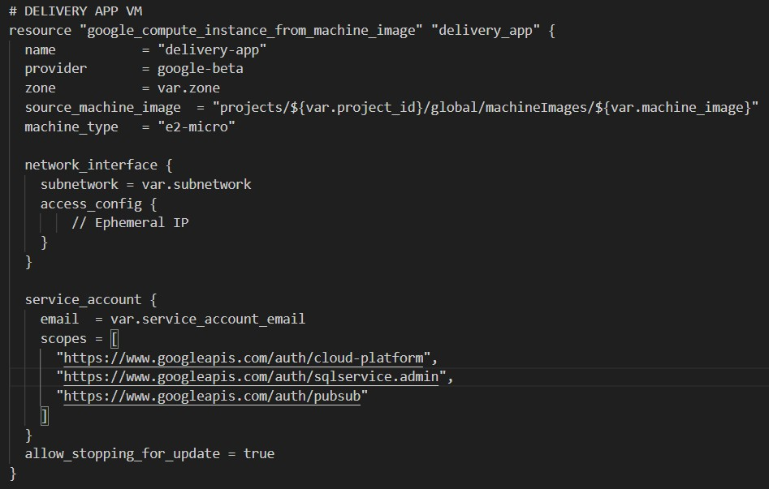

## Base de datos transaccional (Cloud SQL instance)
Para simular la base de datos operativa de la empresa, desplegamos una instancia de Cloud SQL con postgres.

Con las VM ya activas, pasamos a crear la instancia de CloudSQL a través de terraform también. 

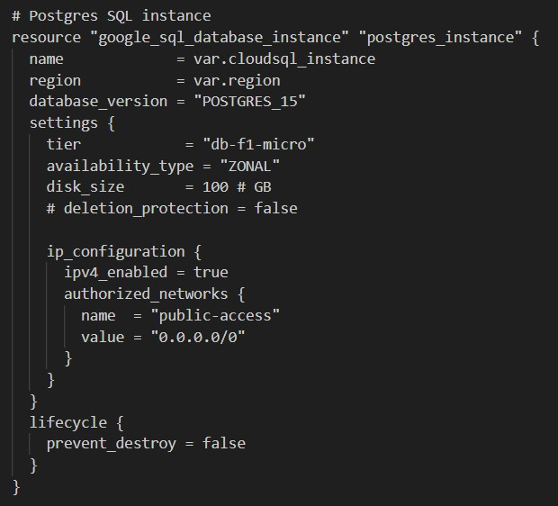

El nombre de la instrancia y la región también se ha definido como variable en terraform:
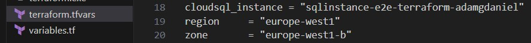

A continuación creamos el usuario y la base de datos "ecommerce" con terraform también:
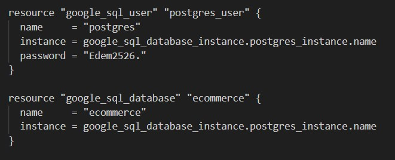

## Datalake (GCS bucket)
Hemos creado un datalake (Bucket de GCS) donde guardar la información adicional de los pedidos en formato parquet a partir del order generator script. Esto nos permite almacenar la información adicional de forma mas eficiente a menor coste.
El bucket lo creamos con terraform también, y para asegurarme que el nombre es único en GCS lo he creado concatenando un prefijo con el nombre de mi proyecto (que incluye mi nombre de usuario).

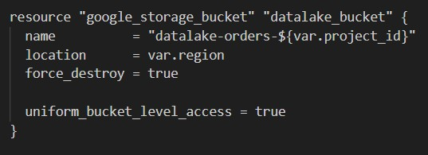
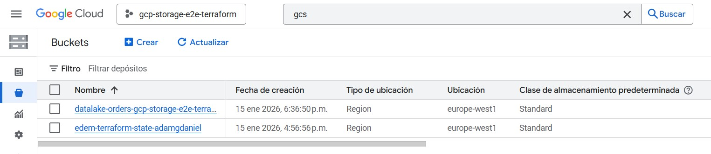
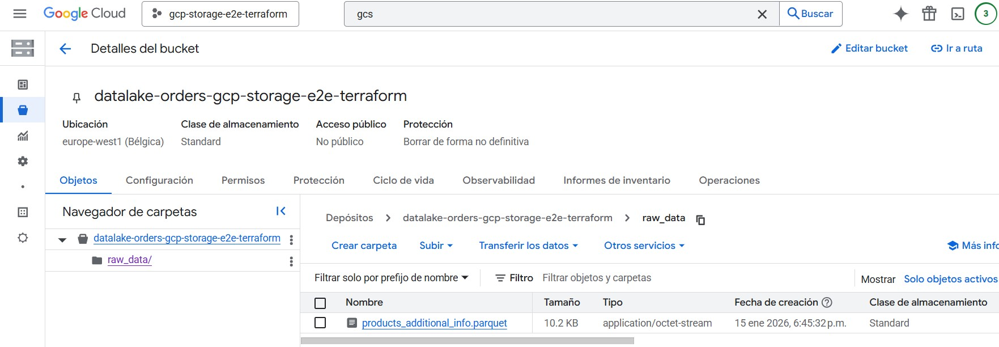

## PubSub 

Para el envio de mensajes entre el Orders app, Delivery app, y el Analytical DB (BigQuery), usamos dos topics de PubSub.
Esto lo hacemos también con terraform: 
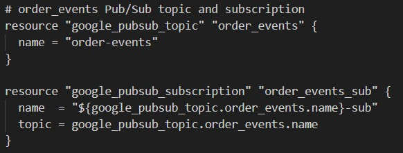
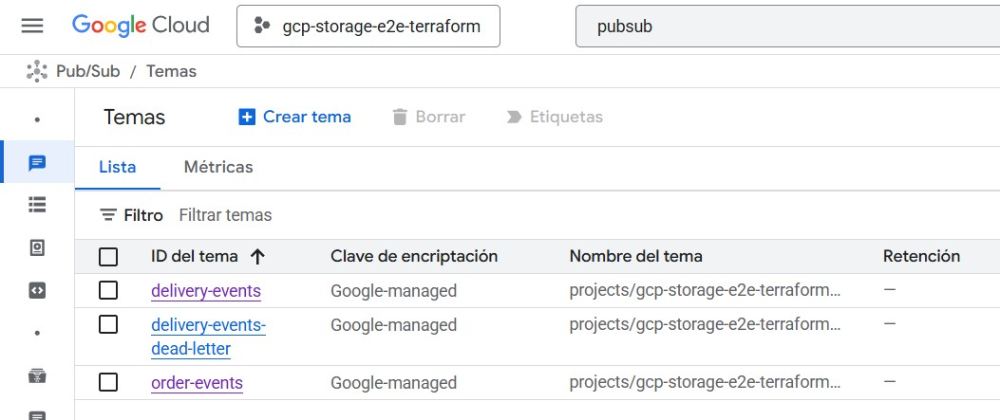
El topic "order-events" mandará información de los pedidos creados con el script en la Orders-app VM al topic de pubsub, y la Delivery-app los leerá con la suscripción creada. Después la Delivery App mandará los eventos de delivery al topic Deliver-events, que lo conectará con BQ a través de otra suscripción. 
Tabién se ha creado una suscripción "dead letter" para recoger los mensajes no entregados después de 5 intentos.
 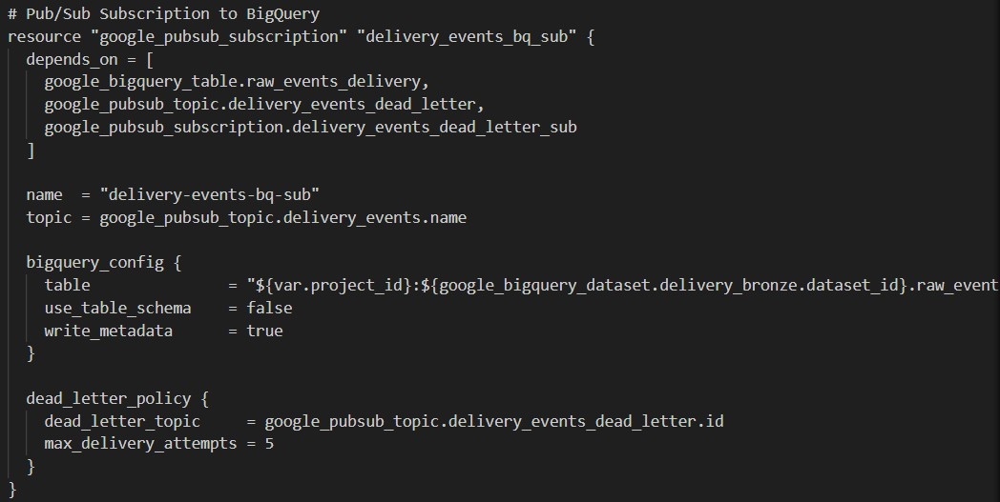
 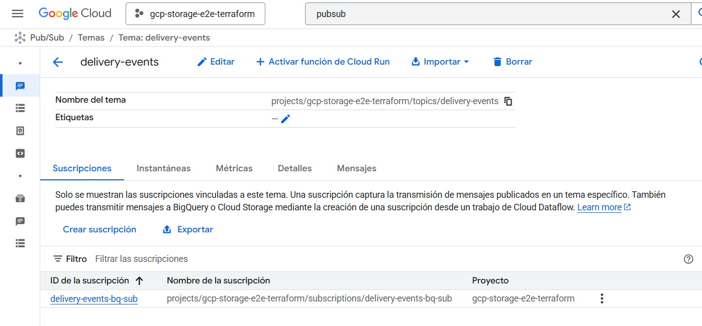

## Data warehouse (BigQuery)

Aqui creamos nuestra base de datos analítica.

Primero aprovisiono los Datasets vacíos para recibir los datos, y después creamos las tablas con sus esquemas:
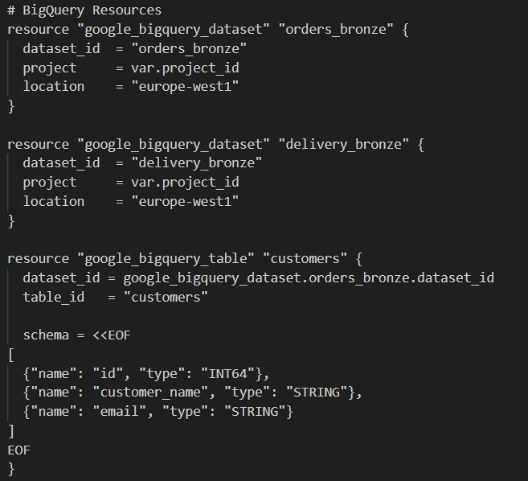

Se puede ver todos los recursos en el código de terraform adjunto.

Para insertar los datos desde la base de datos transaccional (CloudSQL) a la analítica, ejecutamos un EL job ya proporcionado en el repo en local.
Una vez aplicamos los cambios de terraform y ejecutamos las apps en las VMs, podemos ver en la consola tanto los datasets (delivery_bronze & orders_bronze) como las tablas creadas y los datos insertandose:
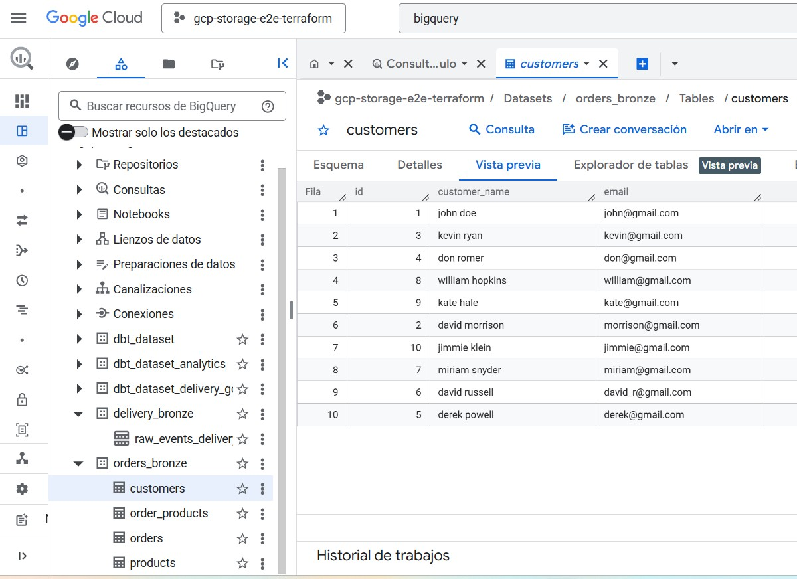

## DBT

La transformación de los datos raw insetrados en BigQuery en los datasets "Bronze" se produce con DBT en local, con el modelo proporcionado en el repo. Una vez se ejecuta, podemos ver los datasets (dbt_dataset, dbt_dataset_analytics & dbt_dataset_delivery_gold) y las tablas creadas y pobladas con los datos:
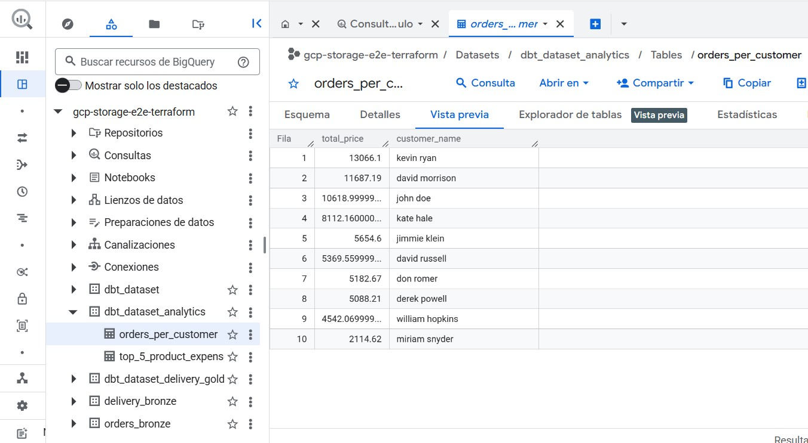

## Metabase

Para la visualización de los datos, usamos Metabase en local. El programa lo ejecutamos corriendo el docker compose proporcionado:
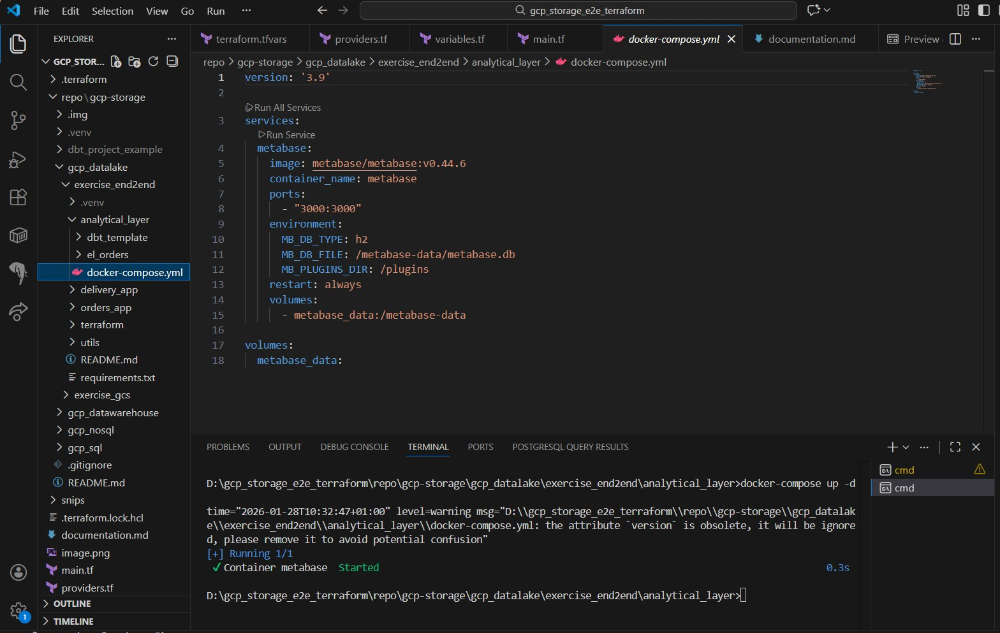

Para identificarnos y que pueda conectarse a nuestro proyecto cloud, hemos creado una Srevice account con permisos de administrador de BQ: 
 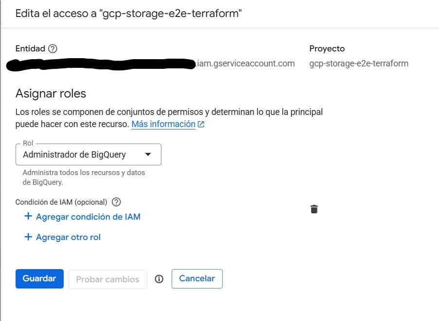

 Posteriormente generamos las credenciales en formato JSON que subiremos a Metabase para acceder a los datos. 
 Una vez tengamos los datos, generamos gráficos relevantes para reportar las métricas de negocio. En este caso he creado un gráfico con los Top 5 productos más vendidos (por ingresos), una pie chart con el porcentaje de ingresos que representa cada cliente, y un gráfico de barras con el estado total de entrega de los pedidos:
 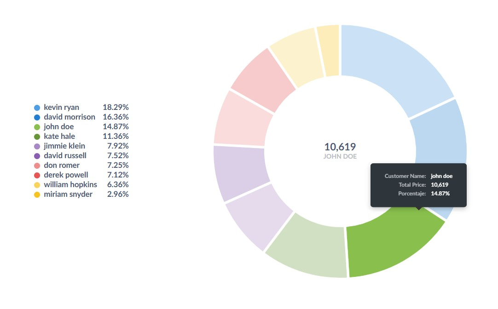
 Después he insetrado todos los gráficos en un cuadro de mando:
 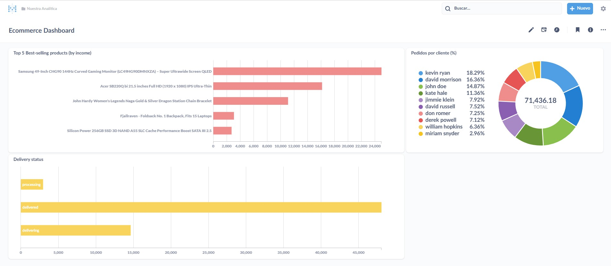
 
 Y con esto estaria completo el proyecto.

