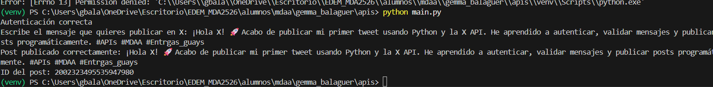

# **📋DESCRIPCIÓN DEL PROYECTO**
La aplicación carga credenciales desde variables de entorno, se autentica la X API usando OAuth 1.0a y permite publicar un post introducido por el usuario desde la terminal. 

Incluye un modo de desarrollo que simula la publicación sin realizar llamadas reales a la API, lo que ayuda a evitar el consumo innecesario de la cuota del plan gratuito.

# **🛠️TECNOLOGÍAS UTILIZADAS**

1. Python 3. 
2. Tweepy (cliente oficial para la X API v2).
3. python-dotenv (gestion de variables de entorno).
4. X API Free Tier.
  
# **📦INSTALACIÓN**

1. Clona el repositorio 

``` sh 
git clone https://github.com/Marcolapietro/mda-api-exercises.git
```
2. Crea y activa un entorno virtual (es opcional pero se recomienda)

```sh
python -m venv venv
venv\Scripts\activate 
```

3. Instala las dependencias. 

``` sh
pip install -r requirements.txt
```

4. En el caso de que tengas problemas con tweepy y python-dotenv, entra en el entorno virual y descarga:

``` sh 
pip install python-dotenv
pip install tweepy 
```

# **🔐 CONFIGURACIÓN**

1. Crea el archivo .env

Copiamos el archivo de ejemplo:

```sh 
cp .env.example .env
```

2. Configuración de las credenciales. 
   
Editamos el archivo .env: 

```sh
X_API_KEY=your_api_key_here
X_API_SECRET=your_api_secret_here
X_ACCESS_TOKEN=your_access_token_here
X_ACCESS_TOKEN_SECRET=your_access_token_secret_here

APP_MODE=development
```
Las credenciales necesarias para autenticarse con la X API se cargan desde un archivo .env utilizando python-dotenv. 

El programa valida que todas las credenciales estén presentes antes de continuar. Si falta alguna, la ejecución se detiene con un error claro. 

Las credenciales nunca están hardcodeadas en el código, siguiendo buenas prácticas de seguridad. 

**Importante 🔒**: 

- Nunca subas tu archivo .env al repositorio. 
- Está incluido en el .gitignore.

# **🔑 AUTENTICACIÓN CON X API**

La autenticación se realiza mediante la clase tweepy.Client, usando OAuth 1.0.a.

Si la autenticación es correcta, el programa muestra un mensaje de confirmación. 

Si oucurre un error, se captura la excepción y la aplicación finaliza de forma controlada. 

# **✍️ PUBLICACIÓN DE POSTS**

El proyecto incluye la función:

``` sh 
publicar_post(texto: str)
```
Esta función:

- Elimina espacios innecesarios del texto. 
- Valida que el post no esté vacío. 
- Valida que no supere los 280 carácteres.
- Publica el post en X o lo simula seguún el modo de ejecución. 

# **▶️ USO**

1. Ejecutamos la aplicación desde la terminal (dentro del entorno virtual): 

```sh
python main.py
```

2. En la terminal se solicita el mensaje que quieres publicar en X. 

3. Modos de ejecución: 
- Development: simula el post (no usa la API).
- Production: publica el post real en X. 

Cambiamos el modo en .env:

```sh
APP_MODE=production
```

**Api limitaciones (free tier)**:

- Máximo 17 posts cada 24 horas. 
- No métricas ni analíticas. 
- Operaciones de lectura muy limitadas. 
Por ese motivo se incluye el modo development para pruebas locales. 

# **🧪OUTPUT**




# **📚 CONCEPTOS APLICADOS**

1. Consumo de APIs REST.
2. Autenticación OAuth 1.0a.
3. Variables de entorno. 
4. Validación de entrada del usuario. 
5. Manejo básico de excepciones. 
6. Buenas prácticas de seguridad. 

# **🚀POSIBLES MEJORAS FUTURAS**

1. Soporte para imágenes. 
2. Guardado de borradores. 
3. Programación de posts. 
4. Interfaz web. 
5. Tests unitarios. 

