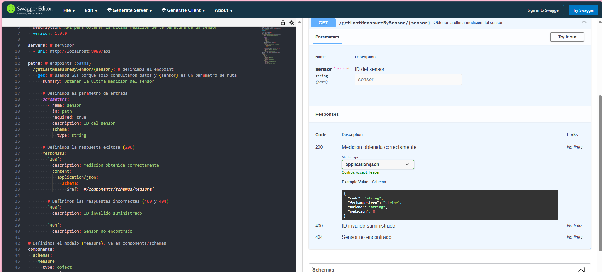
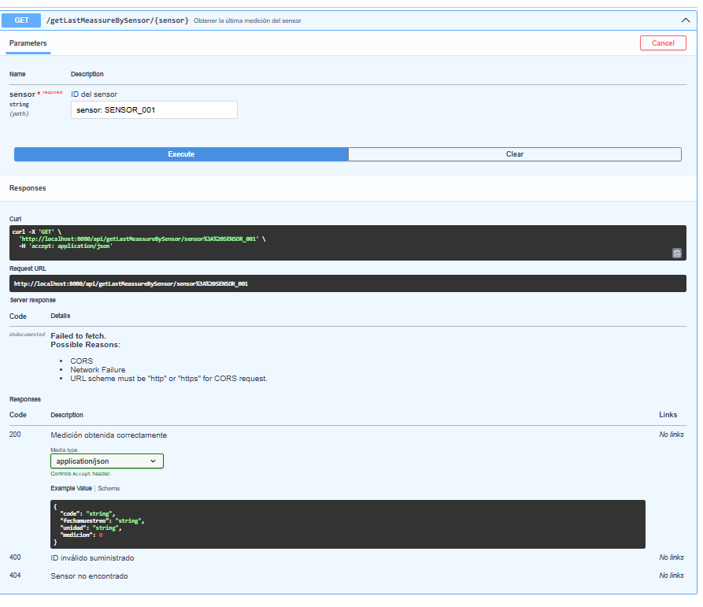

**¿Qué nos pide el ejercicio?**
El ejercicio requiere la documentación de la API y no la implementación de backend. Los pases clave son los siguientes: 

1. Crear un archivo YAML (OpenAPI / Swagger) que describa la API. 

2. Validar que la sintaxis y la estructura sean correctas usando Swagger. 

3. Definir los endpoints, los parámetros, las respuestas esperadas y los códigos de error. 

La **primera combrobación en Swagger Editor, el YAML es revisado solo sintácticamente. Esto incluye: 

1. Que la ruta exista. 
   
2. Que los parámetros estén bien definidos. 

3. Que las respuestas tengan el formato correcto. 
   
En este caso el archivo "swagger.yml" pasa la validación ya que cumple con la estructura OpenAPI. 

En la **segunda comprobación** cuando se realiza Try it out, Swagger realmente intenta llamar al endpoint, sin embargo, no existe un servidor escuchando la ruta y por ello aparecen errores. 

El ejercicio solicita únicamente la creación de la definición de API en formato Swagger/OpenAPI. Sin embargo, no se requiere la implementación de un backend funcional ni la conexión de la API a la base de datos del sensor. Es por ello, que  primera validación en Swagger Editor confirma que la definición es correcta.El error que aparece al usar ‘Try it out’ ocurre porque no existe un servidor que atienda las solicitudes, lo cual es esperado y no afecta la validez de la definición.

