# **📘 End-to-End - Google Cloud Platform**

Este documento recoge las evidencias en Google Cloud Platform que demuestran el correcto funcionamiento de la arquitectura end-to-end implementada, desde la generación de los datos hasta su almacenamiento y su posterior transformación analítica. 

### **ARQUITECTURA DEL PROYECTO**

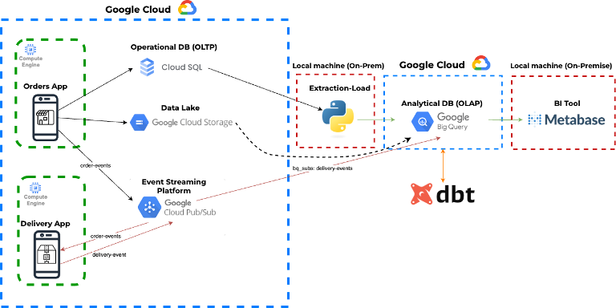

### **0.TERRAFORM + BUCKET**

Los recursos principales de infraestructura se levantan utilizando Terraform, garantizando reproducibilidad y control de la infraestructura como código.

Se ejecutan los siguientes comandos:

```sh 
terraform init
```

```sh 
terraform apply
```
📸 Evidencia – Recursos creados por Terraform
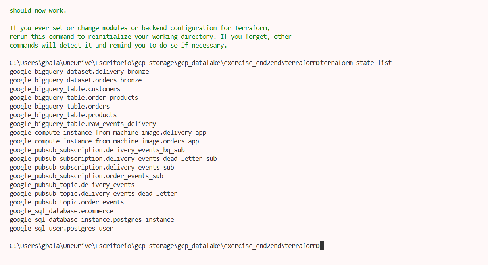

### **1.Despliegue de aplicaciones**

Las aplicaciones orders-app y delivery-app se encuentran desplegadas y en ejecución.rders-app y delivery-app (estado running).

📸 Evidencia – Listado de servicios en Cloud Run

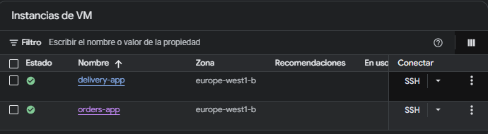

### **2. BASE DE DATOS OPERACIONAL**

La base de datos operacional está desplegada en Cloud SQL y se encuentra activa.

📸 Evidencia – Instancia Cloud SQL

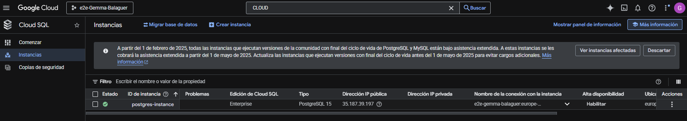

### **3.BIG QUERY**
Se crean los datasets correspondientes a la capa Bronze del Data Warehouse.

📸 Evidencia – Dataset orders_bronze

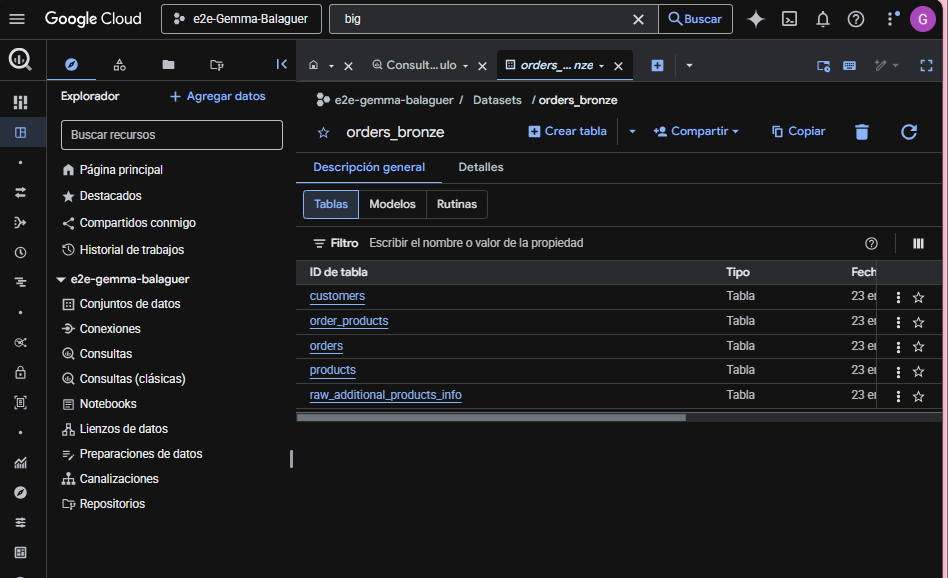

📸 Evidencia – Dataset delivery_bronze

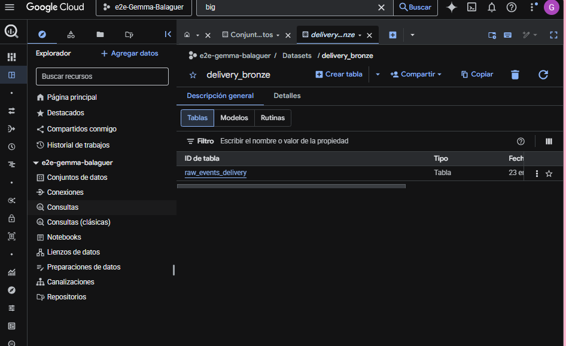

### **4.PUB/SUB**

Se muestra la infraestructura de mensajería utilizada para la comunicación entre aplicaciones.

Las imágenes incluyen también el listado de las suscripciones de cada tópico. 

📸 Evidencia – Tópico order-events

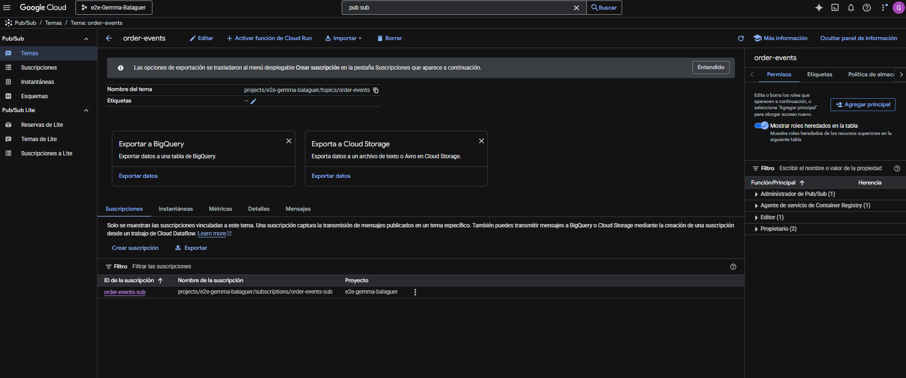

📸 Evidencia – Tópico delivery-events-dead-letter

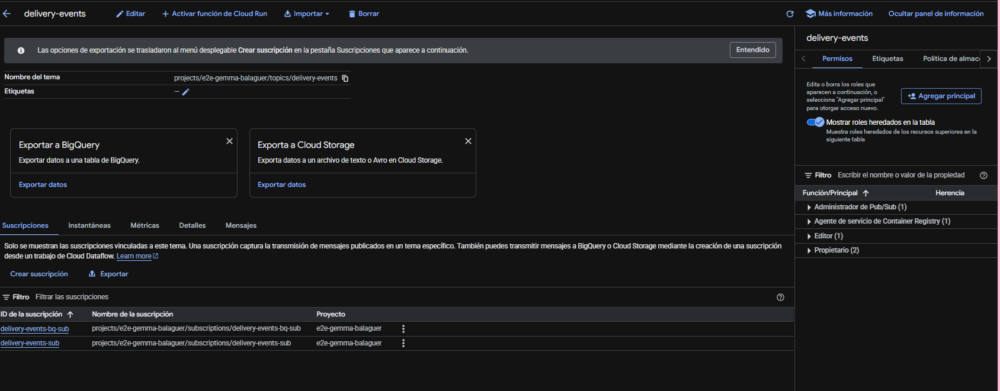

📸 Evidencia – Tópico delivery-events-dead-letter

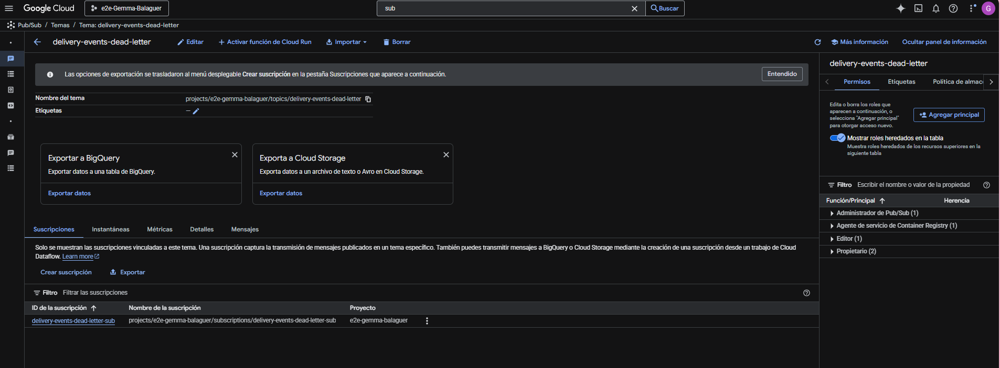

Demostramos el consumo de eventos de pedidos:

📸 Evidencia – Subscripción de consumo de eventos

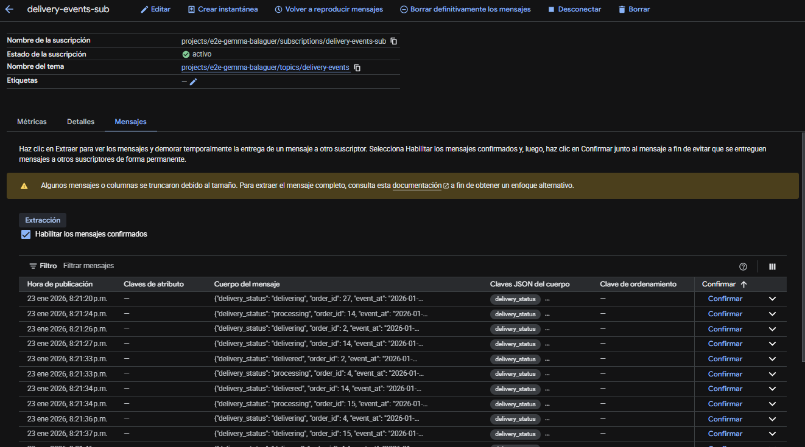

La configuración de la suscripción delivery-events-bq-sub, donde observamos que el tipo de entrega es BigQuery, indicando que los mensajes del tópico delivery-events se escriben directamente en la tabla delivery_bronze.raw_events_delivery. 

📸 Evidencia – Detalle de delivery-events-bq-sub

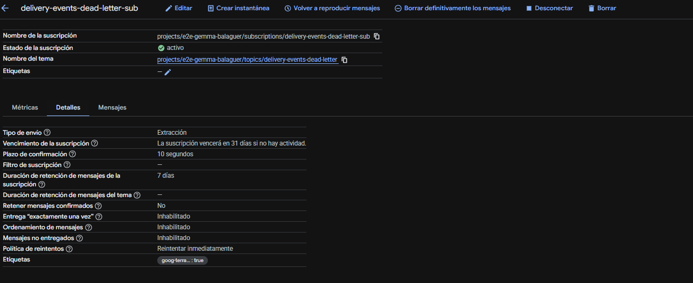

Esta configuración demuestra una integración nativa Pub/Sub, es decir, BigQuery sin necesidad de aplicaciones consumidoras intermedias. 


### **5. BIGQUERY - CAPA BRONZE**


Dentro de orders_bronze se encuentran varias tablas que replican el modelo de datos operacional.

1- Tabla de pedidos.

📸 Evidencia – Tabla orders

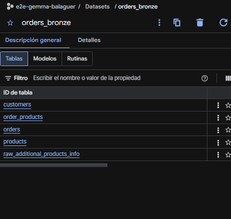

Consulta para evidenciar su función en la tabla de customers: 

📸 Evidencia – Consulta customers

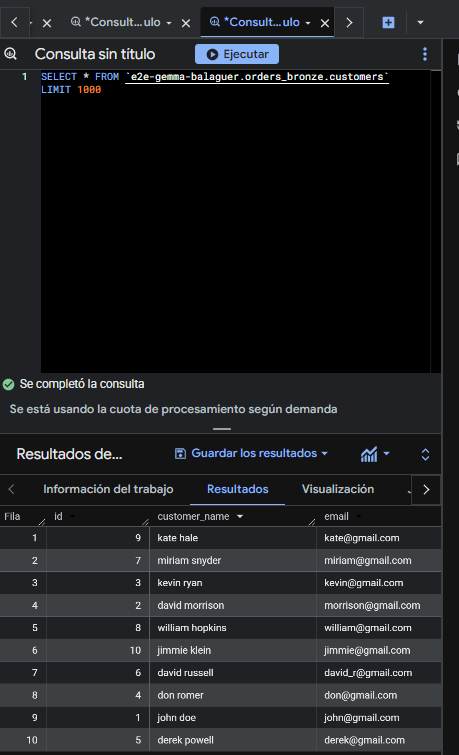

2 - Tabla de eventos de delivery.

📸 Evidencia – Dataset delivery_bronze

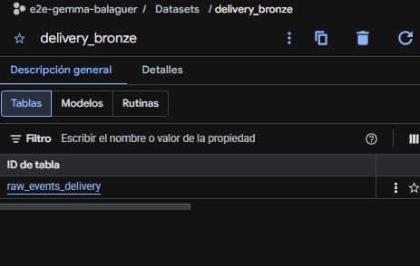

En BigQuery, dentro de delivery_bronze observamos la tabla raw_events_delivery que posee las siguientes columnas: 
- suscription_name. 
- message_id. 
- publish_time. 
- data. 
- attributes. 
Dichas columnas solo existen cuando los datos vienen directamente de una BigQuery suscription.

📸 Evidencia – Estructura raw_events_delivery

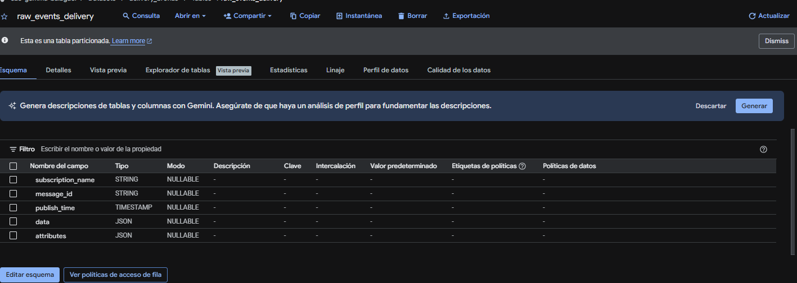

📸 Evidencia – Consulta sobre eventos

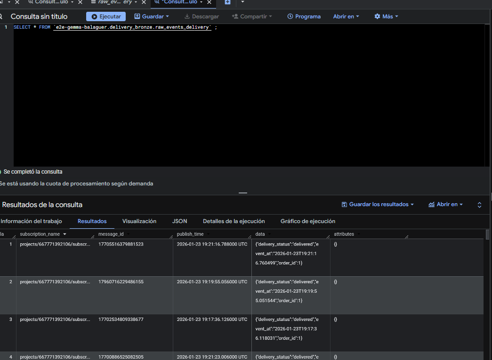

### **6. GOOGLE COLUD STORAGE (DATALAKE)**

El bucket del DataLake demuestra la existencia de una capa de almacenamiento en bruto. 

Dentro del mismo, nos encontramos con el archivo parquet que evidencia la persistencia de datos en formato analítico optimizado para consulta. 

📸 Evidencia – Bucket del Data Lake

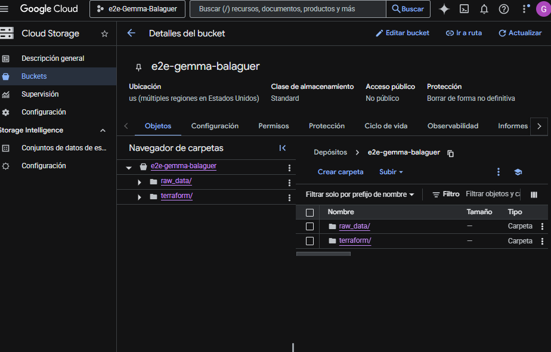

### **7. EXTERNAL TABLE (BIGQUUERY)**

Se crea una External Table en BigQuery para acceder directamente a los datos almacenados en GCS sin duplicarlos.

La external table se encuentra dentro de orders_bronze:

📸 Evidencia – External table en orders_bronze

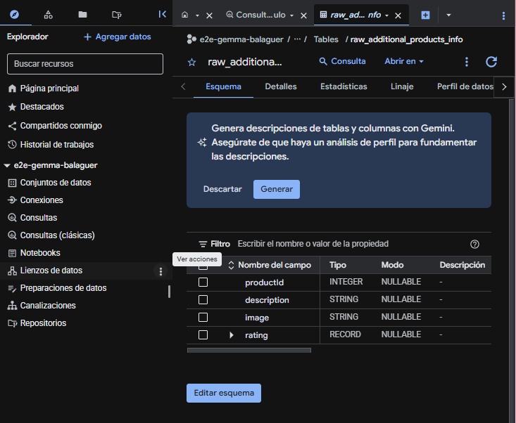

Se ejecuta una consulta para validar su funcionamiento.

📸 Evidencia – Consulta external table

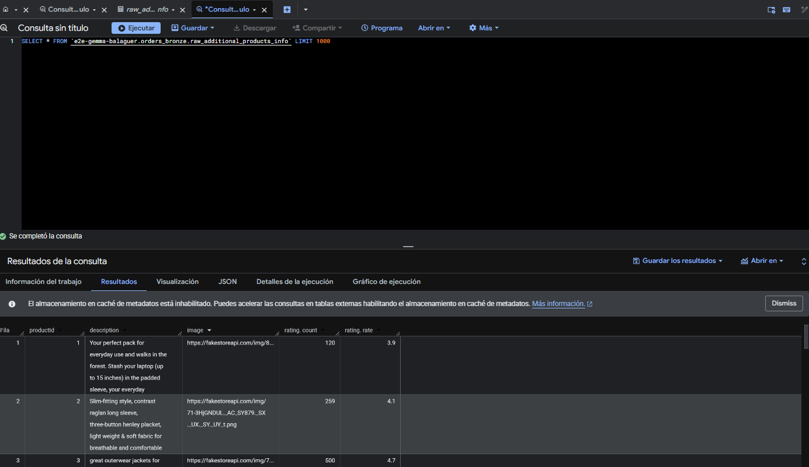

### **8. DBT -TRANSFORMACIONES**
En esta parte tranformamos eventos en modelos analíticos listos para negocio.

Se crean los siguientes datasets: 
- dbt_dataset. 
- dbt_dataset_analytics. 
- dbt_dataset_delivery_gold. 

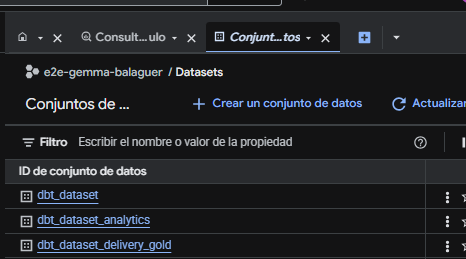

Tablas creadas dentro de dbt_dataset_analytics:

📸 Evidencia – Tablas en dbt_dataset_analytics

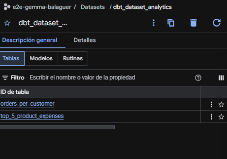
 
Ejecutamos consulta para comprobar que funciona:

📸 Evidencia – Consulta analítica

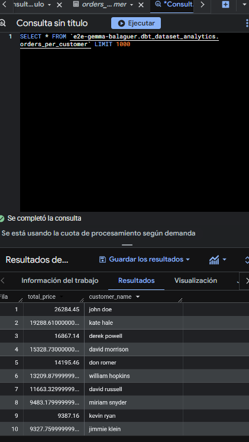

Tablas creadas dentro de dbt_dataset_delivery_gold:

📸 Evidencia – Tablas en dbt_dataset_delivery_gold

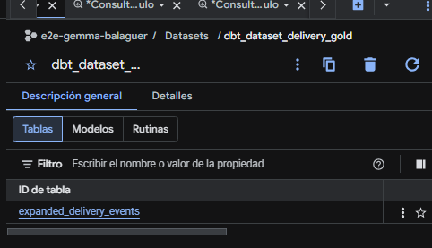


Ejecutamos consulta para comprobar que funciona:

📸 Evidencia – Consulta delivery gold

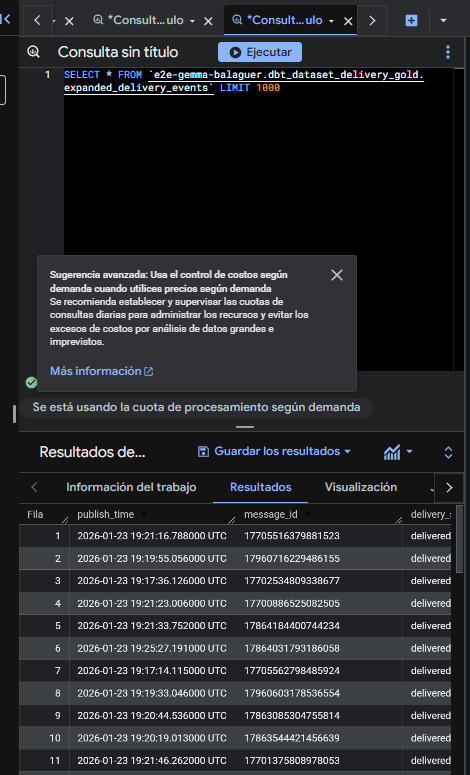  

##**9.METABASE**

Para permitir que Metabase lea los datos de BigQuery de forma segura, se utiliza una Service Account de Google Cloud.

Se genera una Service Account Key (JSON) en GCP con permisos de BigQuery Data Viewer y BigQuery Job User.

Se configura la base de datos en Metabase subiendo este archivo de credenciales, permitiendo la consulta directa sobre los datasets que se encuentran en BigQuery.

📸 Evidencia – top productos

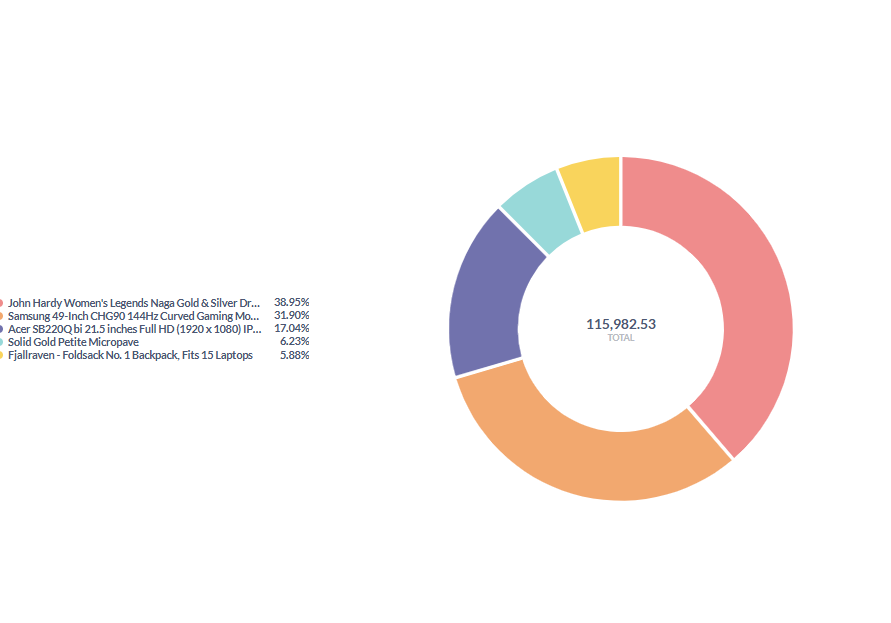

Este gráfico visualiza la concentración de ingresos, revelando que el producto líder ("John Hardy") genera por sí solo casi el 40% de las ventas totales.

Se observa una clara dependencia de los "bestsellers", ya que sumando el segundo producto (Samsung), solo dos artículos representan más del 70% de tu facturación mostrada.

El resto de artículos, como el monitor Acer (17%), actúan como complementarios con un impacto mucho menor en el volumen global de dinero.

Tabla empleada: top 5 products expenses.

📸 Evidencia – top productos

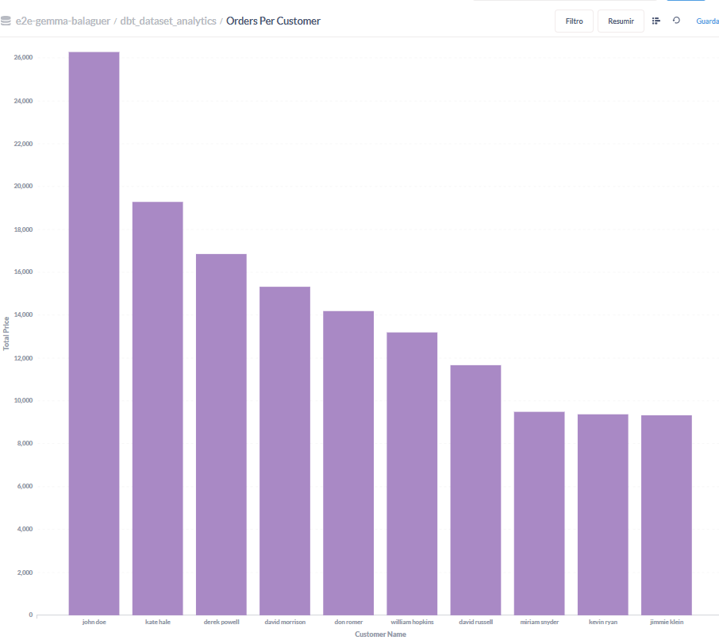

Este gráfico es tu Ranking de Clientes VIP, ordenando a los usuarios por su gasto total en lugar de cantidad de pedidos, mostrando quién deja realmente dinero en la caja.

El cliente "john doe" es el líder indiscutible, superando los 26,000 en compras, lo que lo convierte en un activo crítico que debes cuidar prioritariamente.

Tabla empleada: orders per customer.