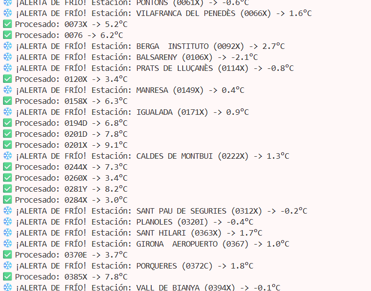
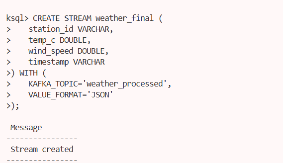
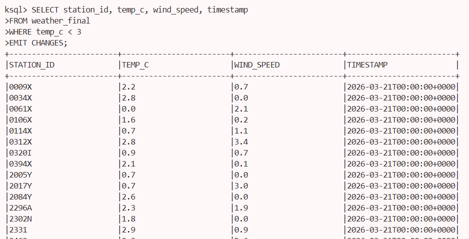

##**INTRODUCCIÓN**
Este proyecto implementa un flujo de datos End-to-End (E2E) para la monitorización meteorológica en tiempo real. El sistema consume datos oficiales de la AEMET (Agencia Estatal de Meteorología), los procesa para detectar condiciones extremas y los pone a disposición para reportes analíticos.

##**CASO DE USO**
Objetivo de negocio: Identificar de forma automática y en tiempo real las estaciones meteorológicas que registran temperaturas críticas para la activación de protocolos de emergencia o protección agrícola.

**Dataset Seleccionado**:
- Fuente: API AEMET OpenData (Observación convencional).
- Parámetros clave: Identificador de estación (idema), ubicación (ubi), temperatura actual (ta), temperatura máxima (tamax) y mínima (tamin).

##**ARQUITECTURA**
**Ingesta (Producer)**: Un script en Python (producer.py) que consulta la API dinámica de AEMET, extrae las observaciones climáticas actuales y las envía como mensajes JSON al tópico weather_raw.

**Procesamiento 1 (Processor)**: Un script en Python (procesador.py) que actúa como consumidor de weather_raw. Realiza una limpieza de registros nulos y aplica una lógica de alerta temprana:

**Detección de Ola de Frío**: Si la temperatura actual (temp_c) es inferior a 3°C, el procesador dispara una alarma visual en la terminal y etiqueta el mensaje con un estado de alerta.

Los datos enriquecidos se reenvían al tópico weather_processed.

**Procesamiento 2 (KSQLDB)**: Se define un STREAM sobre el tópico procesado para realizar consultas analíticas SQL en tiempo real, permitiendo filtrar y segmentar las estaciones bajo alerta de forma dinámica.

**Visualización**: Los resultados finales y las alarmas críticas se muestran en tiempo real a través del CLI de KSQL y los logs del procesador.

##**COMANDOS EMPLEADOS**
sh ```
docker compose up -d 
```
sh ```
python producer.py

python procesador.py 
```
sh ```
docker exec -it kafka-ksqldb-cli-1 ksql http://ksqldb-server:8088
```

##**EVIDENCIAS**
-Ejecutamos el producer.py 

-Ejecutamos el procesador.py 

-Abrimos la terminal de ksql y creamos el stream 

-Lanzamos una consulta

