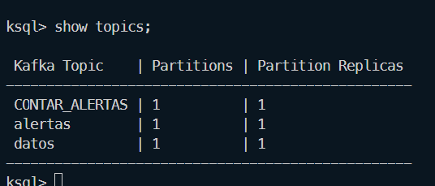
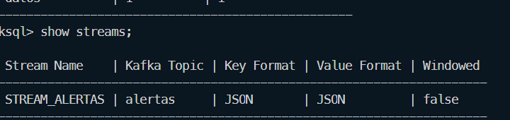
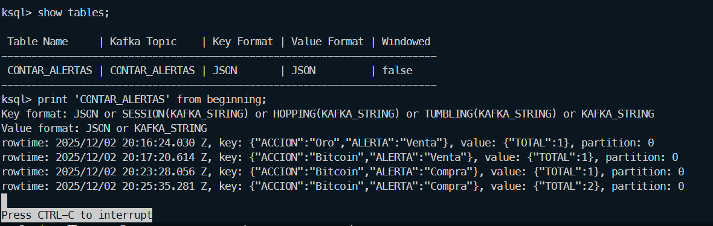
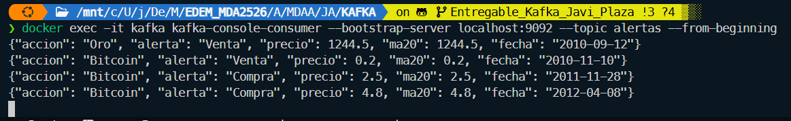

En este proyecto se han creado dos productores y un consumidor.
El productor_alertas produce mensajes con alertas de compra y venta de acciones.
El productor_datos produce mensajes con datos de acciones.
El consumidor consume los mensajes de los productores y los muestra por pantalla. Pero además el consumidor genera una acción, la cual es comprar o vender una acción en función de la alerta recibida.
Además se han creado dos topicos, datos y alertas.
En cuanto al KSQLDB, se ha creado una tabla con la cuenta de cuantas veces se ha comprado y vendido una acción.

Para ejecutar el proyecto, se debe ejecutar el docker-compose.yml.
Para ejecutarlo, se debe ejecutar el siguiente comando:

```
docker-compose up
```

En cuanto a la base de datos, se ha escogido la de el precio de las acciones de BTC y Oro. Para poder generar un evento y poder así usar Kafka, se ha creado una columna con las MA(20) de ambas acciones.

El MA(20) es la media movil de 20 dias del precio de cada acción. Con este indicador se puede saber si la acción está subiendo o bajando, y por lo tanto se emplea para generar las alertas de compra y venta.

En las imagenes de a continuacion se pueden ver los resultados de ejecutar algunos comandos tanto de ksql como de kafka.

- Para poder acceder a ksqlDB, se debe ejecutar el siguiente comando:
```
docker exec -it ksql ksql http://localhost:8088
``` 
    - Una vez dentro de ksqlDB, se puede ejecutar los siguientes comandos para ver los topicos:
```
show topics;
```


    - Se puede ejecutar el siguiente comando para ver el stream:
```
show streams;
```

    - Se puede ejecutar los siguientes comandos para ver la tabla y los datos de la tabla:
```
show tables;
print 'CONTAR_ALERTAS' from beginning;
```


Para poder acceder a los mensajes que esta mandado el productor (lo que recibe el consumidor) se debe de ejecutar el siguiente comando:
```
docker exec -it kafka kafka-console-consumer --bootstrap-server localhost:9092 --topic alertas --from-beginning
``` 
