# ENTREGABLE E2E-ALMACENAMIENTO GCP

## Memoria de entrega

1- Despliegue de Orders App y Delivery App Para simular la generación de datos en origen, ejecuté los scripts de Python que emulan el comportamiento de las aplicaciones de negocio:

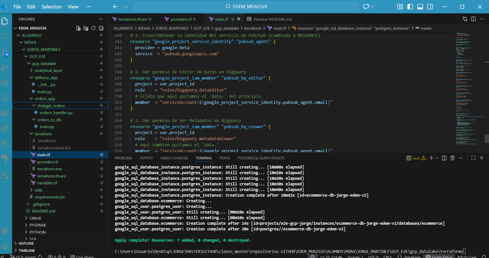

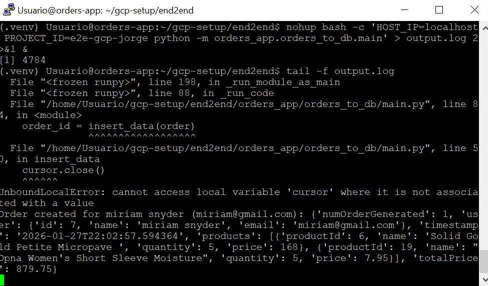

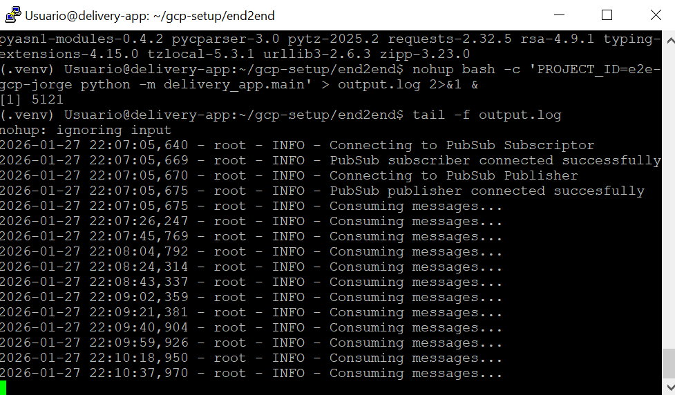

•	Orders App: Ejecuté el proceso de carga (el_orders) para extraer los datos transaccionales (pedidos, usuarios, productos) desde la base de datos origen y cargarlos en la nube.

•	Delivery App: Lancé el script delivery_app.py para generar un flujo continuo de eventos de geolocalización y estado de los repartidores en tiempo real

2- Despliegue de tópicos y subscriptores de Pub/Sub Como parte de la infraestructura para la ingesta de datos en streaming (Delivery App), provisioné los recursos necesarios en Google Pub/Sub mediante Terraform. Esto incluyó la creación de un Tópico para recibir los mensajes de los repartidores y una Suscripción asociada para que esos datos pudieran ser consumidos y persistidos posteriormente.

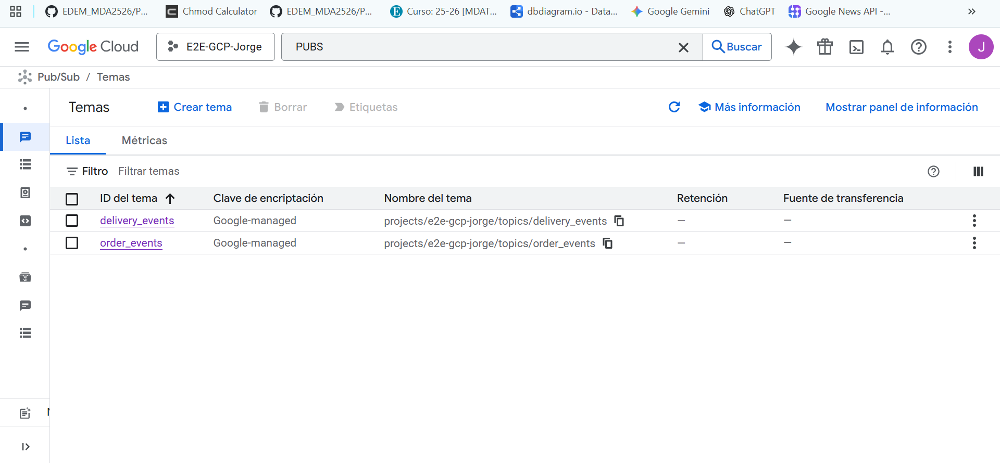

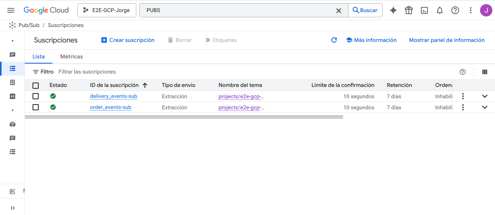

3- Despliegue de Cloud SQL Provisioné una instancia de base de datos gestionada en Google Cloud SQL con motor PostgreSQL. Esta instancia sirvió como la fuente de verdad (sistema operacional) donde residían inicialmente los datos de las órdenes antes de ser extraídos, simulando el entorno de producción de la empresa.

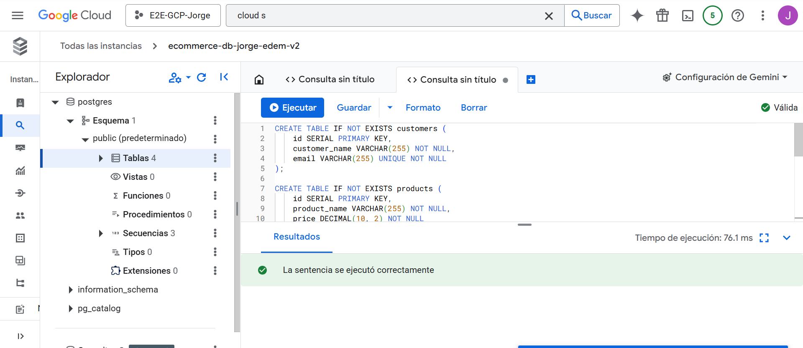

4- Uso de Google BigQuery Configuré el Data Warehouse en BigQuery creando los datasets necesarios para las distintas capas del dato (orders_bronze, delivery_bronze). Verifiqué que los datos llegaran correctamente:

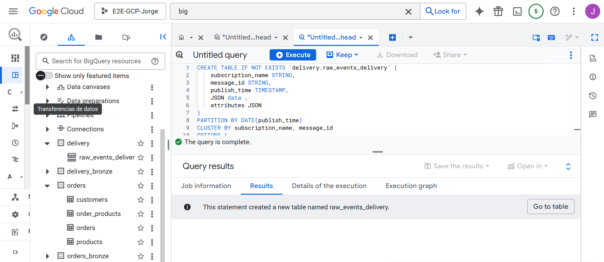

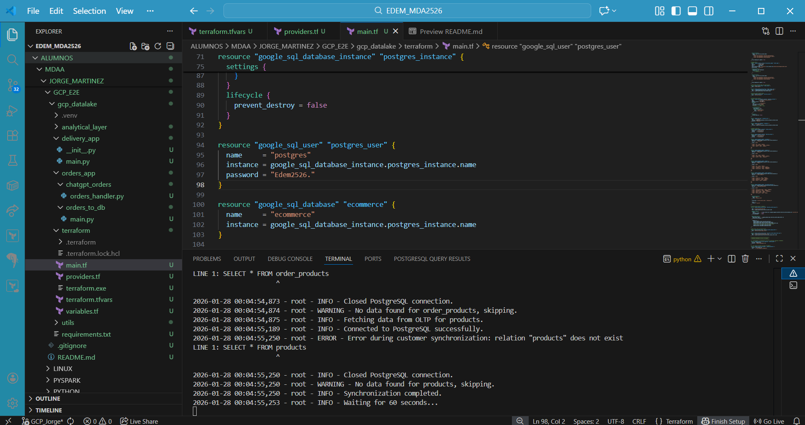

Los datos de Orders se replicaron en tablas correspondientes mediante el proceso Batch.

Los datos de Delivery se ingestaron automáticamente desde Pub/Sub hacia la tabla delivery_bronze.

5- Despliegue del Data Lake Mediante Terraform, desplegué buckets en Google Cloud Storage (GCS) para constituir el almacenamiento de objetos del Data Lake. Esto proporcionó la infraestructura base para almacenar datos no estructurados o archivos intermedios necesarios para el pipeline, asegurando una separación clara entre almacenamiento y cómputo.

6- Uso de DBT (Data Build Tool) Implementé la capa de transformación y modelado de datos (Capas Silver y Gold):

Inicialización: Creé un proyecto dbt (dbt init edem_project) y configuré el entorno virtual en Python, resolviendo problemas de dependencias y rutas en Windows.

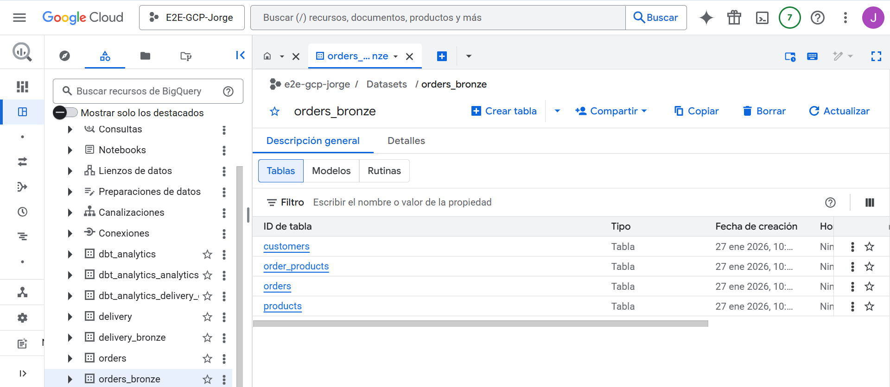

Configuración: Ajusté el archivo profiles.yml para conectar dbt con BigQuery, solucionando conflictos de regionalización (asegurando el uso de europe-west1).

Ejecución de Modelos: Desplegué los modelos SQL para crear la vista enriquecida expanded_delivery_events y las tablas de negocio en el dataset dbt_analytics (Capa Gold).

Visualización (Extra): Finalmente, conecté estos modelos transformados a Metabase para visualizar los resultados en cuadros de mando.

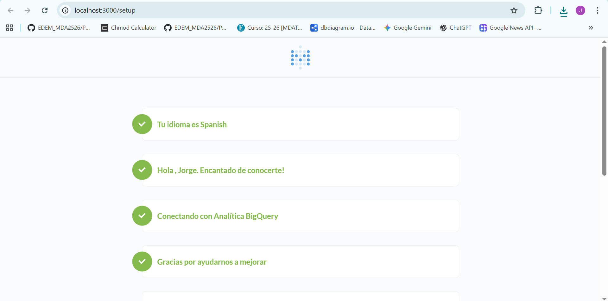

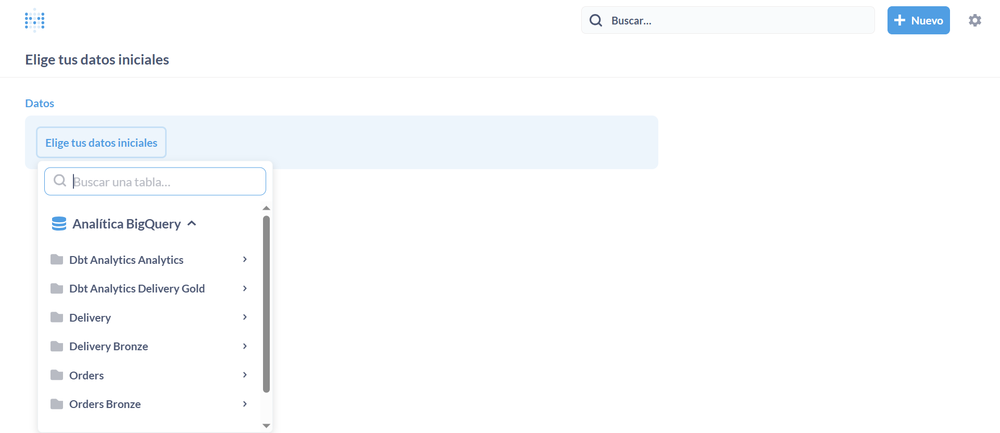