# Documentación de Despliegue: Arquitectura End-to-End E-commerce en Google Cloud (GCP)

Este documento detalla el despliegue técnico de la arquitectura de datos **End-to-End** sobre Google Cloud Platform (GCP). El proyecto simula el ciclo de vida completo de los datos de un E-commerce, desde la generación transaccional de un pedido hasta su visualización en un dashboard.

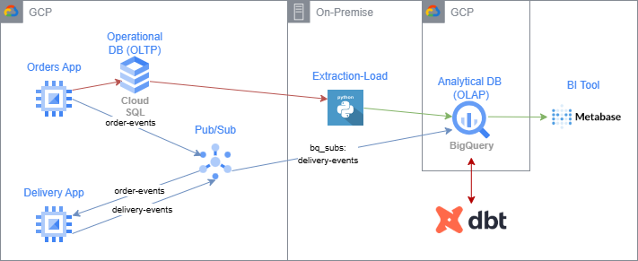
---

## 1. Fase I: Infraestructura como Código (Terraform)

Para garantizar la replicabilidad y automatización del entorno, se utilizó **Terraform**. Esto permite desplegar, modificar y destruir la infraestructura mediante código, evitando errores manuales.

### 1.1. Gestión del Estado

Se crea un bucket en Google Cloud Storage (GCS) para almacenar el estado de Terraform, asegurando la consistencia del despliegue.

```bash
gcloud storage buckets create gs://edem-terraform-state-marina \
  --location=europe-west1 \
  --uniform-bucket-level-access
```

Resultado en la UI: 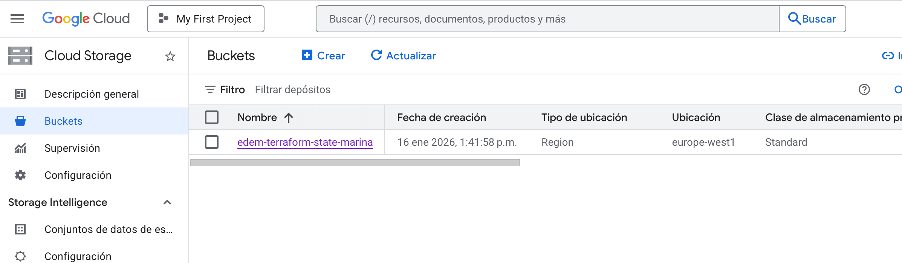

### 1.2. Seguridad y Service Accounts

Antes del despliegue, se configura una **Service Account** con los permisos necesarios para que las instancias de Compute Engine interactúen con otros servicios (Pub/Sub, GCS, BigQuery).

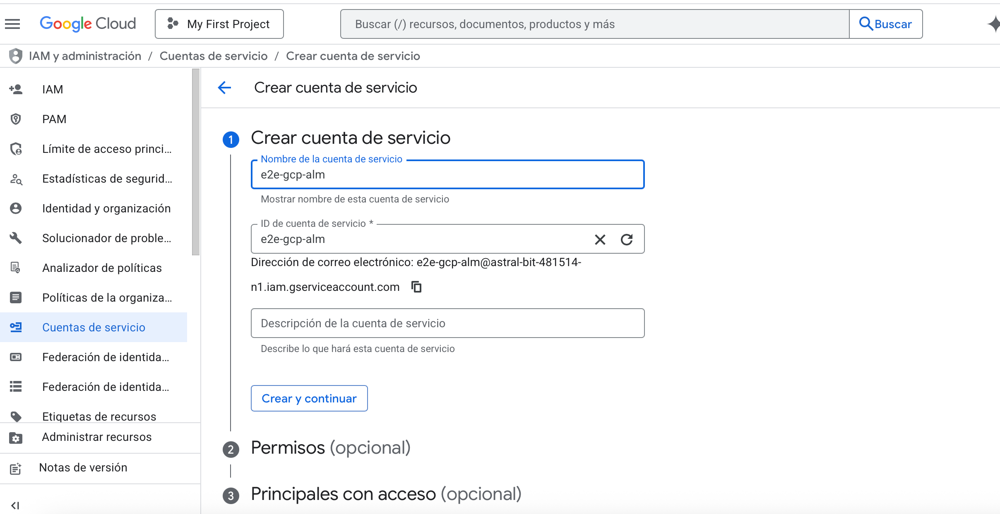
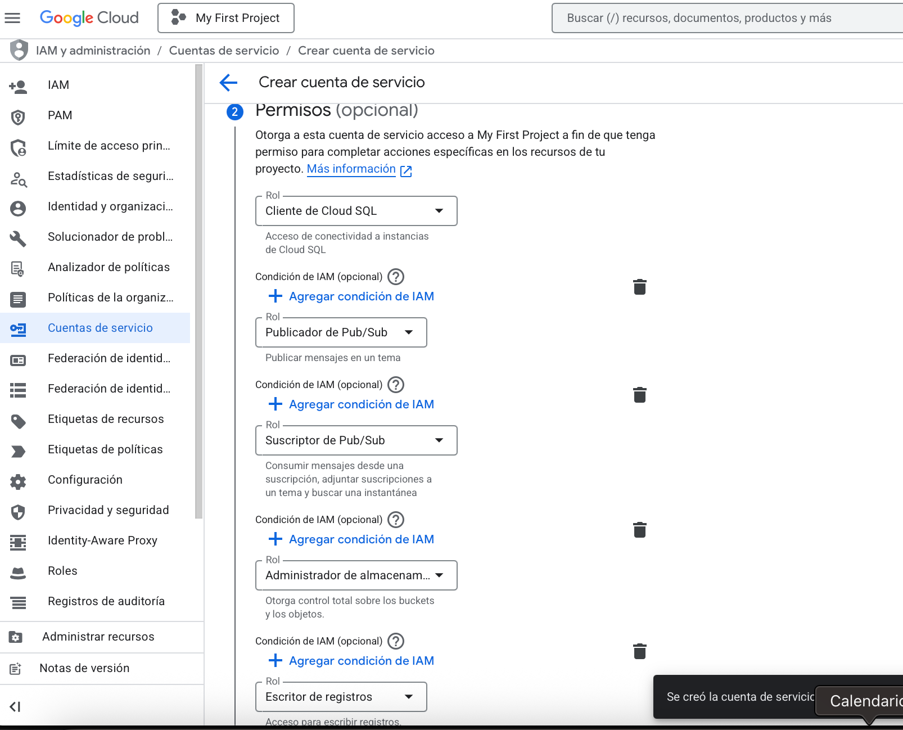

 **Nota de Seguridad:** Las credenciales de la Service Account se referencian localmente en el archivo `terraform.tfvars` para no exponer claves sensibles en el repositorio de código.

### 1.3. Despliegue de Recursos

Tras ejecutar `terraform init`, `plan` y `apply`, se provisionan los siguientes recursos:

1. **Máquinas virtuales (Compute Engine):**
* `orders-app`: Servidor de aplicación de ventas.
* `delivery-app`: Servidor de logística y envíos.

Resultado en la UI: 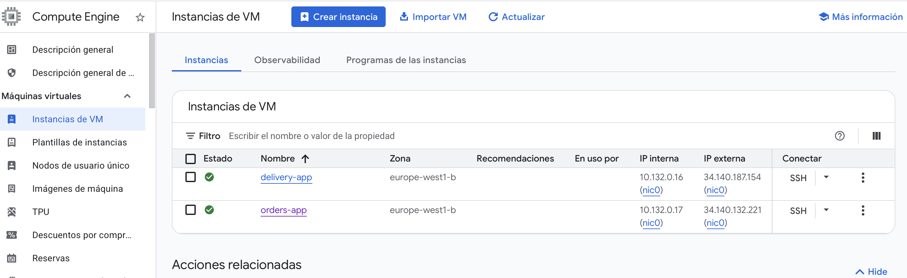


2. **Capa de Mensajería (Pub/Sub):**
* `order-events`: Topic para notificar nuevos pedidos.
* `delivery-events`: Topic para notificar cambios de estado en envíos.

topics: 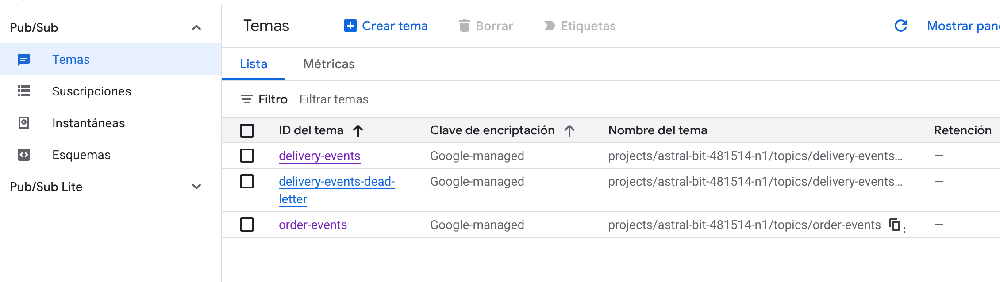
suscripciones: 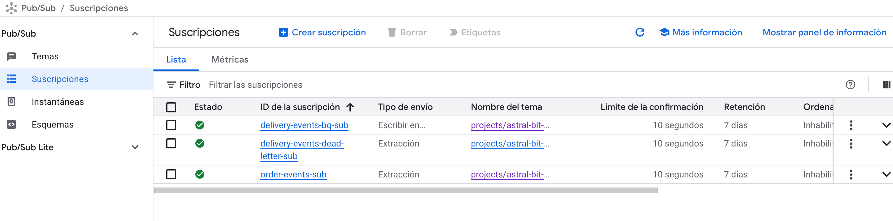

3. **Capa de Datos Operacional (Cloud SQL):**
* Instancia PostgreSQL (`e2e`) optimizada para transacciones (OLTP).
* Base de datos: `ecommerce`.
* Crea usuario postgres con la contraseña Edem2526.

Resultado en la UI: 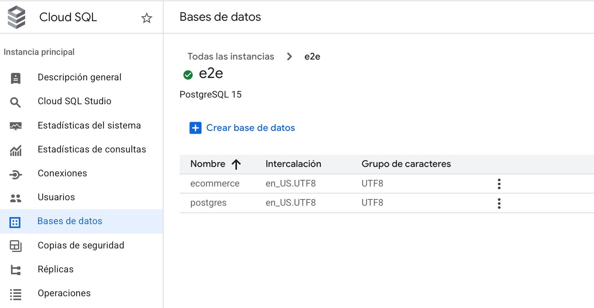

4. **Capa de Datos Analítica (BigQuery):**
* Datasets creados: `orders_bronze` y `delivery_bronze`.
* Tablas vacías preparadas para la ingesta.
* **Suscripción BigQuery:** Se configura un "sink" automático (`delivery_events_bq_sub`) que vuelca los mensajes de Pub/Sub directamente a la tabla `raw_events_delivery`.

Resultado en la UI: 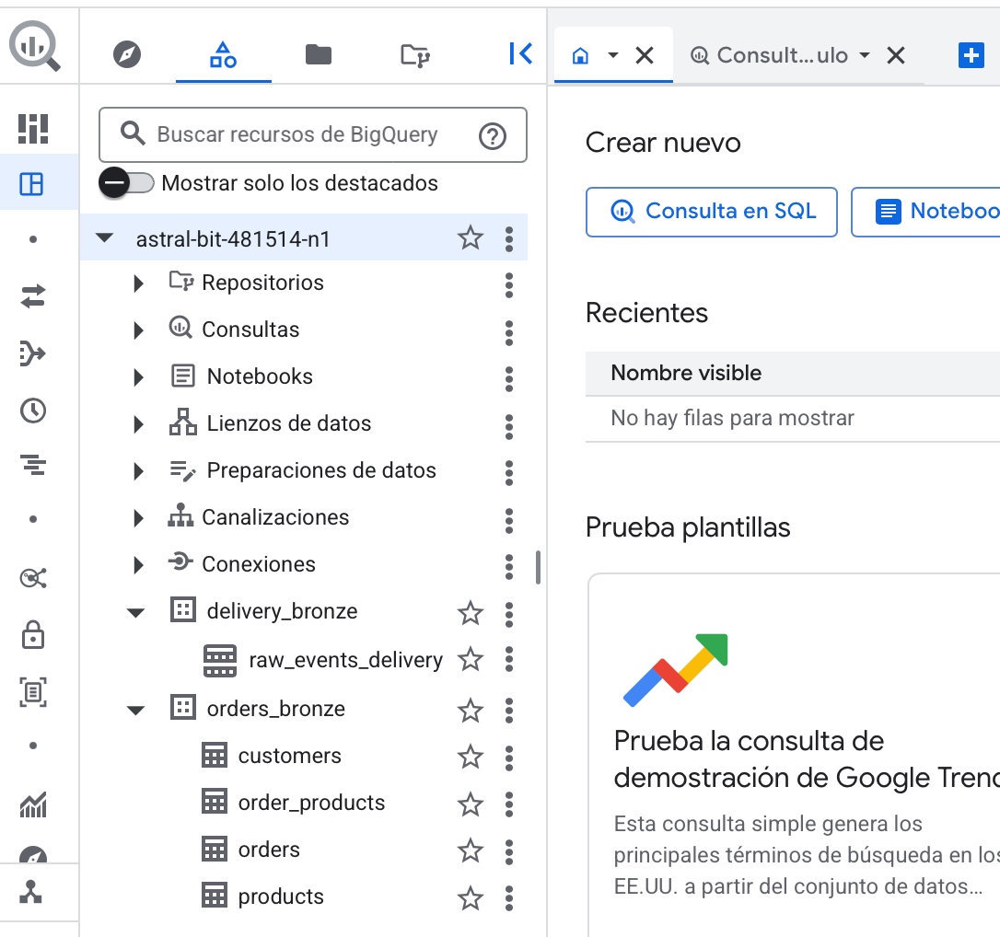

---

## 2. Fase II: Configuración de la Capa Operacional

Configuración de las aplicaciones y la base de datos transaccional para simular la actividad del negocio.

### 2.1. Inicialización del Esquema de Base de Datos

Se conecta a la instancia de Cloud SQL para definir la estructura relacional. Se crean las tablas: `customers`, `products`, `orders` y `order_products` con sus respectivas claves e integridad referencial.

```sql
-- Ejemplo utilizado
CREATE TABLE IF NOT EXISTS orders (
    id SERIAL PRIMARY KEY,
    customer_id INT NOT NULL,
    created_at TIMESTAMP NOT NULL,
    total_price DECIMAL(10, 2) NOT NULL,
    FOREIGN KEY (customer_id) REFERENCES customers(id) ON DELETE CASCADE
);

```
Resultado en la UI:
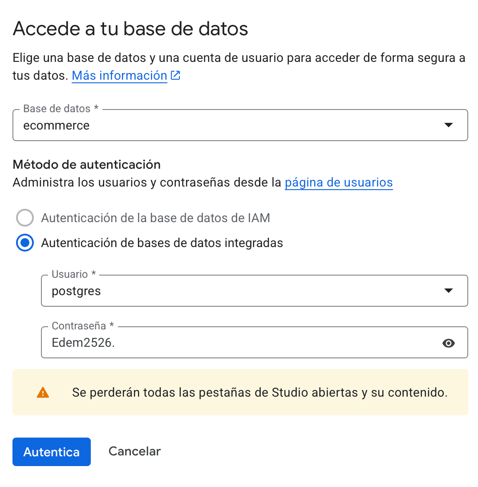
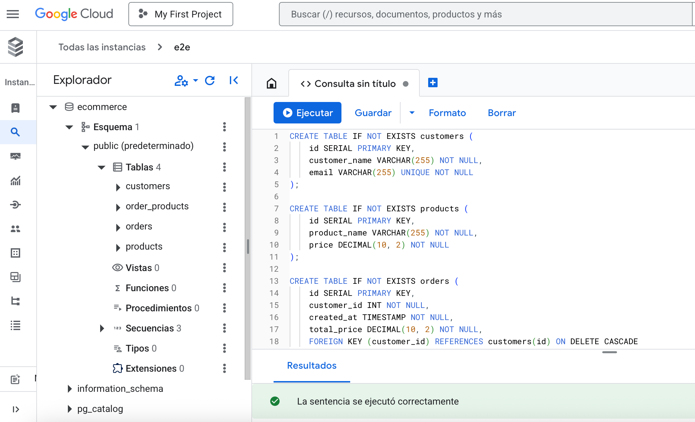

### 2.2. Despliegue de Aplicaciones (Apps)

Se configuran los entornos virtuales (Python venv) y dependencias en ambas máquinas virtuales.

* **Orders App:** Se ejecuta el script generador de pedidos, enviando datos a Cloud SQL y notificaciones a Pub/Sub.
* **Delivery App:** Se inicia el consumidor que escucha `order-events` y genera eventos logísticos.

*Evidencia de Flujo de Datos:*

Resultado en la UI de order-events: 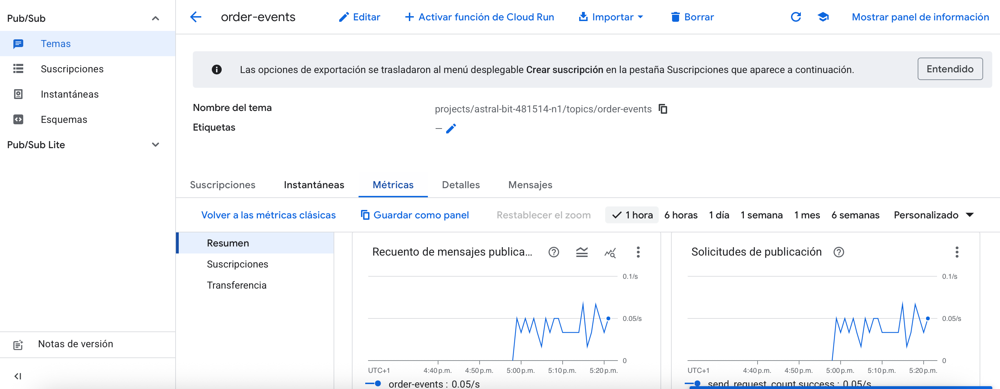
Resultado en la UI de delivery-events: 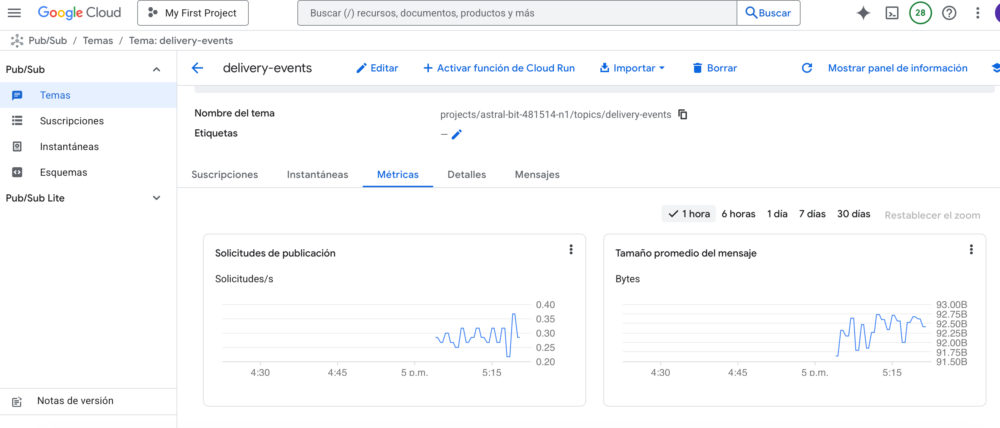
Resultado en la UI de BigQuery: 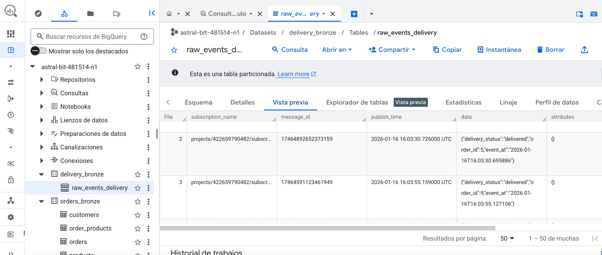
Resultado en la UI de CloudSQL: 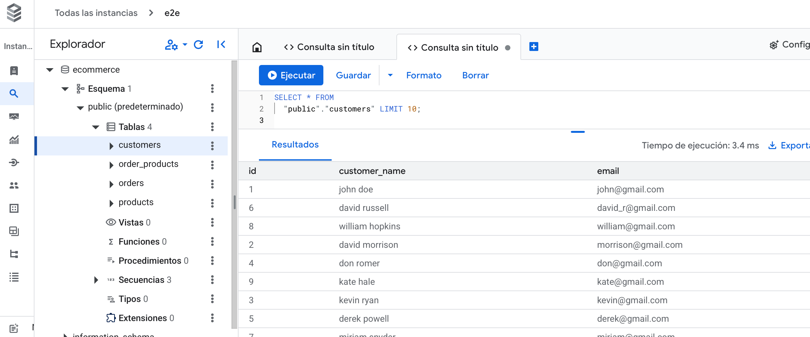 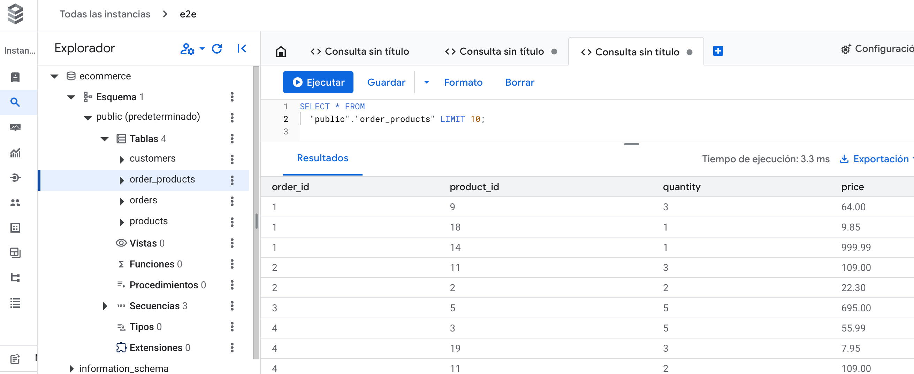 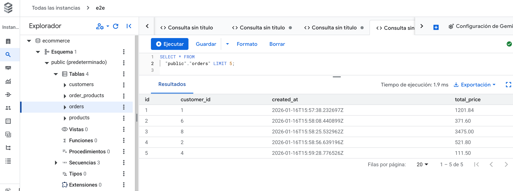

---

## 3. Fase III: Estrategia de Ingesta (Extract & Load)

Se implementa una estrategia de movimiento de datos hacia el Data Lake (BigQuery - Capa Bronze):

1. **Ingesta Streaming:** Los eventos de logística (`delivery-events`) se ingieren en tiempo real vía suscripción de BigQuery.
2. **Ingesta Batch (EL):** Se ejecuta un proceso ETL en Python para replicar el estado actual de la base de datos PostgreSQL hacia BigQuery.

* **Resultado:** Tienes todos los datos históricos y de eventos guardados en la nube (`orders_bronze` y `delivery_bronze`).

Se crea una tabla externa en BigQuery para acceder al contenido.

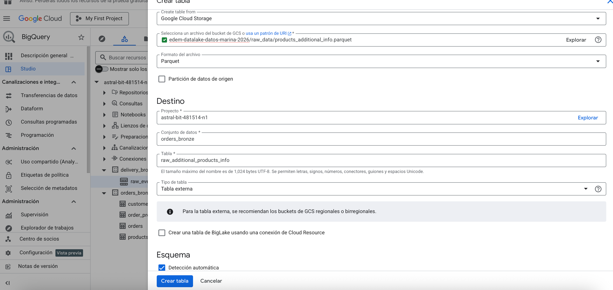

El siguiente paso consiste en sincronizar esos datos, cogerlos de PostgreSQL y copiarlos a BigQuery para poder analizarlos.

**Ejecución del Pipeline EL:**
Desde la máquina `orders-app`, se lanza el script de replicación, lo mismo para `delivery-app` pero no incluye el bucket :

```bash
 nohup bash -c 'HOST_IP=34.78.159.35 GCS_BUCKET_NAME=edem-datalake-datos-marina-2026 PROJECT_ID=astral-bit-481514-n1 python -m orders_app.orders_to_db.main' > output.log 2>&1 &

```

**Resultado:** Los datos transaccionales ahora residen en la capa **Bronze** de BigQuery, listos para ser transformados.
Existen:
- Datos en tiempo real (delivery-events).
- Datos históricos cargados (orders, customers, etc.).
- Datos externos conectados (raw_additional_products_info).

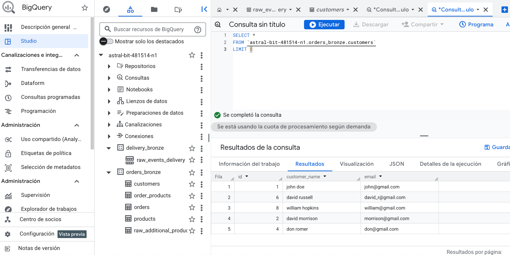

Ya no estan las tablas vacias, es decir, ya hay datos en BigQuery.

---

## 4. Fase IV: Transformación y Modelado con dbt

Los datos crudos son difíciles de entender. Una vez cargados los datos crudos en BigQuery usamos **dbt** para limpiarlos y enriquecerlos.

### 4.1. Configuración del Proyecto

* Inicialización del proyecto `edem_project`.
* Configuración de perfiles (`profiles.yml`) apuntando a BigQuery (`europe-west1`).
* Importación de modelos base y macros.

### 4.2. Capas de Transformación y Datasets

Se definieron modelos SQL modulares organizados por capas. Dbt creó automáticamente los datasets con prefijos personalizados (`dbt_marina_...`) separando las áreas de Analytics, Delivery y Orders.


1. **Capa Gold (Enriquecimiento):**
* Modelo: `expanded_delivery_events` (Vista).
* **Lógica:** Cruce de eventos crudos para reconstruir la traza completa del envío.
* **Materialización:** *View*, para garantizar datos en tiempo real sin latencia de almacenamiento.

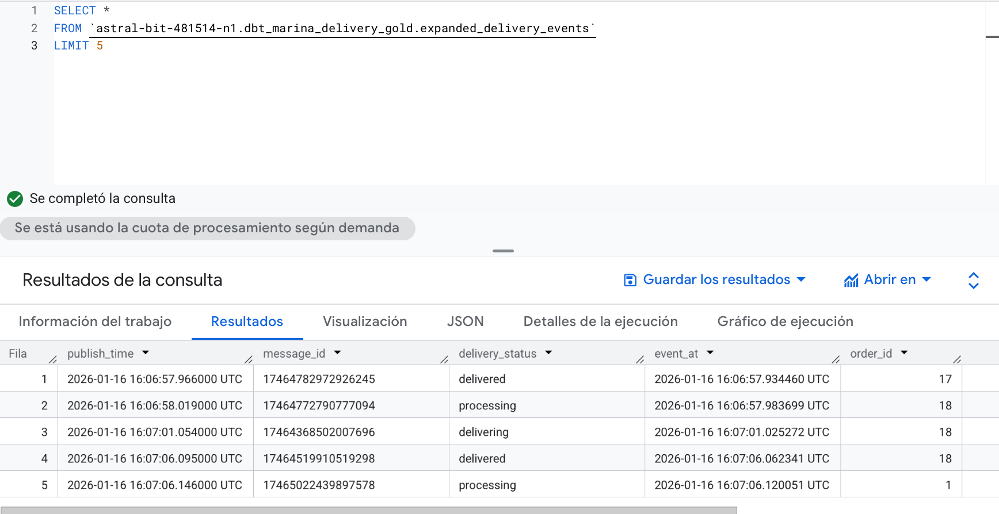

2. **Capa Analytics (Agregación de Negocio):**
* 2.1 Modelo: `top_5_product_expenses` (Tabla).
* **Lógica:** Cálculo de ingresos totales por producto.
* **Materialización:** *Table*, optimizando el rendimiento de lectura para los dashboards.

* 2.2 Modelo: `orders_per_customer` (Tabla).
* **Lógica:** Cantidad de pedidos por cliente.

Esto se ejecuta con el siguiente comando y se muestra el resultado en la imágen.

```bash
dbt run --select analytics

```

Resultado en la UI:
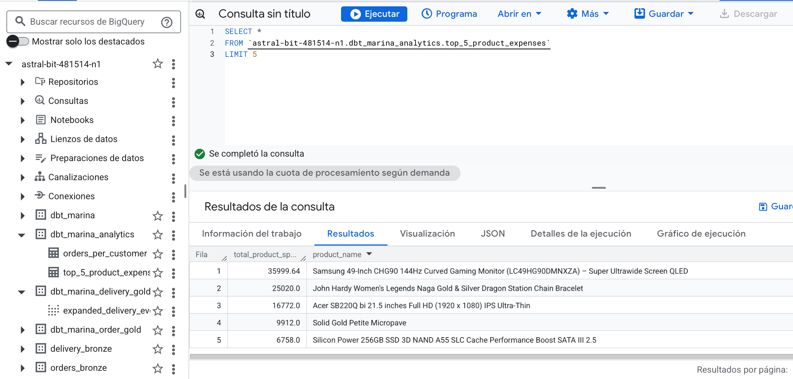

---

## 5. Fase V: Inteligencia de Negocio (BI) con Metabase

Para la capa de visualización, se desplegó **Metabase** utilizando Docker en local, conectado remotamente a BigQuery.

### 5.1. Despliegue Local

```bash
docker-compose up -d

```

Esto levanta el contenedor de Metabase, permitiendo el desarrollo de dashboards sin costes de infraestructura adicional en la nube.

### 5.2. Dashboard

Se diseñó un cuadro de mando con los siguientes KPIs clave:

1. **Top Ventas (Gráfico de Barras):** Identificación de los "Productos Estrella" (Ej: Monitor Samsung 49").
2. **Evolución Temporal (Gráfico de Línea):** Análisis de tendencias de ventas diarias.
3. **Eficiencia Logística (Gráfico de Pastel):** Distribución porcentual del estado de los envíos (Delivered, Delivering,  Processing).

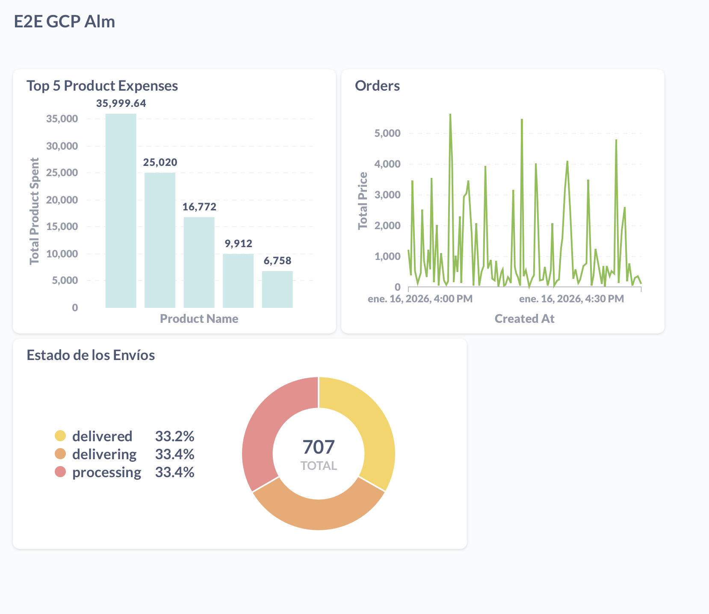 

---

## 6. Conclusiones y Valor Aportado

La implementación de esta arquitectura ha transformado un sistema transaccional básico en una plataforma de datos analítica robusta.

* **Antes:** El análisis de ventas requería consultas pesadas sobre la base de datos de producción (PostgreSQL), poniendo en riesgo el rendimiento de la tienda online.
* **Ahora:** Se dispone de un **Data Warehouse (BigQuery)** dedicado, con datos limpios y transformados automáticamente por **dbt**. Esto permite a los analistas de negocio y directivos tomar decisiones basadas en datos en tiempo real mediante **Metabase**, sin impactar la operativa del negocio.

---

## 7. EXTRA: Gestión de Stock en Tiempo Real (Stock Management)

Como evolución de la arquitectura, se implementó un servicio dedicado al control de inventario (`stock-app`). Este servicio escucha los pedidos en tiempo real, descuenta el inventario y, lo más importante, **genera alertas automáticas** cuando un producto alcanza un nivel crítico de stock, guardando este registro histórico en BigQuery para su análisis.

### 7.1. Ampliación de Infraestructura (Terraform)

Para soportar este nuevo módulo, se actualizó el código de Terraform (`main.tf`) añadiendo componentes de computación, mensajería y almacenamiento.

1. **Computación:**
* **VM `stock-app`:** Nueva instancia en Compute Engine (basada en la imagen estándar del proyecto) encargada de procesar la lógica de inventario.
 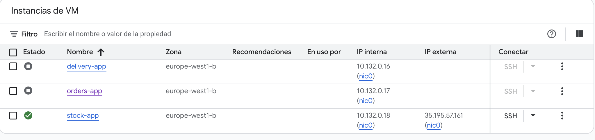

2. **Mensajería (Pub/Sub):**
* **Topic `stock-alerts`:** Canal exclusivo para publicar avisos de "Stock Bajo".
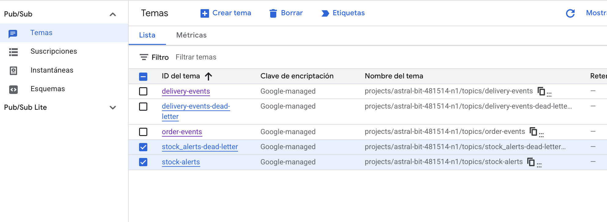
* **Suscripción `stock-sub`:** Conectada al topic existente `order-events`. Esto garantiza que cada vez que hay un pedido, a Stock App le llega una copia.
* **Suscripción de Test:** Se creó una suscripción temporal para validar la llegada de mensajes en tiempo real.
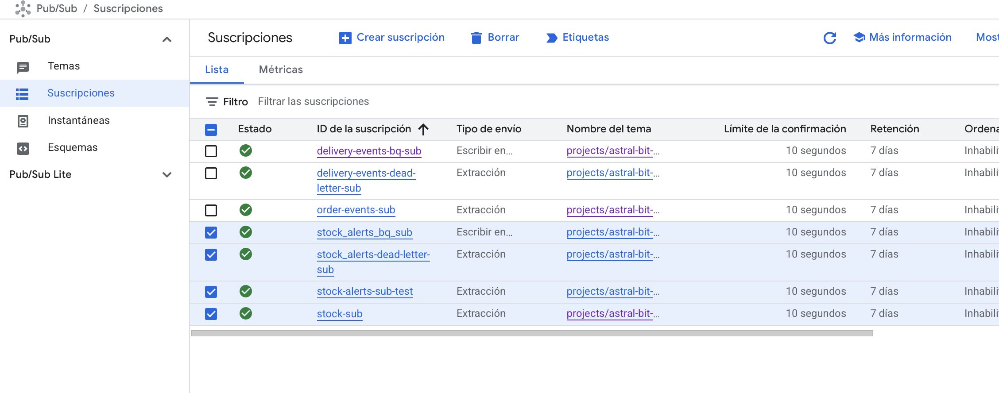

3. **Integración con BigQuery (Data Warehouse):**
* **Dataset y Tabla:** Se aprovisionó un nuevo dataset y una nueva tabla en BigQuery específicamente para recibir las alertas de stock.
* **Suscripción BigQuery:** Una suscripción configurada para escribir directamente los mensajes del topic `stock-alerts` en la tabla de BigQuery.(imagen de topis)
* **Dead Letter Queue (DLQ):** Para garantizar la robustez del sistema, se configuró una cola de mensajes muertos. Si Pub/Sub falla al intentar guardar en BigQuery (tras 5 intentos), el mensaje se desvía a esta cola para no perder datos y permitir su posterior depuración. (imagen de sub)


### 7.2. Lógica de Aplicación y Desarrollo

Se configuró la máquina virtual y se desarrolló la lógica en Python para manejar el estado del inventario.

**A. Configuración del Entorno:**
Se replicó la estructura del proyecto existente para mantener la consistencia en el desarrollo:

```bash
# Conexión y preparación del entorno
gcloud compute ssh stock-app --zone=europe-west1-b
git clone https://github.com/frkroe/gcp-storage.git
cd gcp-storage/gcp_datalake/exercise_end2end   
python3 -m venv .venv
source .venv/bin/activate
pip install -r requirements.txt

# Creación de la app basada en la plantilla de delivery
cp -r delivery_app stock_app

```

Modificamos esa copia para convertirla en la Stock App incluyendo alli lo del script.
   ```sh
   nano stock_app/main.py
   ```

**B. Desarrollo del "Cerebro" (Callback):**
Se modificó el archivo `stock_app/callback.py` para implementar la lógica de negocio:

1. Recibe el pedido.
2. Lee el ID del producto y la cantidad.
3. Resta la cantidad al inventario en memoria.
4. **Condición de Alerta:** Si `Stock < 5`, construye un mensaje JSON de alerta y lo publica en el topic `stock-alerts`.

**C. Enriquecimiento del Emisor (Orders App):**
Para que el sistema de stock funcione, era necesario saber *cuántos* productos se compraban. Se modificó el generador de pedidos en la máquina `orders-app` (`orders_to_db/main.py`) para enriquecer el mensaje y poder restar del stock y generar alertas:

```python
# Modificación en orders_app para incluir detalle de productos
"products": order["products"] 

```

*Esto garantiza que la Stock App reciba el ID del producto y la cantidad exacta solicitada.*

### 7.3. Ejecución y Validación del Flujo End-to-End

El despliegue final consistió en orquestar el productor y el consumidor simultáneamente.

1. **Inicio del Consumidor (Stock App):**
Se pone a la aplicación en modo "escucha" para procesar pedidos entrantes.
```bash
python3 -m stock_app.main

```


2. **Inicio del Generador (Orders App):**
Se lanza el script de generación de tráfico de pedidos en segundo plano (`nohup`).
```bash
nohup bash -c 'HOST_IP=34.78.159.35 ... python -m orders_app.orders_to_db.main' > output.log 2>&1 &

```


*Monitorización:* Mediante `tail -f output.log` verificamos que los pedidos salen con la nueva estructura de datos.

### 7.4. Resultados y Evidencias

El sistema demostró funcionar correctamente en todas sus capas:

* **Detección de Alertas:** La suscripción de test capturó los mensajes generados cuando el stock bajó del umbral.
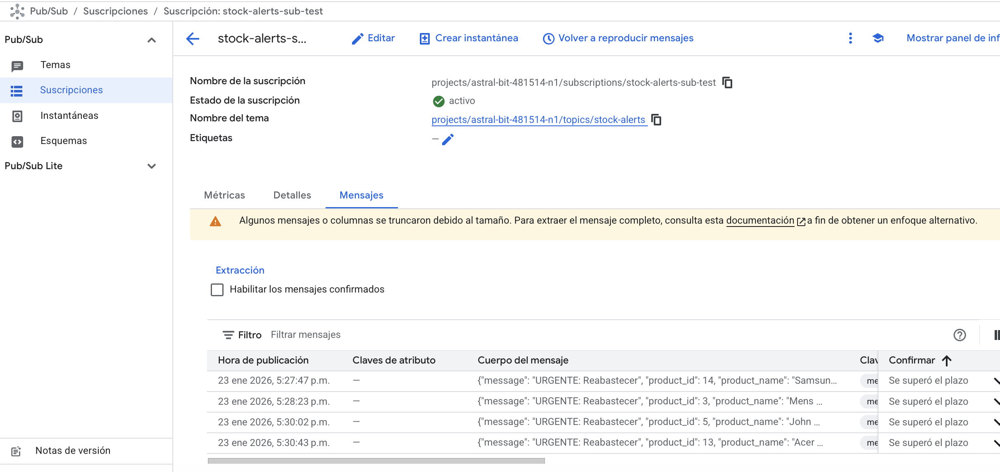

* **Persistencia en BigQuery:** Las alertas viajaron desde la aplicación, pasaron por Pub/Sub y se insertaron automáticamente en la tabla de BigQuery, quedando listas para auditoría o visualización en dashboards.
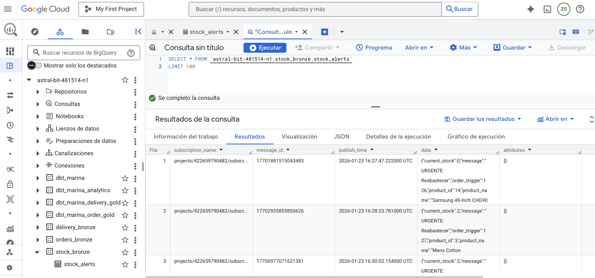

---

## 8. Próximos Pasos y Visualización

Con los datos de alertas ya persistidos en BigQuery, hay posibles mejoras:

1. **Transformación (dbt):** Limpieza de la tabla de alertas y transformaciones para un mejor procesamiento de los datos.
2. **Visualización (Metabase):** Levantamiento del servicio (`docker-compose up -d`) para añadir un nuevo gráfico al dashboard

---

## 9. Conclusiones y Valor Aportado

La implementación de esta arquitectura ha transformado el análisis de ventas en donde no existía visibilidad sobre el inventario, para evitar roturas de stock.

* Ahora, disponemos de un **Data Warehouse (BigQuery)** y un sistema de alertas para evitar estas roturas de stock.
* Se pueden hacer representaciones graficas para su analisis y mejor comprension. 
* La inclusión del sistema de Stock no interrumpió ni modificó el funcionamiento del sistema de Envíos.
