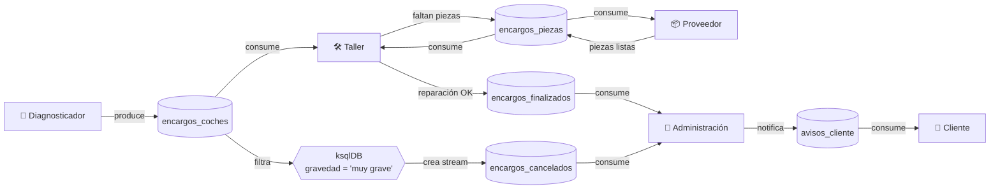

# Taller de coches — Descripción del proyecto

Pequeño sistema basado en Kafka para simular el flujo de trabajo en un taller de coches.  
Componentes y responsabilidades principales:

## Flujo funcional
1. El diagnosticador analiza el coche y genera un encargo con la avería detectada.
2. Si la avería es irreparable, el diagnosticador avisa a administración y administración notifica al cliente.
3. Si la avería es reparable, el taller la recibe:
   - Si dispone de las piezas, repara el coche y notifica a administración que el coche está listo.
   - Si no dispone de las piezas, solicita las piezas al proveedor. Cuando el proveedor confirma envío, el taller recibe la notificación y reanuda la reparación.

## Servicios (consumers / producers)
- **Cliente**: consumer que recibe notificaciones (avisos_cliente) cuando el coche está listo.
- **Diagnosticador**: producer que crea encargos de reparación (encargos_coches) y notifica a administración si no es posible reparar.
- **Taller**: consumer/producer.  
  - Consume encargos_coches.  
  - Produce encargos_piezas cuando falta material.  
  - Consume encargos_piezas cuando llegan piezas.  
  - Produce encargos_finalizados cuando termina una reparación.
- **Proveedor**: consumer/producer que recibe encargos_piezas y, una vez preparadas, notifica al taller.
- **Administración**: consumer/producer que recibe encargos_finalizados y notifica a los clientes (avisos_cliente).

## Topics propuestos
- `encargos_coches` (input inicial — produce diagnosticador, consume taller)
- `encargos_piezas` (taller ↔ proveedor)
- `encargos_finalizados` (taller → administración y filtro ksql para los cancelados)
- `avisos_cliente` (administración → cliente)
- `encargos_cancelados` (opcional — filtrado para averías no reparables)

## ksqlDB (filtro/stream)
Se propone usar ksqlDB para crear streams y filtrar casos. Flujo con ksqlDB:
1. Definir stream raw sobre `encargos_coches`.
2. Crear un stream filtrado (nuevo topic) con los encargos que cumplan una condición (p. ej. `gravedad = 'muy grave'` o `muy alta`) o para cancelar encargos.

Codigo utilizado (en ksql-cli):
```
CREATE STREAM raw_encargos_coches (
  matricula VARCHAR,
  codigo_averia INTEGER,
  estado VARCHAR,
  gravedad VARCHAR,
  desc_averia VARCHAR,
  timestamp VARCHAR,
  pieza VARCHAR
) WITH (KAFKA_TOPIC='encargos_coches', VALUE_FORMAT='JSON');

CREATE STREAM encargos_cancelados WITH (KAFKA_TOPIC='encargos_cancelados', VALUE_FORMAT='JSON') AS
  SELECT * FROM raw_encargos_coches
  WHERE gravedad = 'muy grave';
```

## Estructura JSON

- Tipos comunes:
  - Strings: "matricula", "estado", "gravedad", "desc_averia", "timestamp", "pieza"
  - Números: "codigo_averia" (INTEGER)
  - null es permitido para valores ausentes (ej. "pieza": null)
- Ejemplo de JSON:
```
{
  "matricula": "1077 XCY",
  "codigo_averia": 3,
  "gravedad": "muy grave",
  "desc_averia": "una rotura completa de la caja de cambios ⚙️",
  "timestamp": "2025-11-29 14:44:34",
  "pieza": null
}
```
- Descripción:
  - Matricula del coche generada en diagnosticador.py
  - Codigo de la avería 
  - Gravedad de la avería: Si es "muy grave" no se puede reparar
  - Descripción de la avería utilizada en los mensajes informativos
  - Timestamps
  - Pieza : En un principio el json no lleva pieza, tan solo se le añade si falta alguna pieza en taller.py.

## Esquema: 

VISUALIZAR EN GITHUB NAVEGADOR PARA VERLO GRAFICAMENTE


---  
