# GCP-ALMACENAMIENTO

## Infraestructura y Aplicaciones

El despliegue de la infraestructura base se realiza mediante **Terraform**, lo que garantiza un entorno reproducible y gestionado como código. Es indispensable crear previamente y de forma manual un bucket en Google Cloud Storage para almacenar el estado (`tfstate`) de Terraform. Una vez provisionados los recursos, se procede a la configuración de las instancias de Compute Engine siguiendo estrictamente los procedimientos del módulo `gcp_setup`.

Con el entorno configurado y las dependencias instaladas, se ejecutan los scripts de simulación de negocio: `orders-app` (productor de eventos) y `delivery-app` (consumidor y procesador), dando inicio al flujo de datos operacional.

### Orders-app

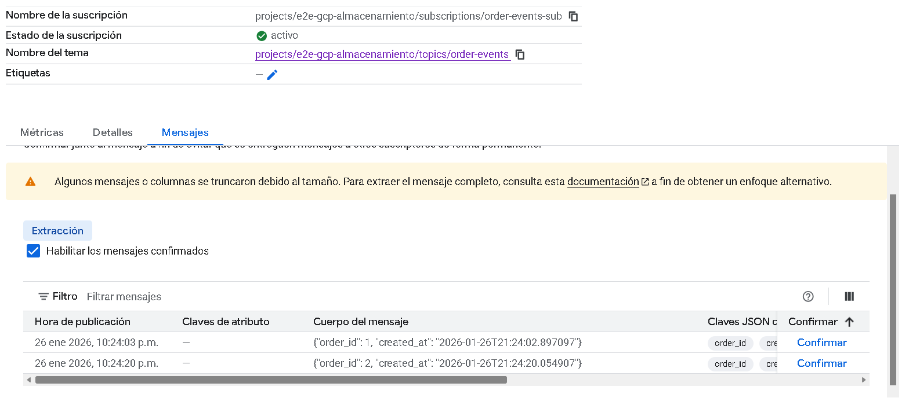

### Delivery-app

## Pub/Sub

Para gestionar la comunicación asíncrona y el desacoplamiento entre servicios, se implementa la arquitectura de mensajería en Google Pub/Sub. Siguiendo las directrices de la clase `gcp_setup`, se despliegan los tópicos y suscriptores necesarios, asegurando que los eventos fluyan correctamente entre las aplicaciones y hacia la capa de almacenamiento.

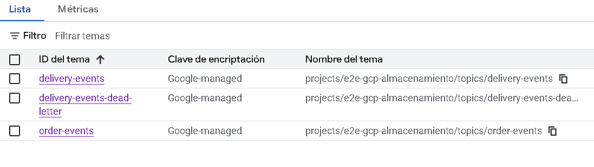

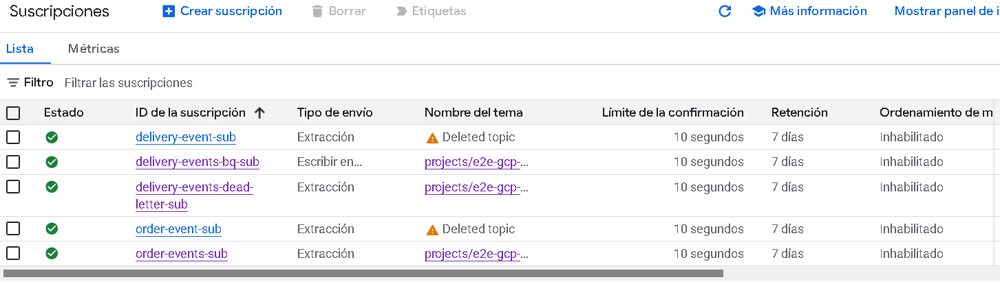

## Cloud SQL

La capa de persistencia transaccional se apoya en una instancia de Cloud SQL desplegada vía Terraform. Una vez la instancia está operativa, se inicializa el esquema de base de datos creando las cuatro tablas relacionales fundamentales para el negocio, basándose en el modelo de datos definido en la clase `gcp_sql`.

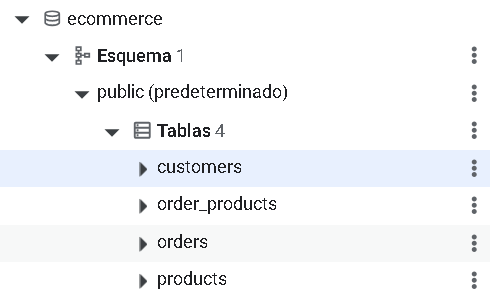

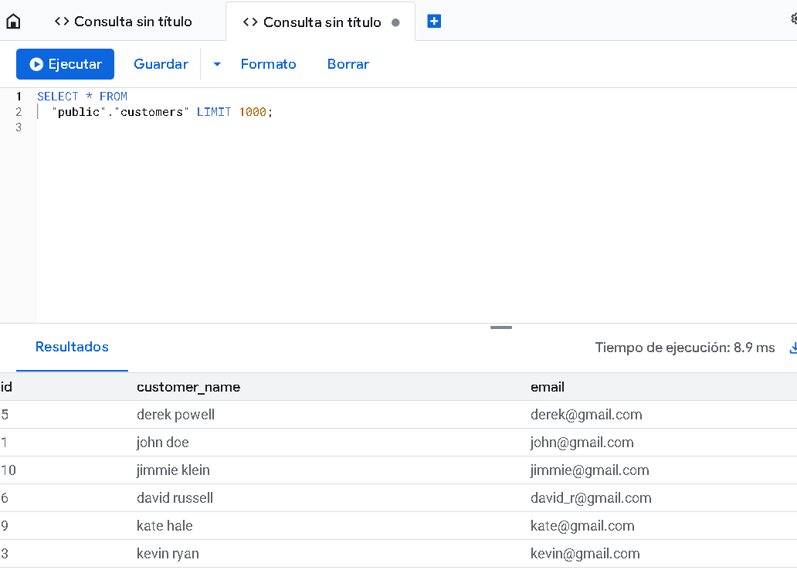

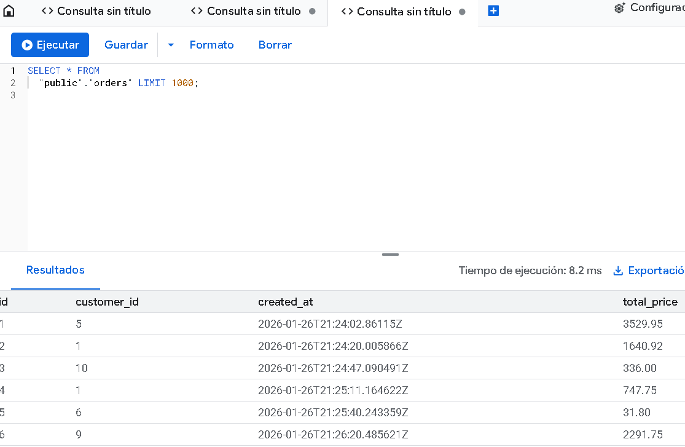

## BigQuery

La integración con el Data Warehouse sigue la metodología de la clase `gcp_datawarehouse`. Tras el despliegue de la infraestructura analítica con Terraform, se crea la tabla `raw_events_delivery` para la ingesta de datos crudos. Se configura la suscripción `delivery-events-bq-sub`, habilitando la escritura directa (streaming insert) desde Pub/Sub hacia BigQuery.

Para garantizar la robustez del sistema y el manejo de fallos, se implementa una estrategia de **Dead Letter Queue**, creando el tópico `delivery-events-dead-letter` y su suscripción asociada `delivery-events-dead-letter-sub` para capturar mensajes no procesables.

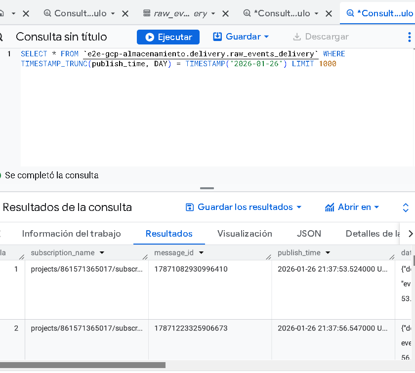

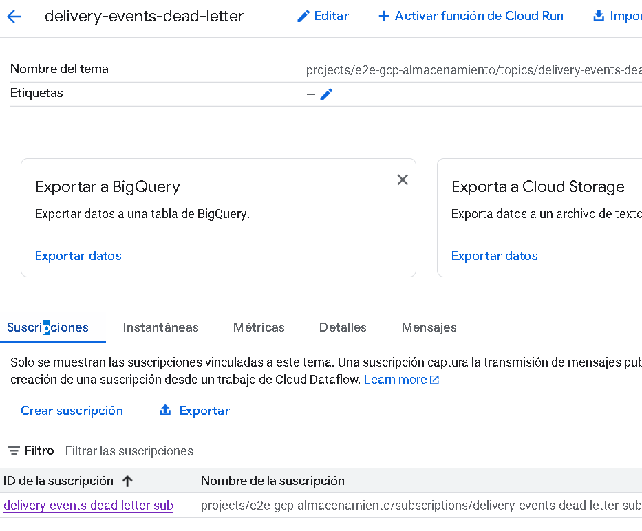

## Data Lake y dbt

El proceso de ingeniería de datos continúa con la ejecución del script de EL (Extract and Load) ubicado en la clase `gcp_datalake`, el cual orquesta la migración de datos desde la capa operacional hacia el entorno analítico. Posteriormente, se configura y ejecuta el pipeline de transformación de datos utilizando **dbt**, corriendo todos los modelos definidos para limpiar, normalizar y estructurar la información para su análisis.

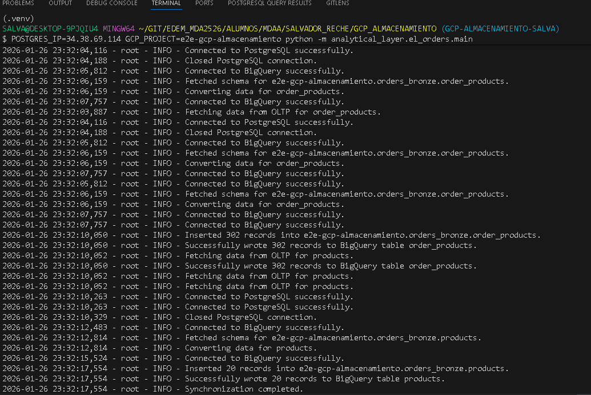

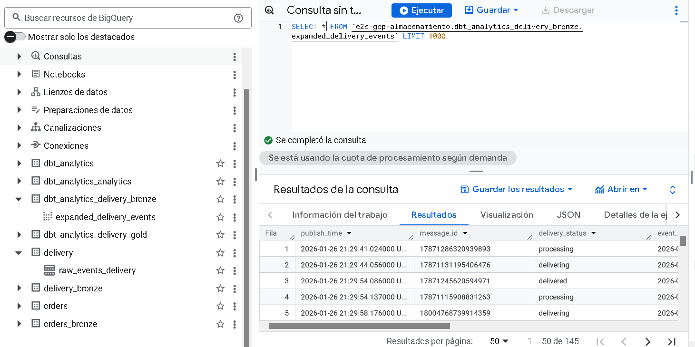

## Visualización con Metabase

La capa de presentación se despliega levantando un contenedor de Metabase en local mediante el archivo `docker_compose` situado en la carpeta `analytical_layer`. Finalmente, se establece la conexión entre Metabase y BigQuery para desarrollar las 'Questions' y construir el dashboard operativo, replicando las visualizaciones enseñadas en la clase `cloud_intro`.

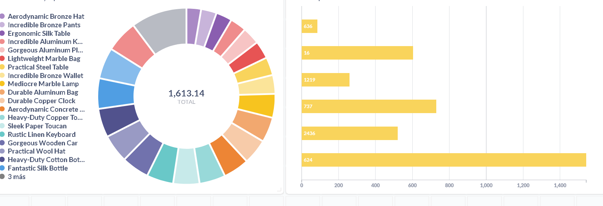