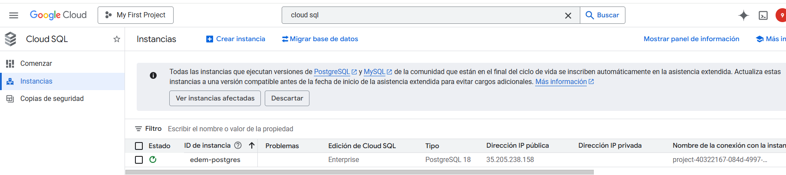
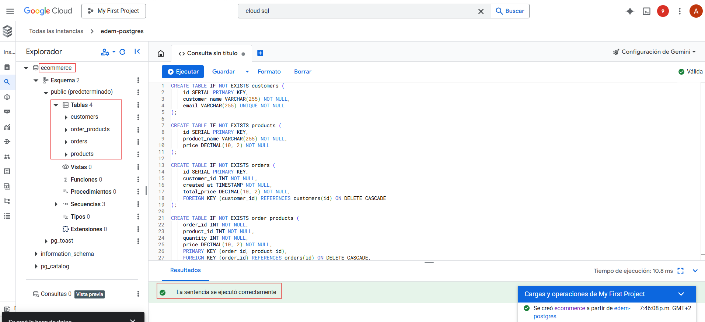
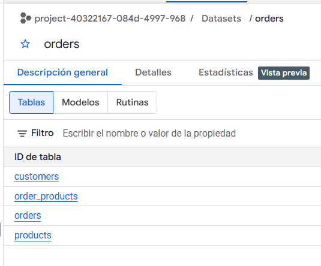
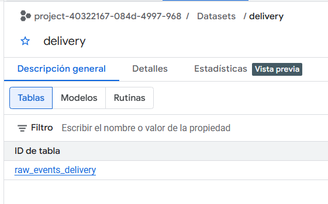
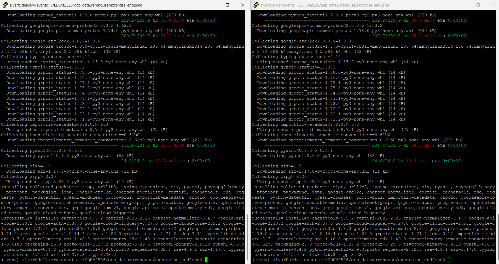
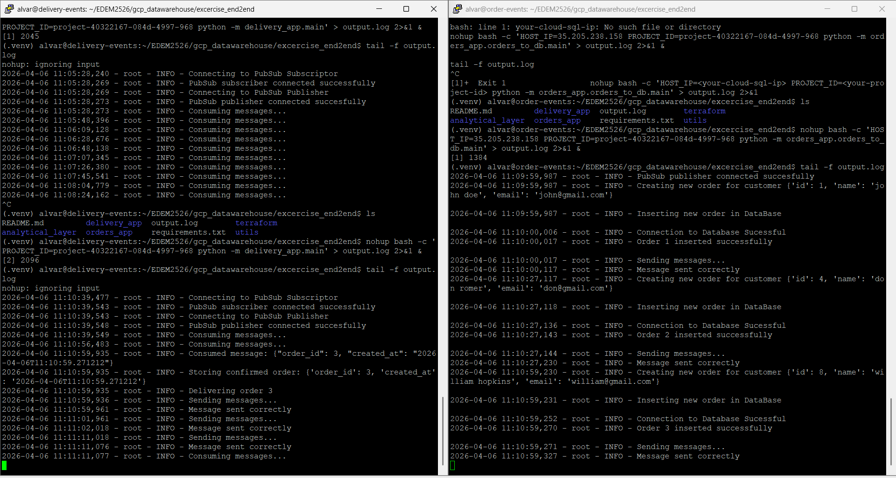
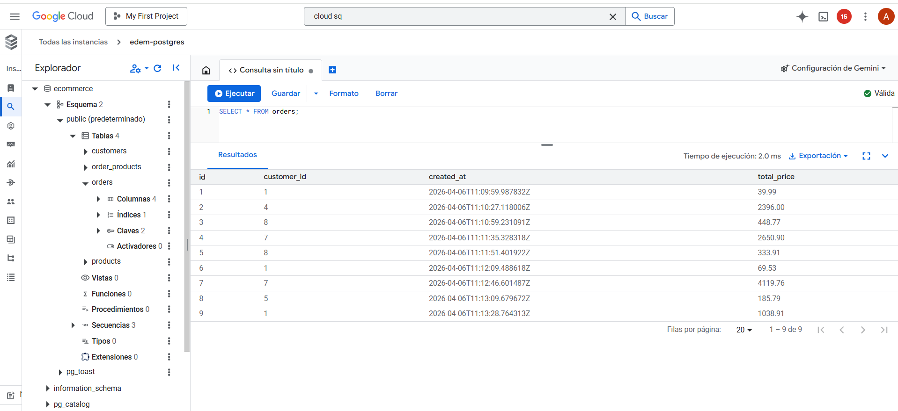
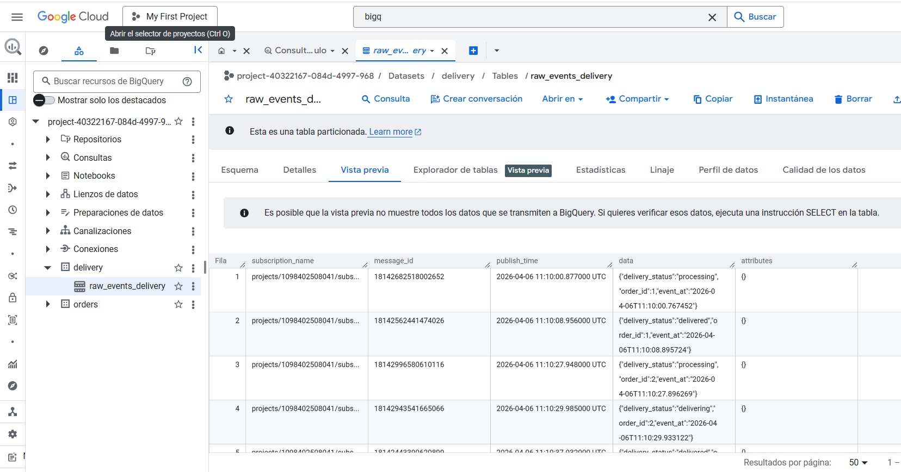
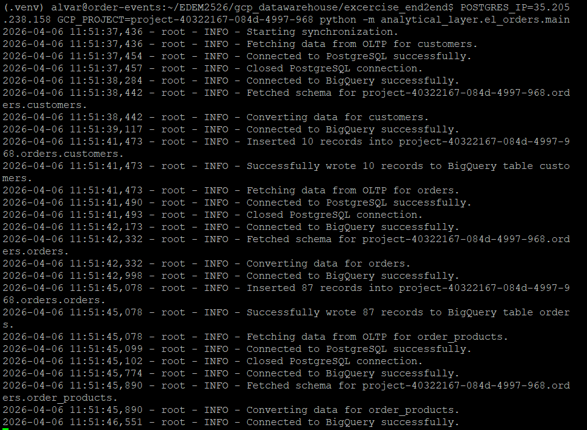

# Entregable GCP Almacenamiento

# Creamos los tópicos de Pub/Sub: 

# Creamos las máquinas virtuales a partir de la imagen base previamente creada

# Creamos la instancia de cloud sql y creamos las tablas

#  Creamos los datasets de Bigquery

# Nos logeamos en las VM e instalamos los requirements

# Ejecutamos orders app y delivery app

# Comprobamos que se insertan los logs en CLOUD SQL y BIGQuery

# Ejecutamos la ETL de cloud SQL -> Bigquery
