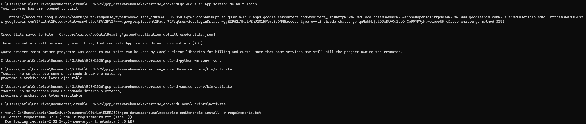

#ENTREGABLE CLOUD

Antes de crear ambas instancias:

Creamos las dos instancias, una para orders-pp y otra para delivery app.

Creamos el dataset

Iniciamos el DBT tras haber sincronizado el PostgresDB database:

Se realiza el DBT run para delivery:

El siguiente paso de DBT run --select analytics para crear las tablas:

Después de esto se hace deploy del docker-compose y más adelante abrimos Metabase

