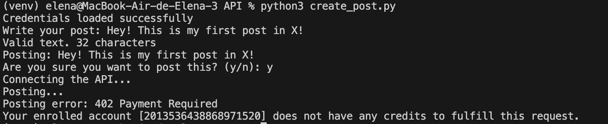

# **X API CHALLENGE: POST PUBLISHER** 
## Project description
Command-line application developed in Python that allows publishing tweets on X (Twitter) using its official API. 

## Technologies used
Language: Python

Libraries: 
- tweepy: Python library to interact with the API
- python-dotenv: reads the .env file
- os: obtains the .env credentials

## Pre-requisites
Before starting, make sure you have installed:

- Python 3.7 or higher: Download Python
- pip: Python package manager (included with Python)
- X Developer Account: You'll need access to the X Developer Portal

## Instalation steps
##### 1. Create a virtual environment (recommended for MacOS)
###### On macOS/Linux
python3 -m venv venv
source venv/bin/activate

##### 2. Install Dependencies (important to already have a requirements.txt file)
pip install -r requirements.txt

## Configuration
###### 1. Obtain X API credentials
###### 2. Go to the X Developer Platform
###### 3. Create a new App
###### 4. Go to the "Keys and Tokens" section
###### 5. Make sure to allow the app to read and write (Configuration)
###### 6. Generate and copy the following credentials into the .env file:
- API Key (Consumer Key)
- API Secret Key (Consumer Key Secret)
- Access Token and Access Token Secret

###### 7. Make sure the .env file is in the .gitignore to avoid disclosing your credentials when uploading your project

## Run the program
###### On macOS/Linux
python3 create_post.py

## Course concepts applied
- **RESTful APIs**: Consuming HTTP endpoints to interact with external services
- **OAuth Authentication**: Implementation of secure authentication flows
- **Environment Variables**: Secure management of credentials and configuration
- **Error Handling**: Try-catch to capture and manage exceptions
- **Third-Party Libraries**: Integration and use of external packages (pip)
- **Best Practices**: Separation of configuration and code, use of .gitignore

## API limitations
#### **Error 402 encountered**
The X API requires a PAID SUBSCRIPTION to publish posts (tweets)

## Known issues and limitations
**1. Error 402 Payment Required**: The API requires a paid subscription to publish tweets
**2. Expired Credentials**: Tokens may expire and need renewal

## Future improvements
With more time and/or resources, I would implement:
- **Tweet Scheduling**: Publish tweets at specific dates/times
- **Image Upload**: Add support for tweets with multimedia
- **Tweet Threads**: Post multiple connected tweets
- **Analytics Dashboard**: Visualize engagement statistics
- **Response Bot**: Automatically reply to mentions
