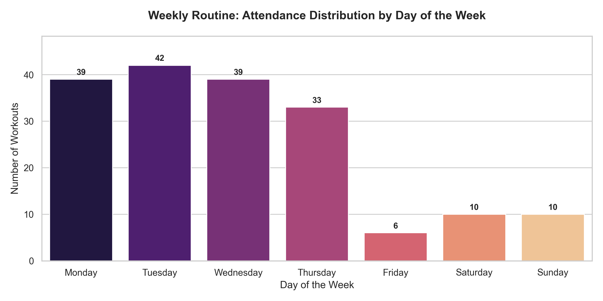
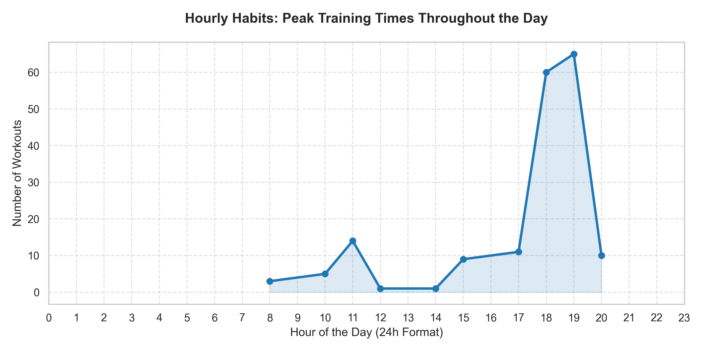
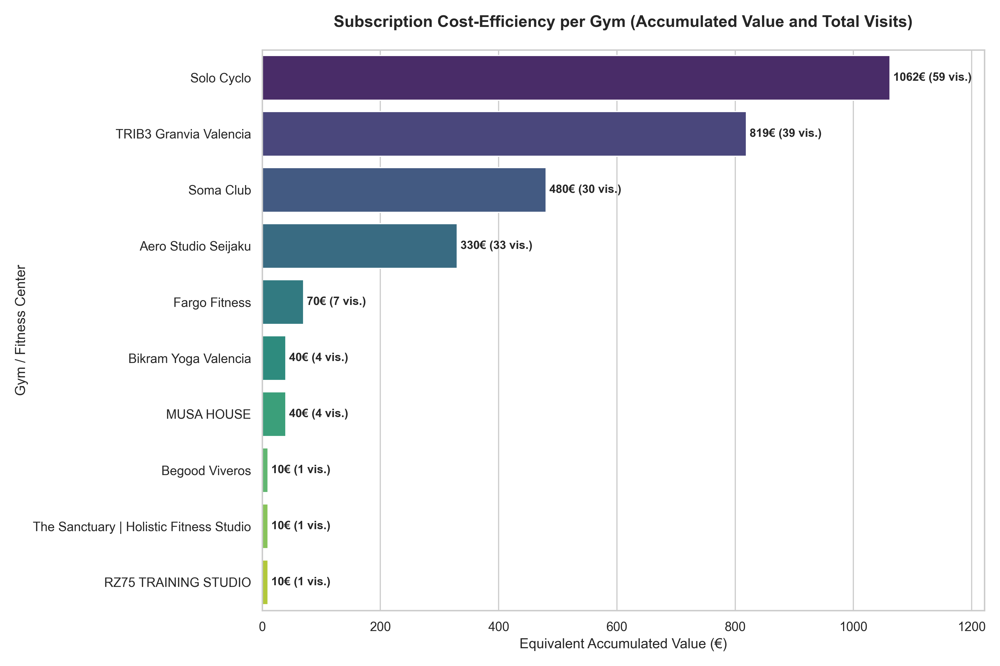
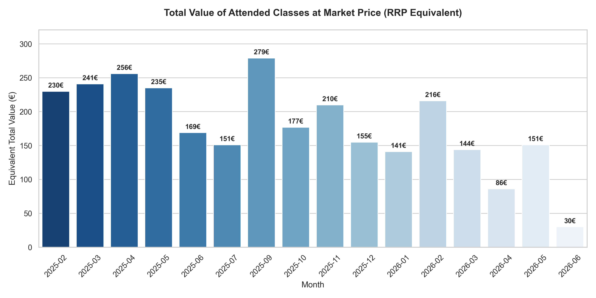

## **WELLHUB TRAININGS ANALYTICS**
An End-to-End Data Engineering project in which I analyze my training history via Wellhub, a corporate subscription app that allows users to attend multiple fitness centers under a single monthly membership.

Considering I hold a Gold Subscription (which started at 59€/month and has now increased to 82€/month), the objective of this project is to build an automated data pipeline to calculate the **true cost-efficiency** of my membership. I want to discover if the market value of the classes I attend surpasses my subscription fee or if I should consider other options.

#### 1. Data source
Wellhub generates a raw .csv file which includes the following schema:
- `date` -> the timestamp in which the checkin or booking is done (in UTC)
- `checkin_booking` -> whether if the row refers to a booking or a checkin (attendance) of a class
- `status` -> the final status of the event (completed/cancelled/no-show/...)
- `partner` -> the name of the gym attended
- `class_type` -> whether if it is on-line or on-site

#### 2. Bucket in S3
I configured a bucket in S3 to save the raw data, that is, the .csv downloaded from my Wellhub account. 

#### 3. Transformation (AWS Glue + Spark)
I developed a data transformation script inside an **AWS Glue Job** using a *Custom Transform* node with **PySpark** to clean and model the data.

- **Key transformations implemented**:
  - **Deduplication:**
    I needed to transform the data because the .csv duplicated it by showing one row for a booking and one for a checkin for the same class. 
      - Implemented solution: filtering it so only the **completed checkins** were the valid ones. 
  
  - **"Precio individual" feature**:
    I checked out the individual fees in my most frequentedly visited gyms, to estimate how much money would have cost me to attend those classes paying for the individual fee, adding therefore a new column to the table called "precio_individual".
    Fees:
      - `SoloCyclo`: 18€
      - `Trib3`: 21€
      - `Soma`: 16€
      - `Others`: 10€
  
  - **Cancellation fee:**
    I had to take into consideration that in october 2025 I was charged because I did not checkin to a class, so the app understood that I did not attend. I was then charged 10€ but the class was labeled as Booked but not "Checkedin".
  
  - **Language and formatting:**
    I translated the column names to Spanish and changed the date to format TIMESTAMP.
  
#### 4. Storage (AWS RDS)
Due to limitations in the AWS Glue Visual UI regarding direct relational database connections, I bypassed the visual sink and wrote native **JDBC spark writer code**. 

The script connects directly to an **Amazon RDS PostgreSQL** database instance, using an `.mode("overwrite")` configuration to ensure the data lake state is perfectly mirrored without appending duplicate entries across pipeline runs.

#### 5. Analysis (VSCode)
I connected **Pandas** to the remote RDS instance to run SQL analytical queries. The core script (`wellhub_analytics.py`) tracks metrics such as:
- subscription value return
- top fitness centers
- booking-to-attendance ratios

Additionally, I generated four key analytical charts using **Matplotlib** and **Seaborn**:

**Behavioural Insights**
- **Weekly routine**: A chart that showcases my most active days of the week: 

- **Hourly habits**: Peak training time frames throughout the day to visualize my preference between morning or evening trainings:
  

This last graph turned out to be a challenge because when I saw it I noticed that something was wrong. I have never been to the gym at 6 AM! Then I realized that having the TIMESTAMP data in UTC was the reason why the hours did not reflect my real habits. Just a quick change to Europe/Madrid fixed the problem!

**Price efficiency Insights**
- **Cumulative return per gym**: A horizontal breakdown showing the accumulated financial value and physical visits per gym. This highlights which specific centers drive the highest return on investment. 

- **Monthly Market Value**: A month-by-month tracking of what my training routine would have cost at standard retail price. **This chart clearly benchmarks whether my monthly training value exceeds the 82€ flat-rate subscription fee**.

#### 6. Key conclusions & Business Insights
Based on the automated data pipeline and the generated charts, here is the data-driven verdict regarding my Wellhub Gold Subscription efficiency and training habits:

**Financial Verdict: Is it worth it?**
* **Massive Return on Investment (ROI):** The data proves that the subscription is **highly cost-effective**. While my flat-rate fee has risen from 59€ to 82€/month, the monthly market value of the classes I attend consistently surpasses **150€ to 250€ per month**. 
* **The "Solo Cyclo" & "TRIB3" Impact:** These two premium centers alone drive most of my subscription value. Attending 59 sessions at *Solo Cyclo* (at an 18€ market rate) and my *TRIB3* sessions means that in almost any given month, **going to just 4 or 5 of these classes completely covers my 82€ membership cost**. Everything else I do is technically free.
* **Decision:** **Keep the subscription.** The data clearly advises against cancelling it or switching to individual drop-in fees, as my current training volume would be financially unsustainable without Wellhub.

**Routine & Behavioral Discoveries**
* **Weekly Optimization:** The *Attendance by Day* chart revealed exactly how my routine is structured. Due to scheduling constraints, I tend to concentrate my workouts heavily during the weekdays, as my evenings are job-free, while during weekends I am in class or spending time with family and friends, which does not leave me enough time to head to the gym. 

* **Hourly Preferences:** Thanks to the PostgreSQL timezone correction (`UTC` to `Europe/Madrid`), the line chart accurately maps my lifestyle. It highlights a clear peak at 17:30 and 18:30, proving I prefer late-afternoon post-work sessions over early-morning workouts.
  
* **Booking vs Attendance Efficiency:** My *Assistance Ratio* shows a highly disciplined pattern. Booking cancellations are minimal, meaning I rarely waste reservation slots or incur late fees, except for the single outlier tracking anomaly in November 2025.