# Entregable Arquitectura end2end GCP Almacenamiento

### Paso 1: Creación de la imagen
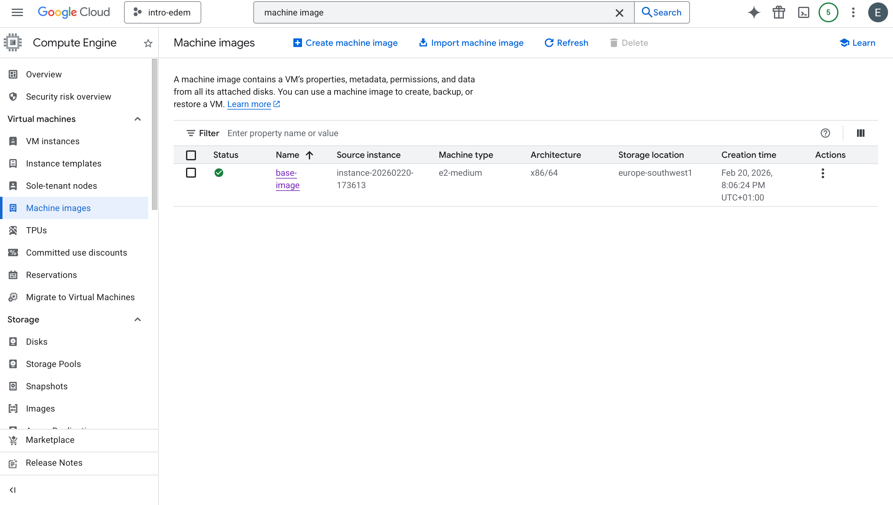

### Paso 2: Creación de las instancias a partir de la imagen
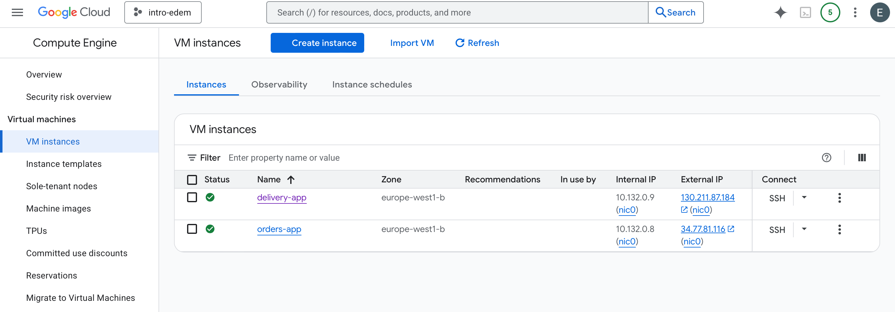

### Paso 3: Pub-Sub Topics
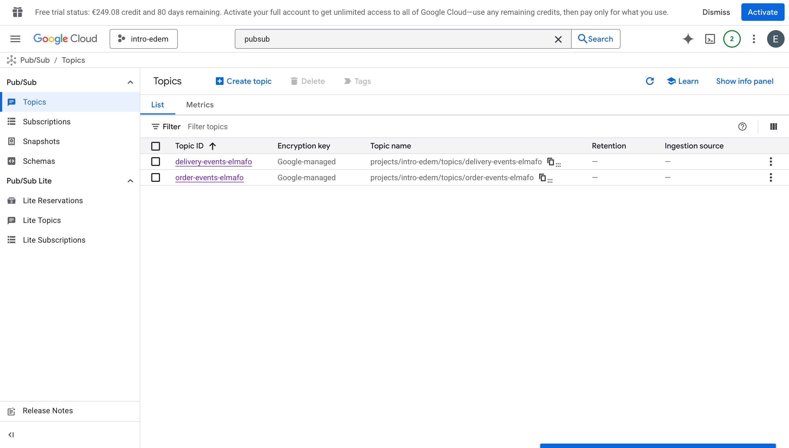

### Paso 4: SQL 
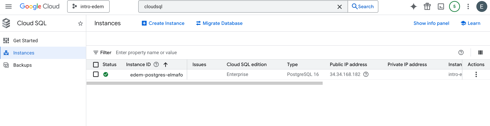
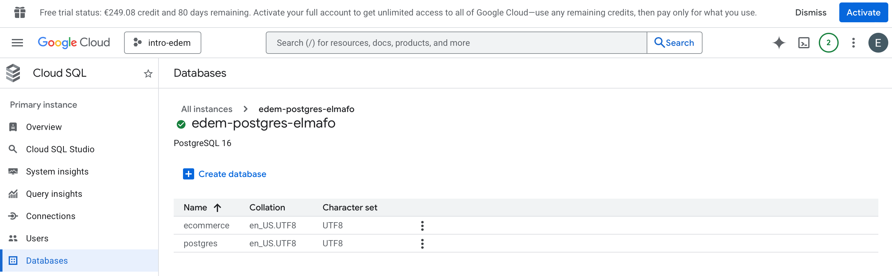

### Paso 5: Creación de pedidos en orders-app 
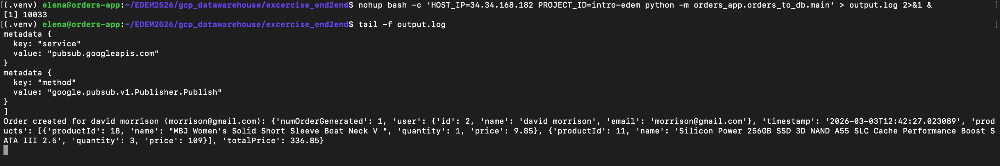

### Paso 6: Consumo de pedidos del tópico order-events-elmafo y publicación en el tópico delivery-events-elmafo
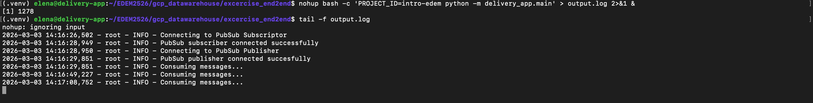

### Paso 7: BigQuery
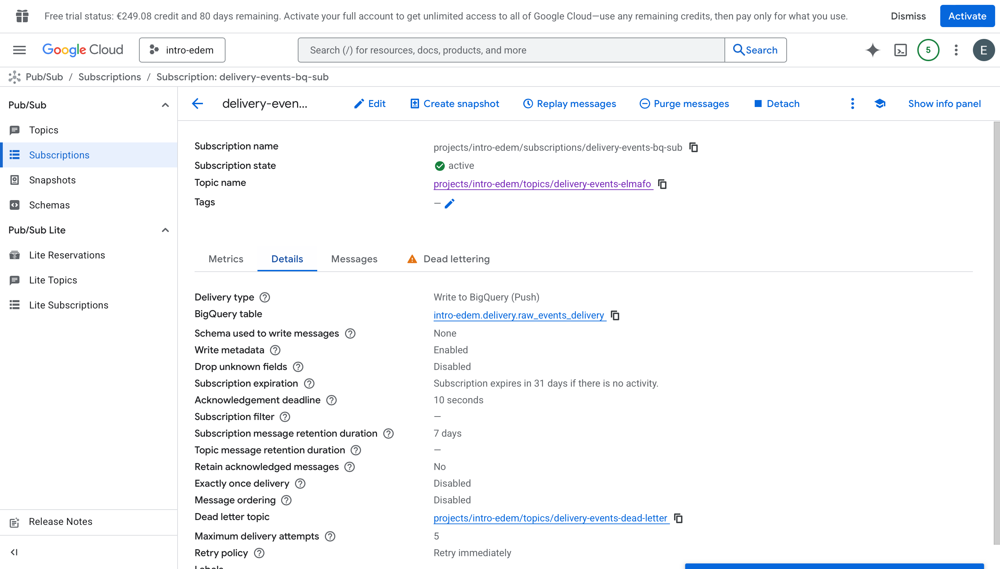

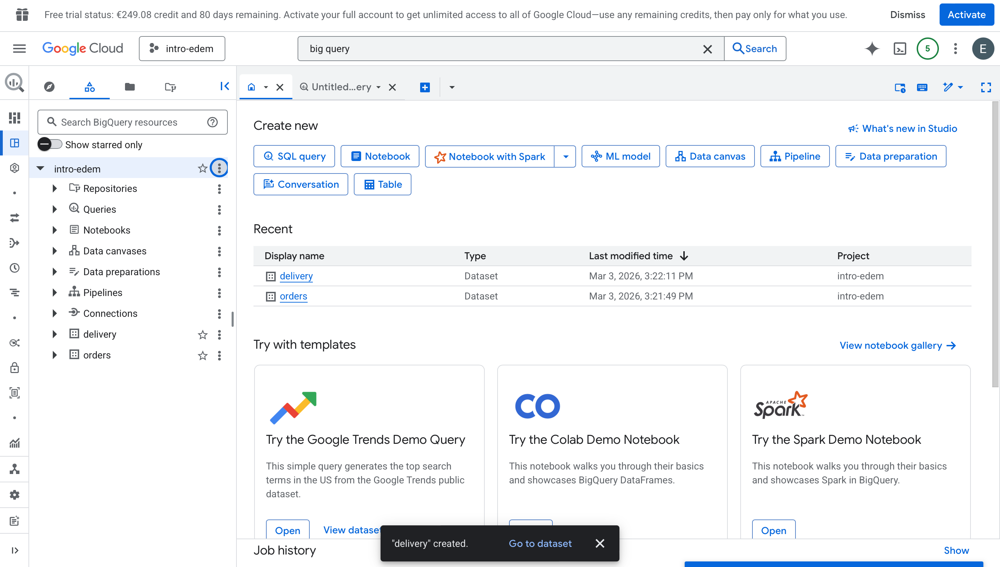

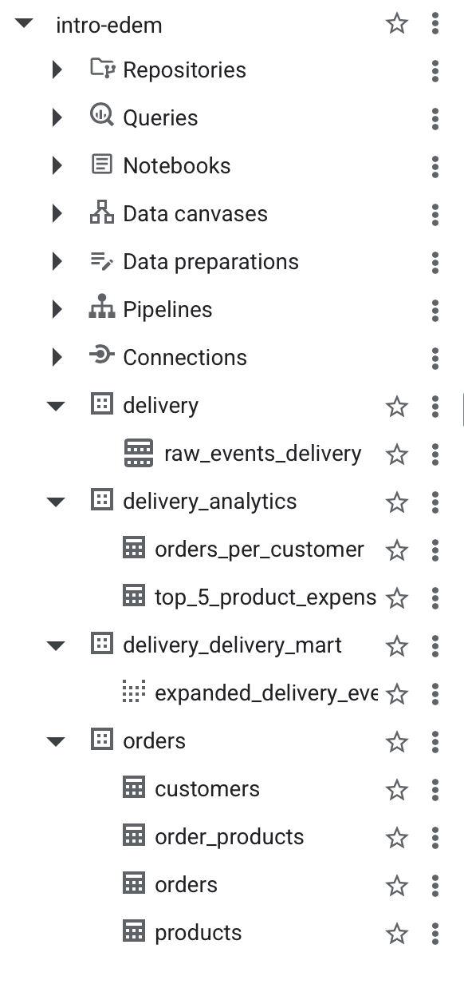

### Paso 8: Suscripción a delivery-events
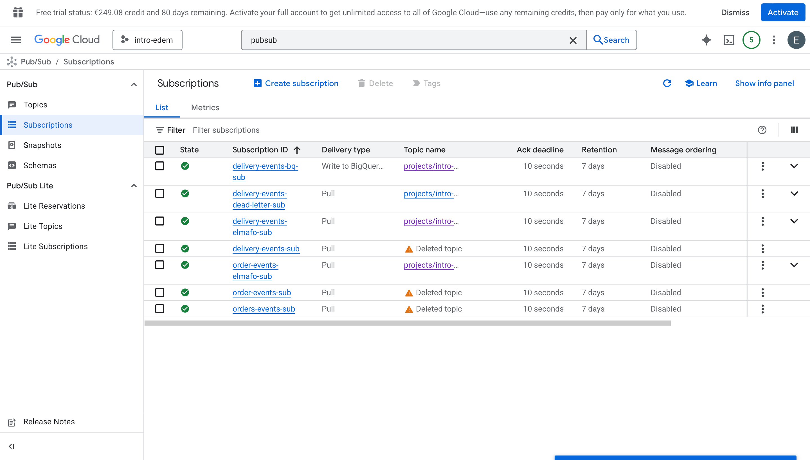

### Paso 9: Sincronización con la base de datos
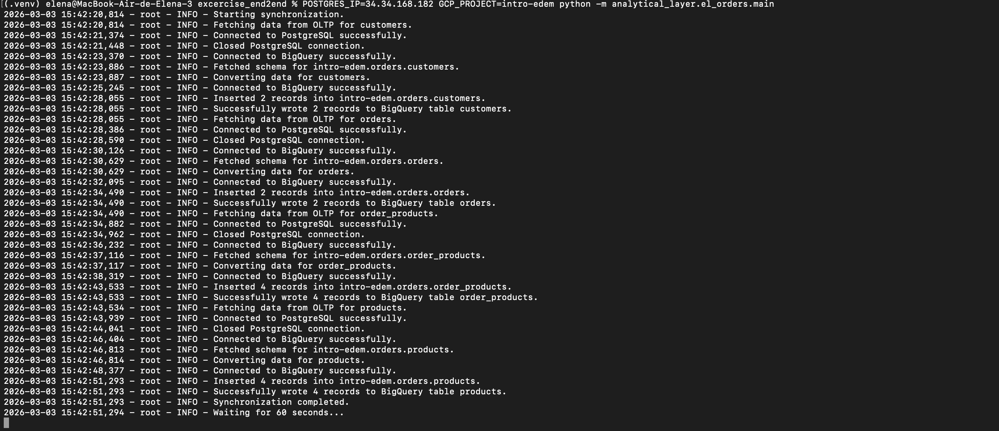

### Paso 10: dbt
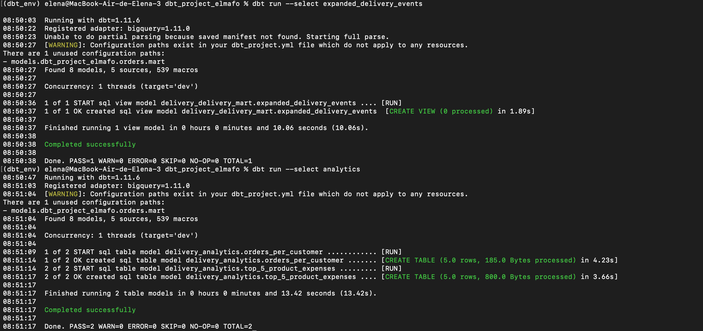

### Paso 11: Gráficos en Metabase
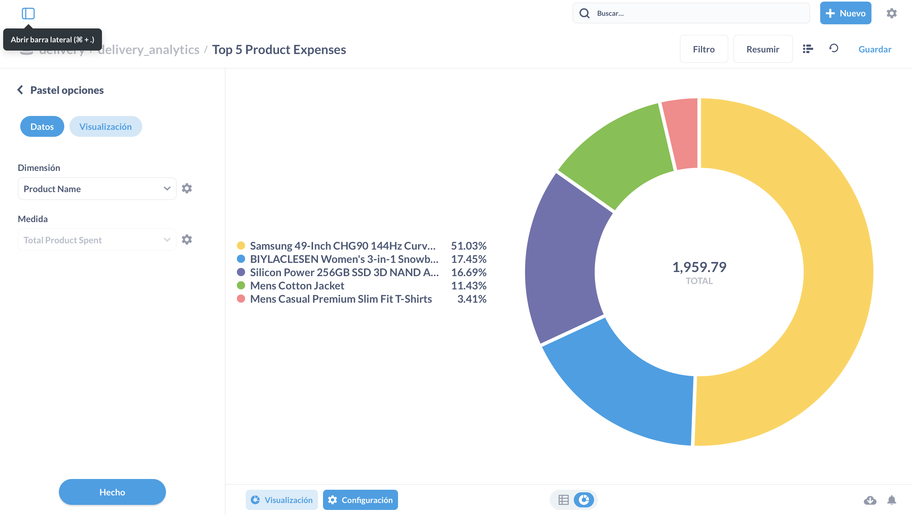

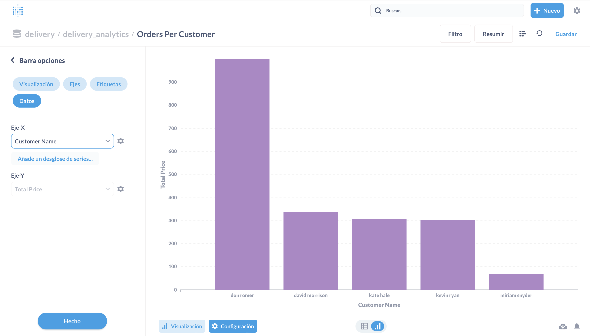

