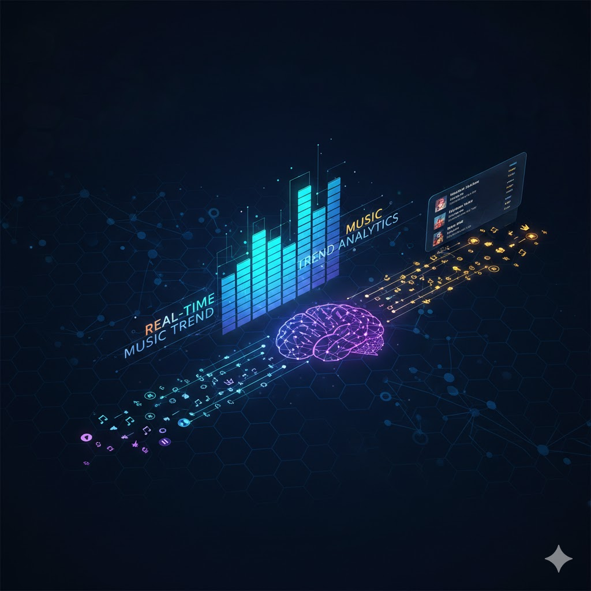

# **Análisis de Tendencias Musicales en Tiempo Real**


## **"Necesito saber qué canciones son tendencia ahora mismo, no mañana ni la semana que viene"**

### Arquitectura del Proyecto
El sistema se divide en tres etapas críticas para transformar datos crudos en información de negocio:

1. Generación de Eventos: Productor (producer.py)
Cada interacción de un usuario en la app es un evento. En un sistema real, manejamos millones de eventos por segundo.
- Lógica: Si un usuario escucha más de 30 segundos, se envía un evento. Si salta la canción, se envía otro.
- Datos Crudos: El mensaje es ligero para soportar volúmenes masivos. Incluye IDs de usuario, de canción y la acción realizada.

2. Primer Procesamiento: Consumidor (consumer.py)
Actúa como nuestra capa de limpieza y enriquecimiento (ETL).
- Traducción de Datos: Los datos vienen con IDs numéricos (ej. Artist_ID: 502). El consumidor recibe el mensaje y busca en una base de datos rápida que el ID 502 es "Rosalía".
- Optimización: Descarta datos técnicos (como la versión del sistema operativo) que no aportan valor al análisis de tendencias, reduciendo el ruido en el sistema.

3. Análisis en Tiempo Real: ksqlDB
Tratamos los temas de Kafka como tablas de una base de datos con datos que nunca dejan de llegar.
- Agregación por Ventanas: Filtramos el análisis para centrarnos en lo que ocurre en los últimos 5 minutos, no en toda la historia.
- Lógica de Tendencia: El sistema suma reproducciones. Si una canción pasa de 100 a 5,000 reproducciones en un minuto, se marca automáticamente como "Trending".
- Filtrado Crítico: Implementamos una regla de puntuación: "Si la acción es 'SKIP', resta puntos; si es 'PLAY', suma". Esto evita que canciones que los usuarios rechazan aparezcan en el top.

### Tecnologías Utilizadas
- Apache Kafka: Broker de mensajería y almacenamiento de flujos.
- ksqlDB: Procesamiento de flujos mediante consultas SQL.
- Python: Implementación de los scripts de Productor y Consumidor.
- Docker: Orquestación de los servicios de la infraestructura.

### Modelo de Datos (Data Pipeline)
El flujo de información se transforma en tres estados clave, permitiendo que datos técnicos se conviertan en métricas de negocio.

**A. Mensaje Crudo (Ingesta)**
Generado por la aplicación cliente. Prioriza la ligereza para permitir alta escalabilidad.

Tópico: music_raw_events

```json

{
  "track_id": "SONG_01",
  "action": "play",
  "duracion_seg": 145,
  "pais": "ES",
  "ip": "192.168.1.15",
  "timestamp": "2026-02-10T18:50:00Z"
}
```

**B. Mensaje Enriquecido (Procesado)**
Resultado de la ejecución de consumer. Se eliminan datos técnicos y se añade información del catálogo musical y validación de seguridad.

Tópico: music_enriched_data

```json

{
  "titulo": "Espresso",
  "artista": "Sabrina Carpenter",
  "genero": "Pop",
  "pais": "ES",
  "es_bot": false,
  "duracion": 145,
  "ts": "2026-02-10T18:50:00Z"
}
```

**C. Mensaje Agregado (Final)**
Generado por ksqlDB. Representa el estado actual de la tendencia musical una vez aplicados los filtros de lógica de negocio.

Tabla: ranking_exitos

```json

{
  "TITULO": "Espresso",
  "ARTISTA": "Sabrina Carpenter",
  "TOTAL_REPRODUCCIONES": 1450
}

```

