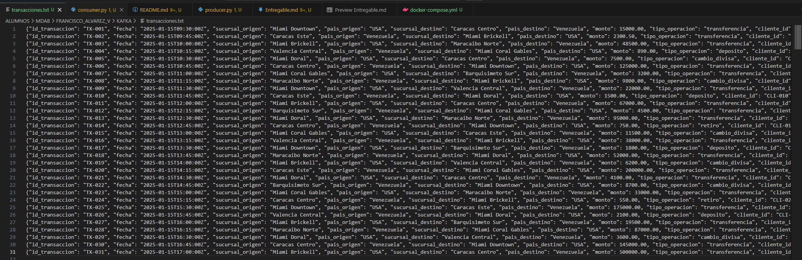
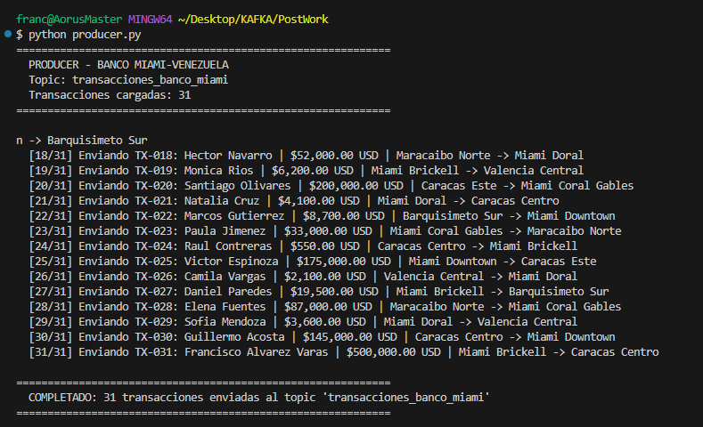
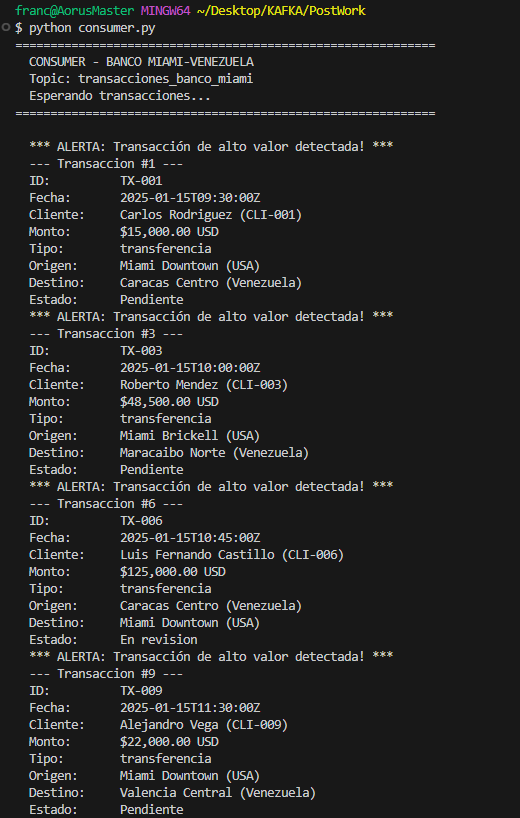
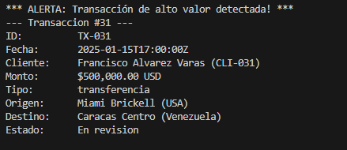

# 1 - Base de Datos

## Imagen de la base de datos

La base de datos es transacciones.txt

# 2 - producer.py

## Aqui esta la imagen del producer y el resultado escrito

# 3 - consumer.py

## Filtro de transacciones elevadas

Me dedique una imagen.

transacciones.txt → Producer → Topic 1 → Consumer Procesador → Topic 2 → Consumer Final