Linux_Comandos

Para entregar este ejercicio, debes copiar este archivo en tu carpeta de alumno y completar las respuestas a las preguntas que se formulan en el mismo. Una vez completado, debes subirlo a vuestro repositorio remoto de GitHub y realizar una Pull Request poniendo a Pedro Nieto como reviewer.

Ejercicio de comandos en la consola de linux.

**1.Listar todos los archivos del directorio bin.**

Usuario@DESKTOP-JR00EL7 MINGW64 ~
$ docker exec -it unix bash
root@50cb0cb70ef6:/# cd bin
root@50cb0cb70ef6:/bin# pwd
/bin
root@50cb0cb70ef6:/bin# ls

**2.Listar todos los archivos del directorio tmp.**

ls -lR

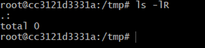

**3.Listar todos los archivos del directorio etc que empiecen por t**

root@cc3121d3331a:/etc# ls /etc/t*
README
root@cc3121d3331a:/etc#

**4.Listar todos los archivos del directorio dev que empiecen por tty.**

cd /dev

ls -l

ls /dev/tty*

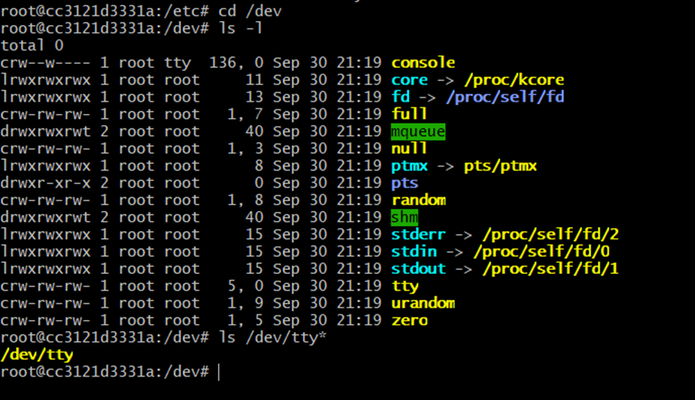

**5.Listar todos los archivos del directorio dev que empiecen por tty y acaben en 3.**

root@cc3121d3331a:/dev# ls /dev/tty*3
ls: cannot access '/dev/tty*3': No such file or directory
root@cc3121d3331a:/dev#

**6.Listar todos los archivos del directorio dev que empiecen por t y acaben en C1.**

ls -l

ls /dev/t*C1

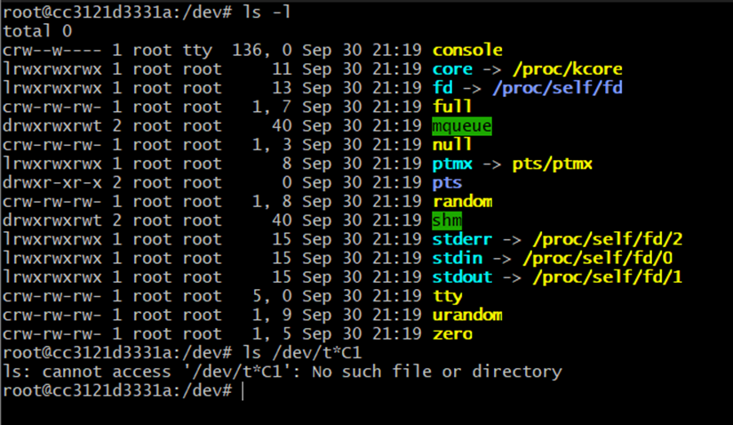

**7.Listar todos los archivos, incluidos los ocultos, del directorio raíz.**

cd ..

pwd

/

ls -la

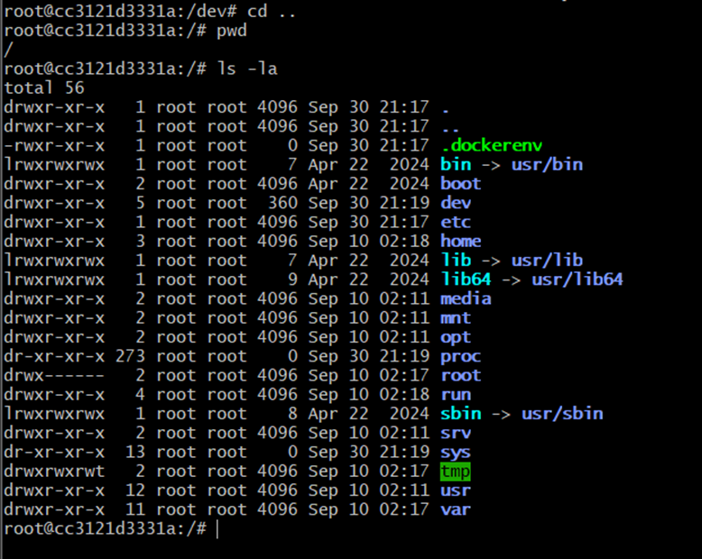

**8.Listar todos los archivos del directorio etc que no empiecen por t.**

$ ls /etc/[!t]*

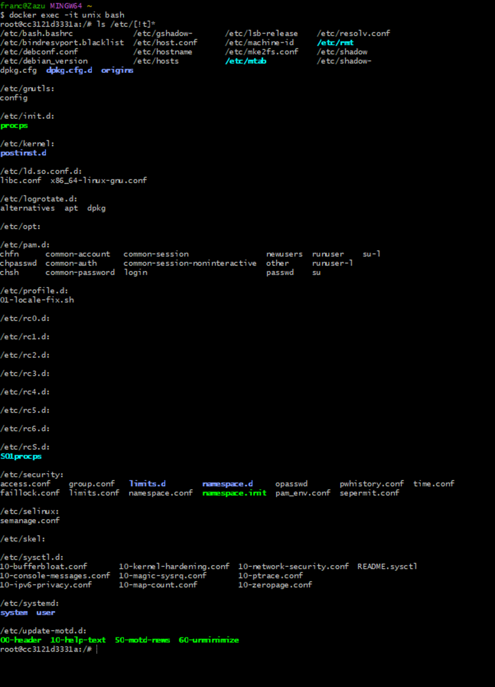

**9.Listar todos los archivos del directorio usr y sus subdirectorios.**

root@cc3121d3331a:/# cd usr
root@cc3121d3331a:/usr# ls -lR

**10.Cambiarse al directorio tmp, crear directorio PRUEBA.**

cd /tmp
mkdir PRUEBA
ls -l

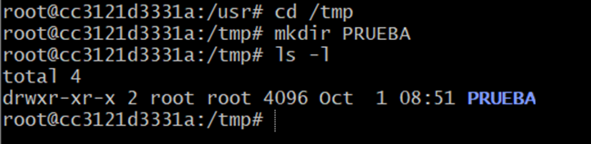

**11.Verificar que el directorio actual ha cambiado.**

ls -lR

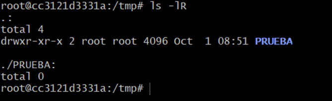

**12.Mostrar el día y la hora actual.**

date 

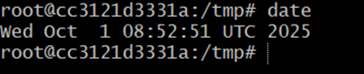

**13.Con un solo comando posicionarse en el directorio $HOME.**

cd /home

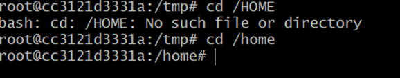

**14.Verificar que se está en él.**

pwd

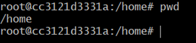

**15.Listar todos los ficheros del directorio HOME mostrando sus permisos.**

ls -lR

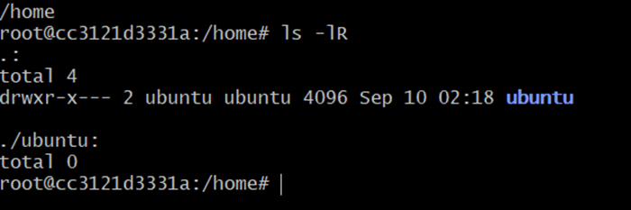

**16.Borrar todos los archivos y directorios visibles de vuestro directorio PRUEBA.**

cd /tmp
ls
cd PRUEBA
ls

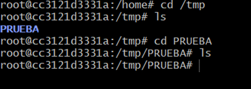

**17.Crear los directorios dir1, dir2 y dir3 en el directorio PRUEBA. Dentro de dir1 crear el directorio dir11. Dentro del directorio dir3 crear el directorio dir31. Dentro del directorio dir31, crear los directorios dir311 y dir312.**

cd /tmp
ls
cd PRUEBA
ls
mkdir /PRUEBA dir1 dir2 dir3
ls -l

---------------------------

mkdir /PRUEBA/dir1 dir11
mkdir /PRUEBA/dir3 dir31
mkdir /PRUEBA/dir3/dir31 dir311 dir312

-----------------------------------------

ls -lR

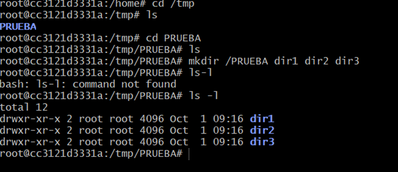
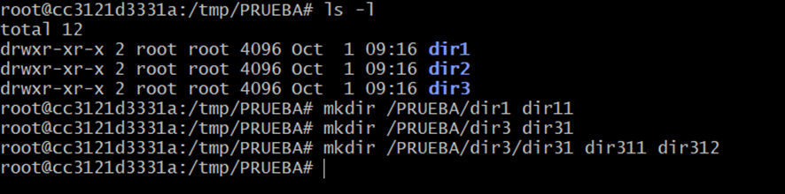
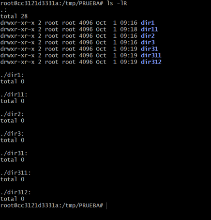

**18.Copiar el archivo /etc/mtab a vuestro directorio PRUEBA.**

cd /etc
ls -l
find mtab
cp /etc/mtab /tmp/PRUEBA
cd /tmp
ls -l

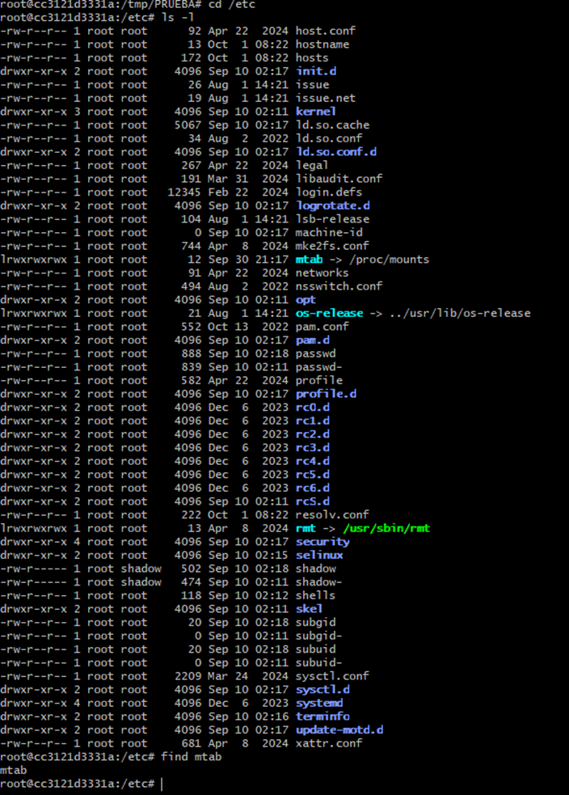
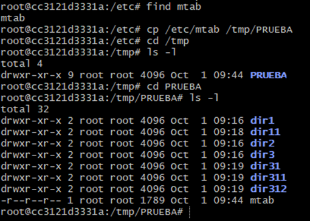

**19.Copiar /etc/mtab en dir1, dir2 y dir3.**

ls -l
cp /etc/mtab dir1/
cp /etc/mtab dir2/
cp /etc/mtab dir3/

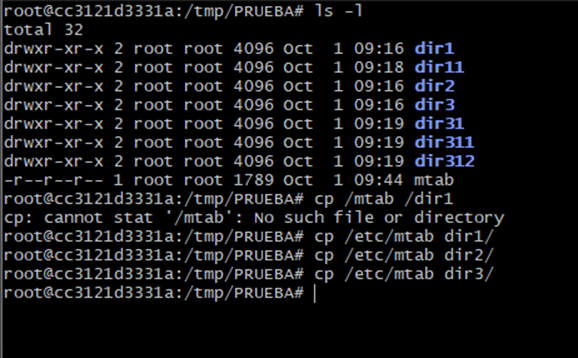

**20.Comprobar el ejercicio anterior mediante un solo comando.**

ls -lR

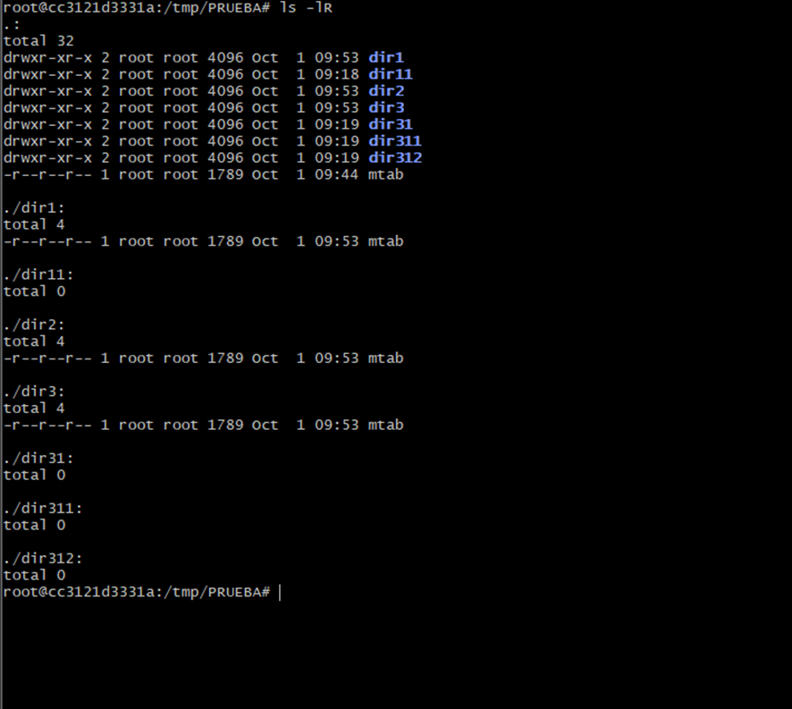