En este ejercicio migramos el flujo de datos del data warehouse que usábamos en el módulo de Cloud Intro hacia un stack 100% gestionado en Google Cloud Platform.
(Disclaimer, mi cuenta gratuita de GCP caducó, por lo que estoy reciclando un proyecto compartido. Es incorrecto, pero suponía un retraso dar de alta una cuenta completamente nueva)

1. Crear los topics de Pub/Sub

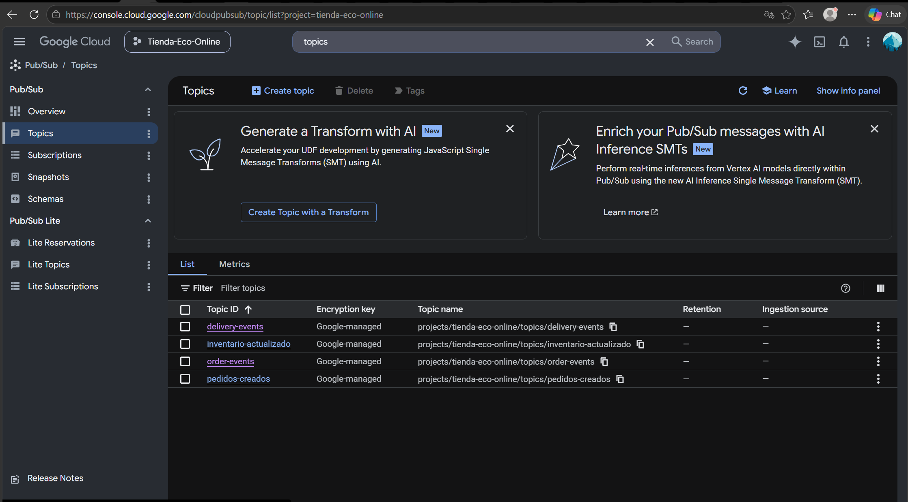

2. Creación de las instancias

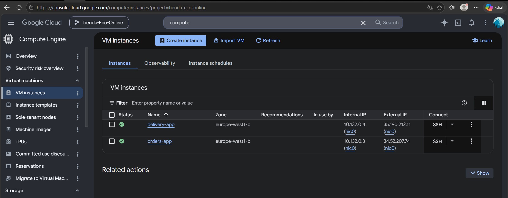

3. Create the Cloud SQL instance

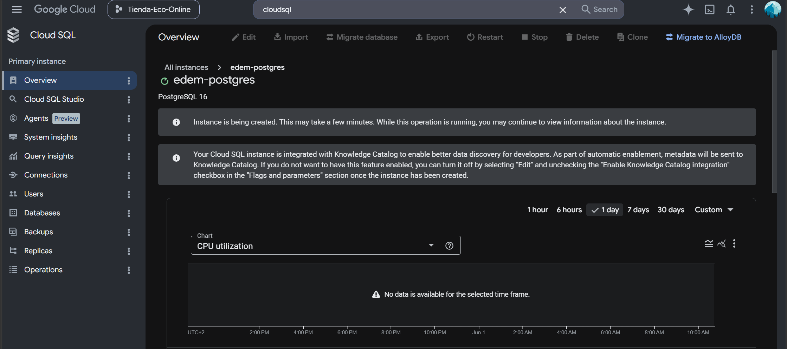

4. Instances

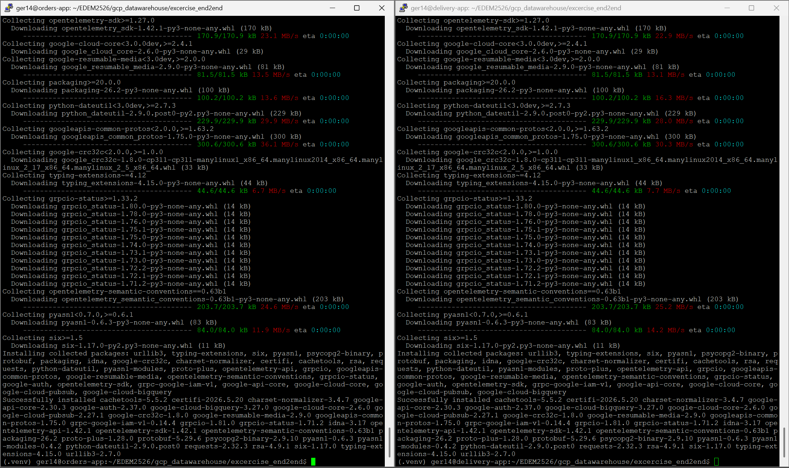

5. For the orders-app instance

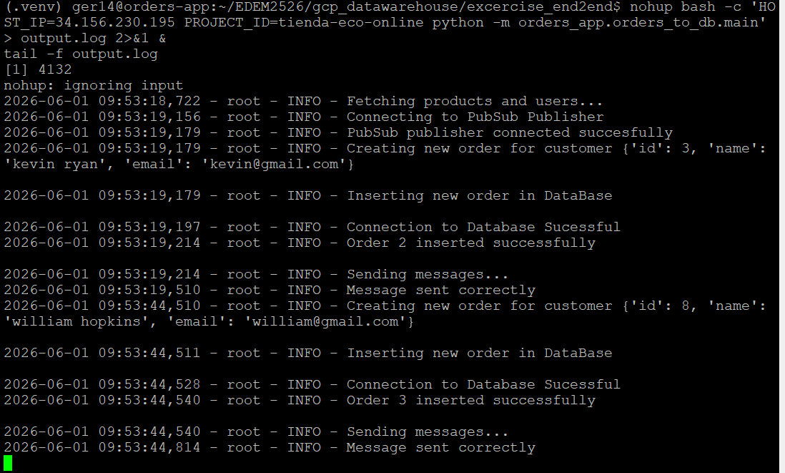

6. For the delivery-app instance

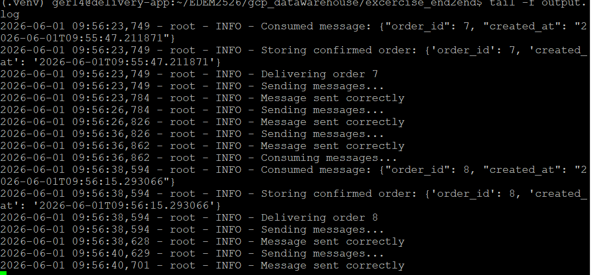

7. Datasets BQ

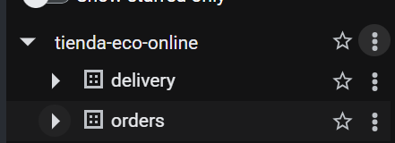
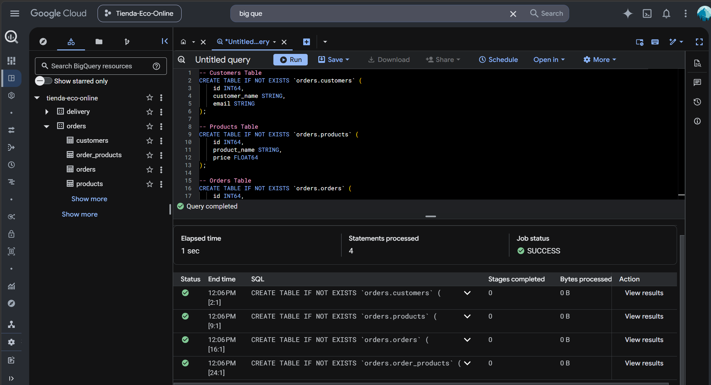

8. Suscripciones

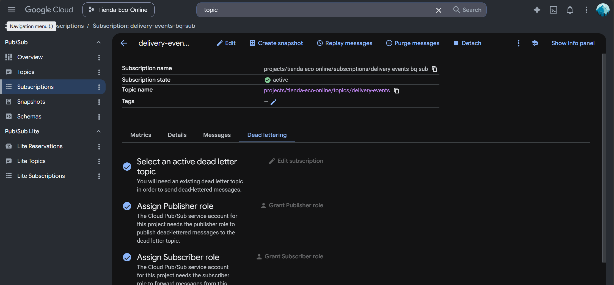

9. Sincronizamos CloudSQL con BQ

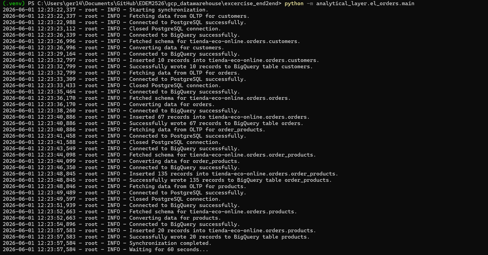

10. DBT

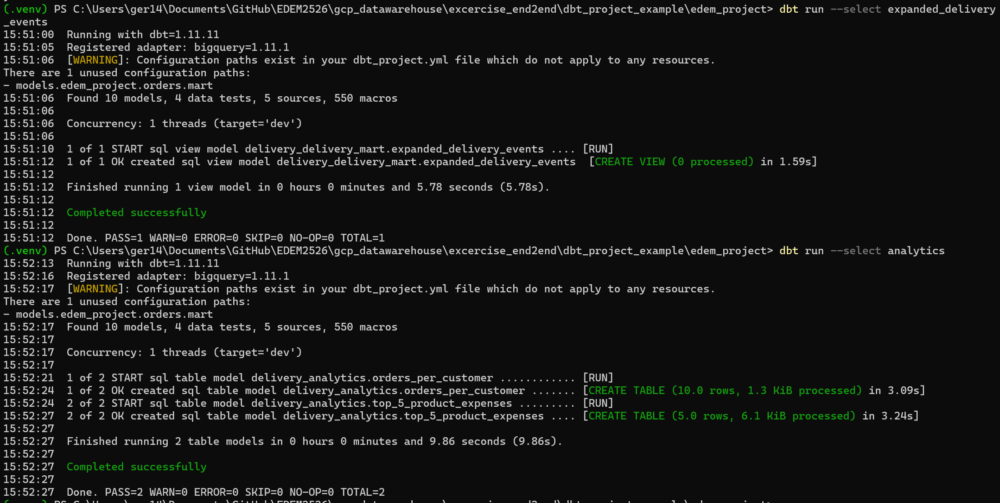

11. Dashboard
    
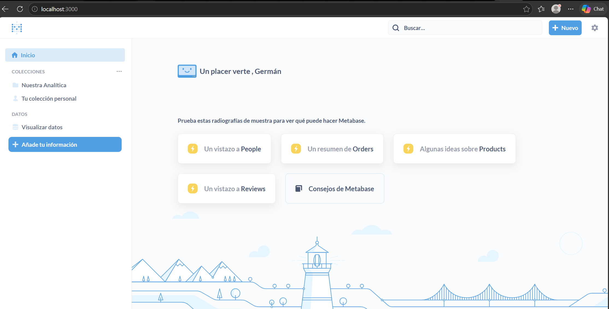

