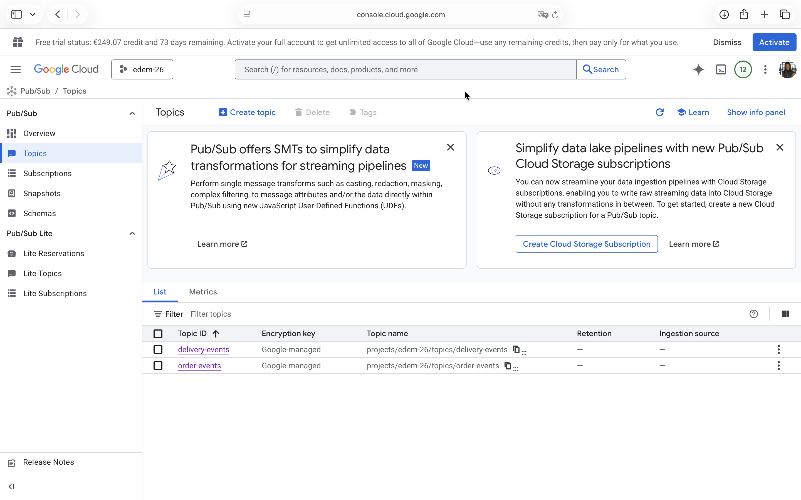
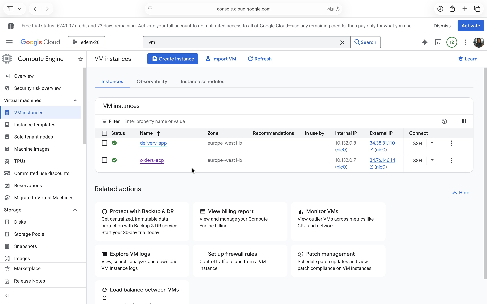
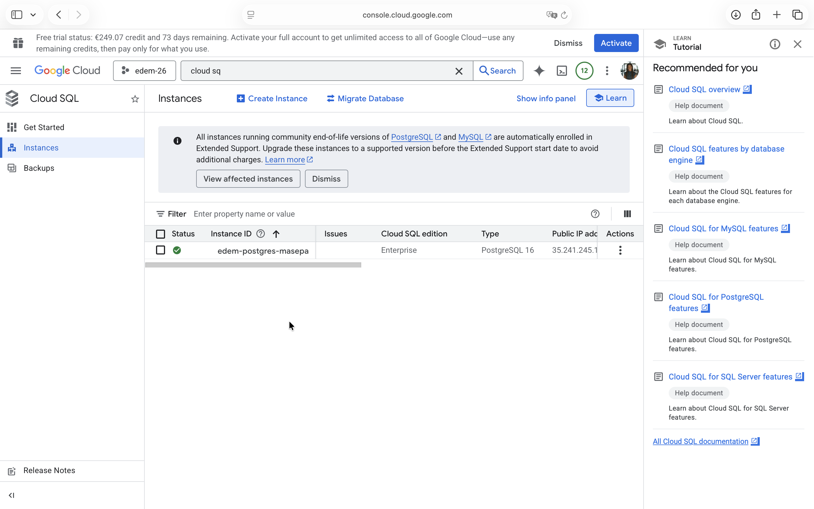
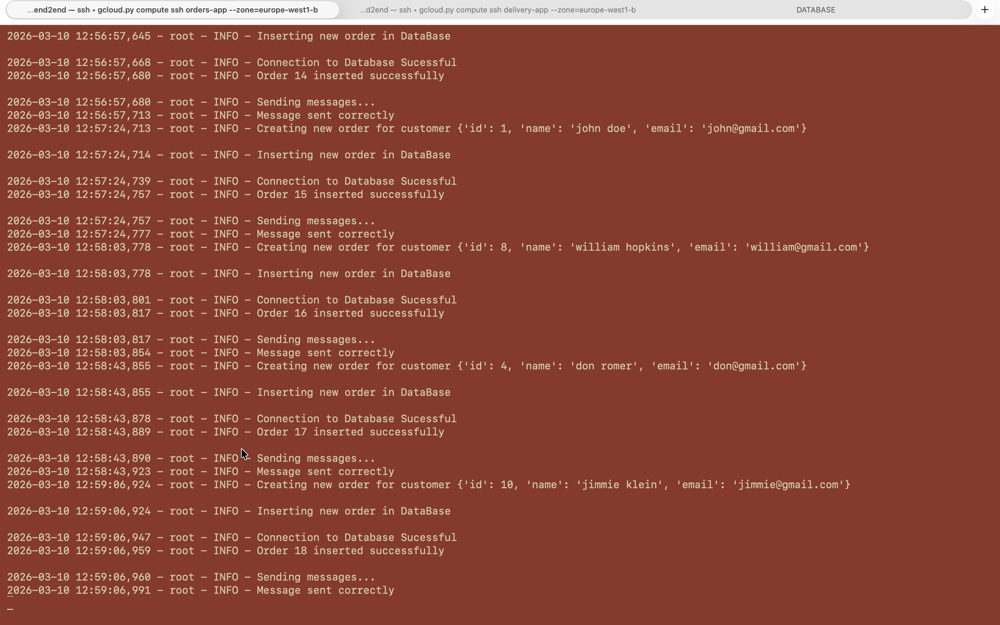
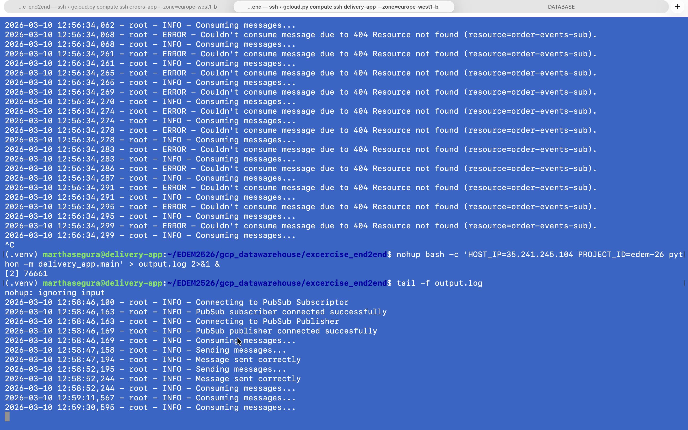
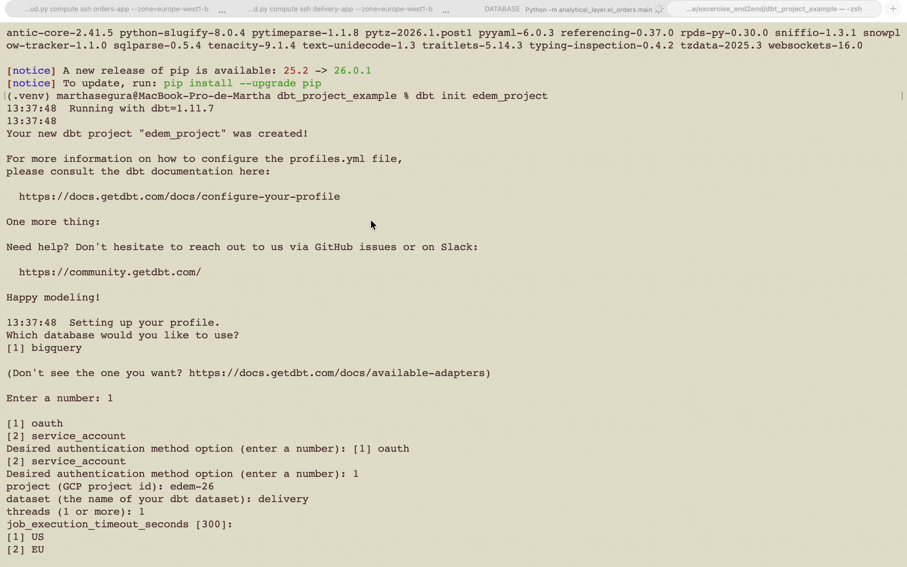
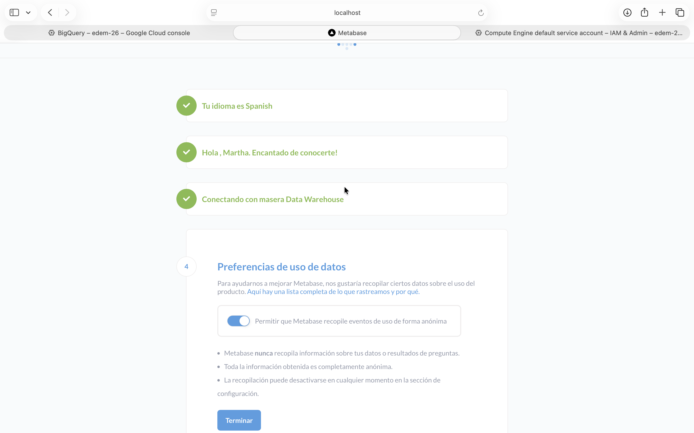
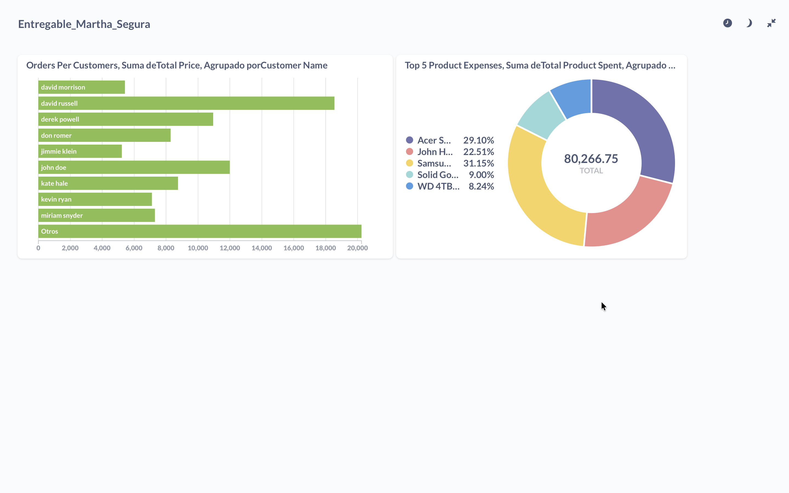

# Proyecto End-to-End: Martha Segura

* **Pub/Sub Topics:** Creación de `order-events` y `delivery-events`.

* **Compute Engine:** Instancias `orders-app` y `delivery-app` operativas.

Configuración de la base de datos operacional PostgreSQL en Cloud SQL.

* **Orders App:** Insertando registros en Cloud SQL y publicando en Pub/Sub.

* **Delivery App:** Consumiendo eventos de `order-events`.

## Transformación de Datos con dbt (Capa Analítica)
[alt text](<05- dbt-bigquery.png>)

## Visualización y BI
Despliegue de Metabase mediante Docker y conexión con el Data Warehouse (BigQuery) utilizando una Service Account de GCP.

## Dasboard final
