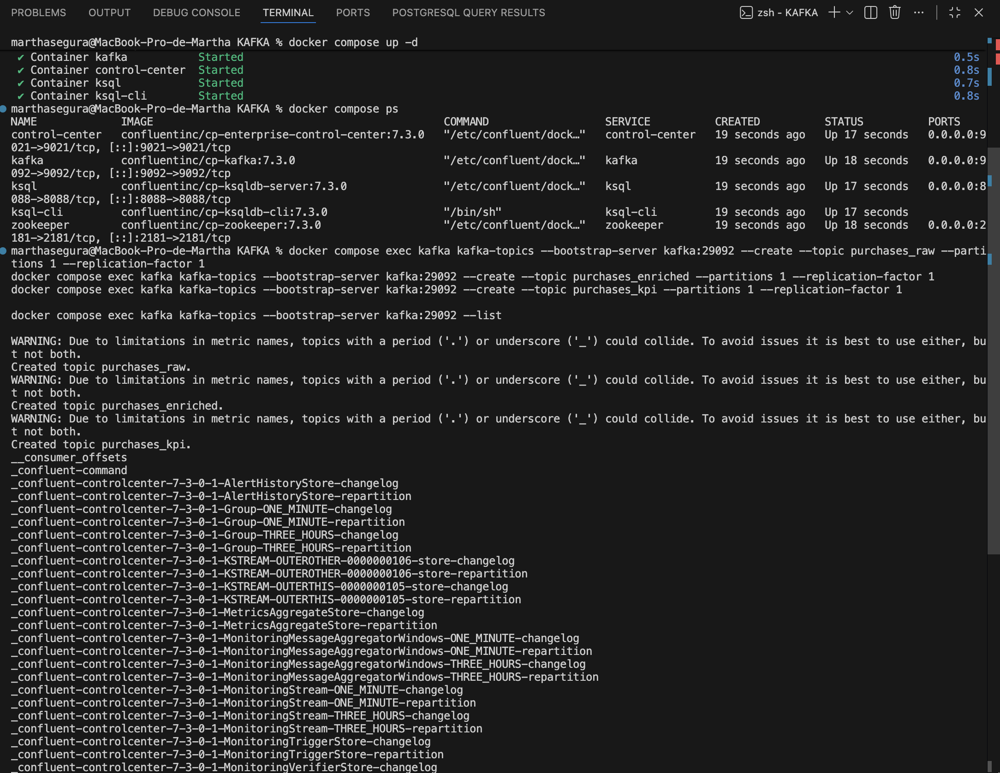
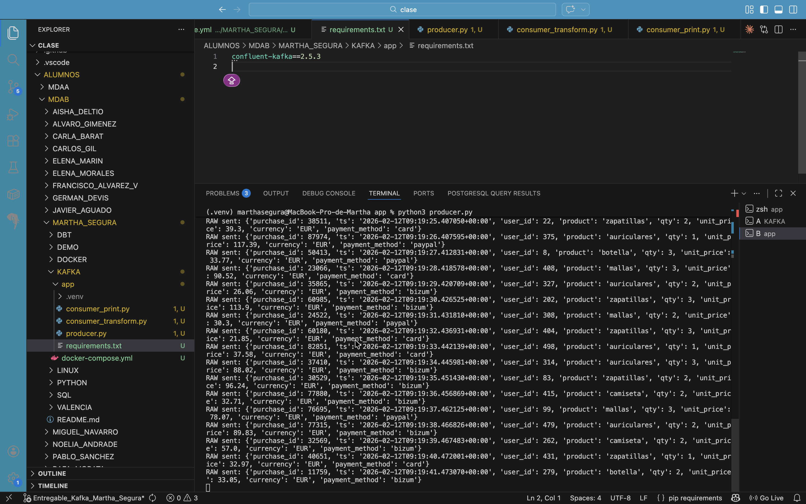
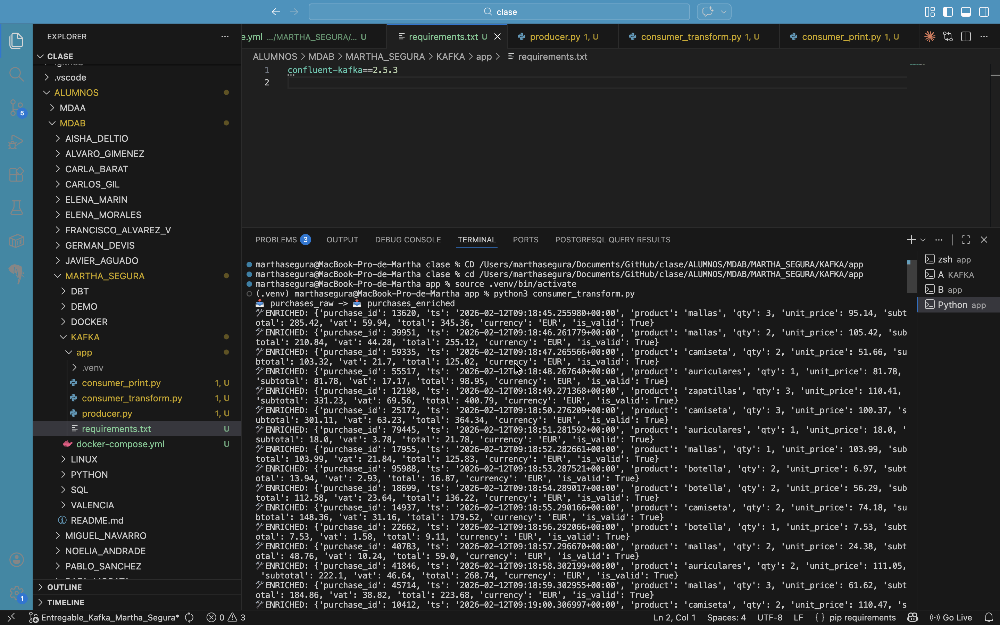
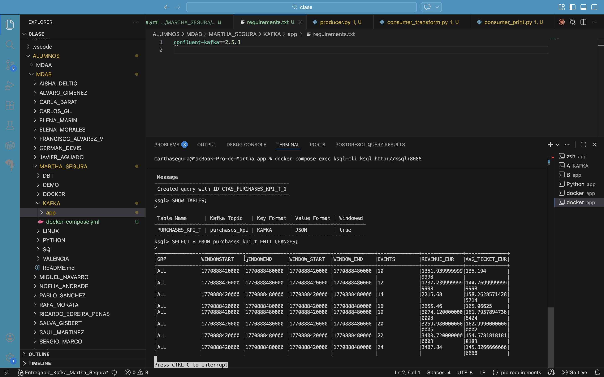
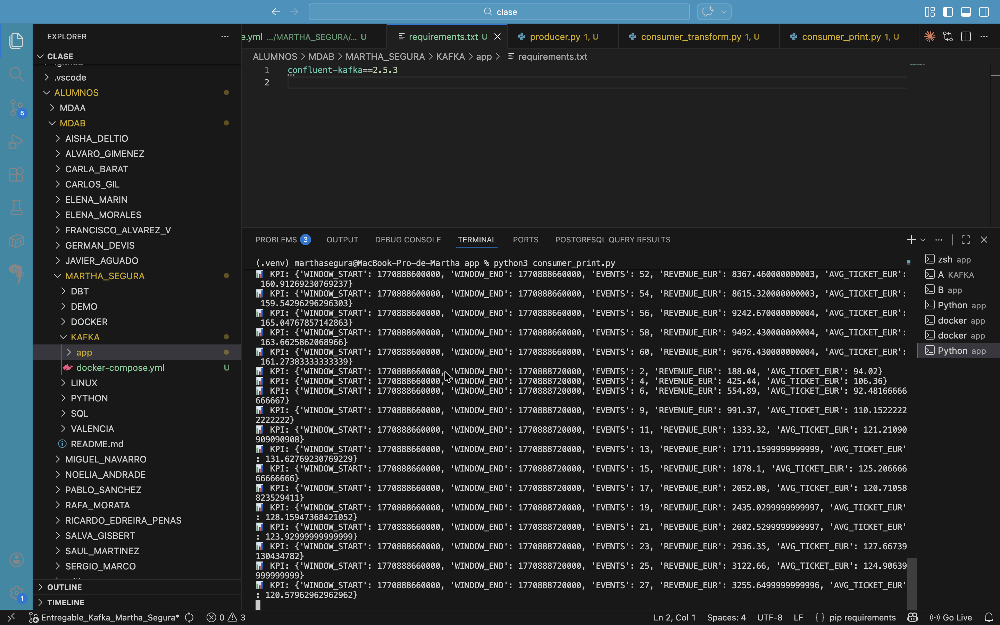

## Kafka Post Work – Data Processing End to End
## 1. Caso de uso
Para este ejercicio he elegido un caso sencillo y realista: registro de compras online en tiempo real.
La idea es simular una tienda online que genera eventos de compra continuamente y procesarlos en tiempo real para obtener métricas de negocio como:
Número de compras por minuto
Ingresos totales por minuto
Ticket medio
Este tipo de caso es uno de los usos más habituales de Kafka en entornos reales.
## 2. Dataset seleccionado
El dataset es simulado mediante un Producer en Python que genera eventos de compra en formato JSON.
Cada evento contiene información como:
purchase_id
timestamp
product
quantity
unit_price
currency
payment_method
Aunque los datos son generados aleatoriamente, simulan un sistema real de compras online.
## 3. Arquitectura implementada
La arquitectura sigue exactamente el esquema trabajado en clase:
Data Source (Producer en Python)
→ Kafka Topic purchases_raw
→ Consumer en Python (transformación)
→ Kafka Topic purchases_enriched
→ KSQL (agregación por ventanas de tiempo)
→ Kafka Topic purchases_kpi
→ Consumer final (impresión en terminal)
En este ejercicio se utilizan:
1 Producer
2 Consumers
1 Stream en KSQL
1 Table en KSQL

## 4. Ejemplos de Json de su modelo de datos json
4.1. Evento original – Topic purchases_raw
Mensaje generado por el Producer:
{
  "purchase_id": 10231,
  "ts": "2026-02-12T09:10:05Z",
  "product": "zapatillas",
  "qty": 1,
  "unit_price": 49.90,
  "currency": "EUR"
}
Este mensaje representa una compra realizada en la tienda online.
4.2 Evento transformado – Topic purchases_enriched
Mensaje después de ser procesado por el Consumer en Python:
{
  "purchase_id": 10231,
  "ts": "2026-02-12T09:10:05Z",
  "product": "zapatillas",
  "qty": 1,
  "unit_price": 49.90,
  "subtotal": 49.90,
  "vat": 10.48,
  "total": 60.38,
  "currency": "EUR"
}
En esta fase se calculan:
Subtotal
IVA (21%)
Total de la compra
4.3. Evento agregado – Topic purchases_kpi
Mensaje generado por KSQL con los KPIs por minuto:
{
  "window_start": "2026-02-12T09:10:00Z",
  "window_end": "2026-02-12T09:11:00Z",
  "events": 18,
  "revenue_eur": 832.55,
  "avg_ticket_eur": 46.25
}
Este mensaje muestra:
Número de compras en ese minuto
Ingresos totales
Ticket medio

## screenshots

### 1. Creación de topics

### 2. Ingestión en tiempo real

### 3. Transformación con Consumer

### 4. Procesamiento con KSQL

### 5. Consumer final mostrando KPIs

