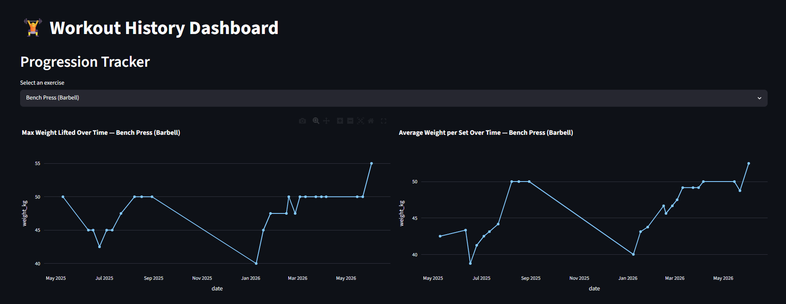
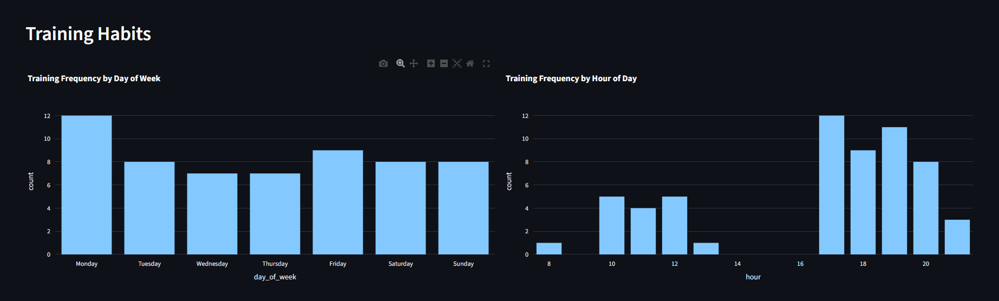
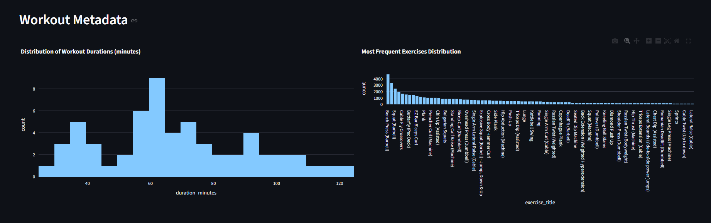

# End-to-End Gym Workout Data Platform (Hevy Analytics Lab)

---

## Architecture Overview

This project is a modular data platform that automates the ETL/EL processes from a **Hevy App CSV export** all the way to an interactive analytics dashboard. The pipeline is fully containerized with Docker and is organized into four layers:

1. **Transactional Layer (AWS RDS PostgreSQL)**
   The Hevy CSV export (`raw_data/workout_data.csv`) is cleaned and loaded into a normalized (3NF) OLTP schema — `workouts`, `exercises`, and `sets` — hosted on AWS RDS PostgreSQL. This is the system of record.

2. **Analytical Warehouse Layer (AWS Redshift Serverless)**
   An EL job extracts a denormalized, joined view of the OLTP tables from RDS and loads it into a `fact_sets` table on AWS Redshift Serverless, optimized for analytical queries (`DISTSTYLE EVEN`, sorted by `start_time` and `workout_id`).

3. **Open Data Lakehouse (Apache Iceberg + AWS Glue + Amazon S3 via AWS Athena)**
   The same denormalized dataset is also written to Amazon S3 in **Apache Iceberg** table format and registered as a table in the **AWS Glue Data Catalog**, making it queryable via **AWS Athena** for ad-hoc, schema-evolving, open-format analytics.

4. **Visualization Layer (Streamlit + Plotly)**
   A local **Streamlit** dashboard connects to the Redshift analytical warehouse and renders interactive **Plotly** charts for progression tracking, training habits, and workout metadata.

---

## Dashboard Preview

### Progression Tracker
Interactive line charts showing max weight lifted and average weight per set over time, filterable by exercise.



### Training Frequency & Habits
Bar charts showing training frequency by day of the week and hour of the day, helping identify peak training moments.



### Most Frequent Exercises Distribution
Distribution of workout durations, workout types/titles, and the most frequently performed exercises across the training history.



---

## Tech Stack

- **Python 3.11**
- **AWS RDS** — PostgreSQL transactional database (OLTP)
- **AWS Redshift Serverless** — analytical data warehouse (OLAP)
- **Apache Iceberg** — open table format for the data lakehouse
- **AWS Glue** — data catalog for the lakehouse tables
- **Amazon S3** — object storage backing the lakehouse
- **AWS Athena** — serverless SQL query engine over the Iceberg lakehouse
- **awswrangler** — AWS data integration library (Pandas <-> Iceberg/Glue/Athena)
- **Pandas** — data extraction, cleaning, and transformation
- **Streamlit** — interactive web dashboard framework
- **Plotly** — interactive charting library
- **Docker / Docker Compose** — containerized local deployment

---

## Setup & Execution Guide

### 1. Configure environment variables

Create a `.env` file in the project root with the following variables:

```env
# PHASE 1 — LOCAL (Docker):
POSTGRES_HOST=
POSTGRES_DB=
POSTGRES_USER=
POSTGRES_PASSWORD=
POSTGRES_PORT=

# PHASE 2 — AWS (Aurora RDS):
RDS_HOST=
RDS_DB=
RDS_USER=
RDS_PASSWORD=
RDS_PORT=

# PHASE 3 — AWS (Redshift Serverless):
REDSHIFT_HOST=
REDSHIFT_DB=
REDSHIFT_USER=
REDSHIFT_PASSWORD=
REDSHIFT_PORT=

# PHASE 4 — AWS (S3):
AWS_S3_BUCKET=
AWS_GLUE_DATABASE=
AWS_ACCESS_KEY_ID=
AWS_SECRET_ACCESS_KEY=
AWS_REGION=your-region

# PHASE 5 — AWS (Athena):
AWS_DEFAULT_REGION=your-region
```

### 2. Build and run the platform

From the project root, run:

```bash
docker-compose up --build
```

This starts two services:

- **`app`** — runs `main.py`, which executes the full pipeline end to end:
  1. Loads and cleans the Hevy CSV into AWS RDS PostgreSQL.
  2. Replicates the data from RDS to AWS Redshift (`fact_sets`).
  3. Writes the data to the S3/Glue Iceberg lakehouse for Athena queries.
- **`frontend`** — runs the Streamlit dashboard (`app.py`).

### 3. Verify the pipelines

Check the `app` service logs to confirm each stage completed successfully:

```bash
docker-compose logs -f app
```

You should see confirmation messages for RDS ingestion, RDS-to-Redshift replication, and the S3/Glue Iceberg write.

### 4. Access the dashboard

Once the `frontend` service is running, open your browser at:

```
http://localhost:8501
```

You'll see the Workout History Dashboard with the Progression Tracker, Training Habits, and Workout Metadata sections.

---

## Project Structure

```
AWS_ALMACENAMIENTO/
├── .streamlit/
│   └── config.toml          # Streamlit server configuration
├── assets/
│   ├── gym_progression.png   # Dashboard preview image
│   ├── gym_habits.png         # Dashboard preview image
│   └── gym_metadata.png       # Dashboard preview image
├── raw_data/
│   └── workout_data.csv       # Hevy App CSV export
├── app.py                      # Streamlit + Plotly analytics dashboard
├── config.py                   # Environment-based configuration loaders
├── database.py                 # RDS / Redshift connections and DDL
├── pipeline.py                  # CSV cleaning and RDS load logic
├── redshift_pipeline.py         # RDS -> Redshift EL pipeline
├── lakehouse_pipeline.py         # RDS -> S3/Glue Iceberg EL pipeline
├── main.py                       # Orchestrates the full pipeline
├── requirements.txt              # Python dependencies
└── docker-compose.yaml           # Service definitions (app + frontend)
```
