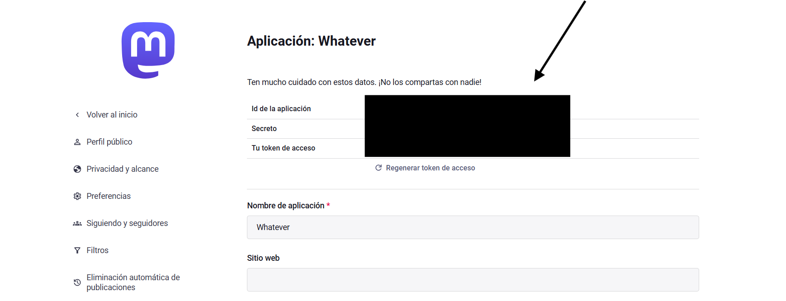

# 
# Mastodon API Challenge: Status Publisher

## 🎯 Objective

Build a solution in **any programming language or framework** that can successfully publish a status (toot) through the Mastodon API. This is an open-ended challenge designed to test your API integration skills, creativity, and software development practices.

## 📋 Challenge overview

**Core Goal:** Create an application capable of publishing at least one status to a Mastodon instance.

**Approach:** You have complete freedom in how you implement this solution. Whether you build a CLI tool, web application, mobile app, or automated service - the choice is yours!

---

## 🔑 Prerequisites & Setup

This section will guide you step-by-step through setting up your Mastodon API credentials.

### Step 1: Choose a Mastodon Instance

Mastodon is decentralized. You can use any instance where you have an account, or create a new one:
- [mastodon.social](https://mastodon.social) (The largest instance)
- [mastodon.online](https://mastodon.online)
- [fosstodon.org](https://fosstodon.org) (Technology-focused)

### Step 2: Create a Developer Application

Once you have an account and are logged in:

1. **Go to Preferences**
   - Click the gear icon or find "Preferences" in the menu.

2. **Access Development Settings**
   - In the sidebar, click on **Development**.

3. **Create a New Application**
   - Click the **New Application** button.
   - **Application name**: e.g., "Student API Challenge"
   - **Application website**: (Optional, can be your GitHub repo)
   - **Redirect URI**: Leave as `urn:ietf:wg:oauth:2.0:oob`
   - **Scopes**: 
     - ✅ Ensure **`write:statuses`** is checked (required to post).
     - You can leave other default scopes as they are.

4. **Save the Application**
   - Scroll to the bottom and click **Submit**.

### Step 3: Obtain Your Access Token

Now you need to obtain your access token. Here's what the application dashboard looks like:



1. **Open Your Application**
   - Click on the name of the application you just created ("Student API Challenge").

2. **Copy the Access Token**
   - You will see a field labeled **Your access token**.
   - **CRITICAL**: Copy this token. This is the only credential you need for this challenge.
   - Unlike X API, Mastodon (by default) only requires this single Bearer token for simple status posting.

### Step 4: Save your credentials securely

Create a `.env` file in your project root:
```bash
MASTODON_ACCESS_TOKEN=your_access_token_here
MASTODON_INSTANCE_URL=https://mastodon.social  # Replace with your instance
```

**DO NOT:**
- ❌ Share these with anyone
- ❌ Post them in public forums
- ❌ Commit them to Git

---

## ✅ Core requirements

Your solution **MUST**:

1. **Authenticate** with the Mastodon API using your Access Token.
2. **Publish a status** successfully (minimum 1 character, maximum 500 characters by default).
3. **Handle errors** gracefully (invalid tokens, rate limits, network errors).
4. **Protect secrets** - Use environment variables or secure configuration files.
5. **Include documentation** - README with setup instructions.

---

## 🚀 Optional enhancements

You're encouraged to extend your solution! All suggestions below are compatible with the Mastodon API:

### Basic enhancements

**Input Validation & Error Handling**
- Validate status length before sending (1-500 characters).
- Check for empty or whitespace-only statuses.
- Handle Mastodon API rate limit errors (HTTP 429) gracefully.
- Provide meaningful error messages.

**User Feedback & Local Storage**
- Display confirmation prompt before posting.
- Show success message with timestamp and the URL of the created post.
- Store published statuses locally (JSON file, CSV, or in-memory).

**Development Mode**
- **Test/Mock mode**: Allow posting to a local file instead of Mastodon API during development.
- **Dry-run flag**: Preview what would be posted without actually calling the API.

### Intermediate enhancements

**Build Your Own API Wrapper**
- **Basic Authentication**: Protect your local post publishing endpoints.
- **API Key Authentication**: Generate and validate API keys for your service.
- **JWT Tokens**: Use JWT to manage sessions.

**CRUD Operations on Status Drafts**
- **Create**: Save status drafts locally.
- **Read**: List all your saved drafts.
- **Update**: Edit drafts before posting.
- **Delete**: Remove unwanted drafts.

**Enhanced Input Features**
- **Visibility settings**: Allow choosing visibility (`public`, `unlisted`, `private`, `direct`).
- **Content Warning**: Add a spoiler text/content warning to your post.
- **Hashtag suggestions**: Auto-append configured hashtags.

### Advanced enhancements

**Local Scheduling System**
- **Schedule posts**: Store posts with future timestamps and a background task to publish them.

**Web Interface for Your Service**
- **Frontend**: Build a UI for composing and publishing statuses.
- **Draft management**: Visual interface to manage drafts.

**Content Generation & Integration**
- **Public APIs**: Fetch data from free APIs (Weather, News, Quotes) and post updates to Mastodon.

**Media Support**
- **Image uploads**: Use the `POST /api/v1/media` endpoint to upload an image first, then attach its ID to your status.

---

## 🔒 Security requirements

**CRITICAL: Never commit API keys or secrets to your repository!**

1. **Use environment variables** (.env file).
2. **Add `.env` to `.gitignore`**.
3. **Provide `.env.example`** as a template.

### Example: Loading environment variables in Python

```python
import os
from dotenv import load_dotenv
import requests

load_dotenv()

TOKEN = os.getenv('MASTODON_ACCESS_TOKEN')
INSTANCE = os.getenv('MASTODON_INSTANCE_URL')

def post_status(text):
    url = f"{INSTANCE}/api/v1/statuses"
    headers = {
        "Authorization": f"Bearer {TOKEN}",
        "Content-Type": "application/json"
    }
    data = {"status": text}
    
    response = requests.post(url, headers=headers, json=data)
    return response.json()
```

---

## 📦 Submission guidelines

Include:
1. **Source code** (well-organized).
2. **README.md** with installation and usage steps.
3. **.env.example** template.

---

## 📚 Helpful resources

- [Mastodon API Documentation](https://docs.joinmastodon.org/api/)
- [Post a Status (Endpoint Docs)](https://docs.joinmastodon.org/methods/statuses/#create)
- [Mastodon OAuth Scopes](https://docs.joinmastodon.org/api/oauth/scopes/)

---

*Last updated: January 2026*
