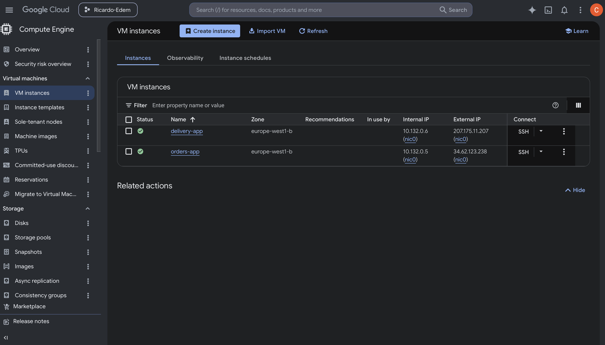
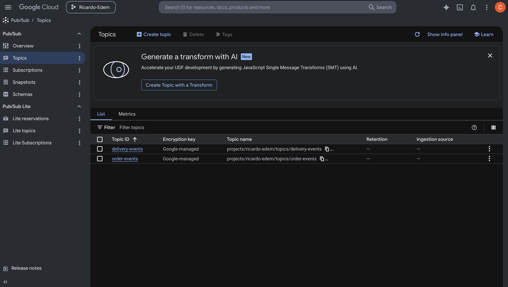
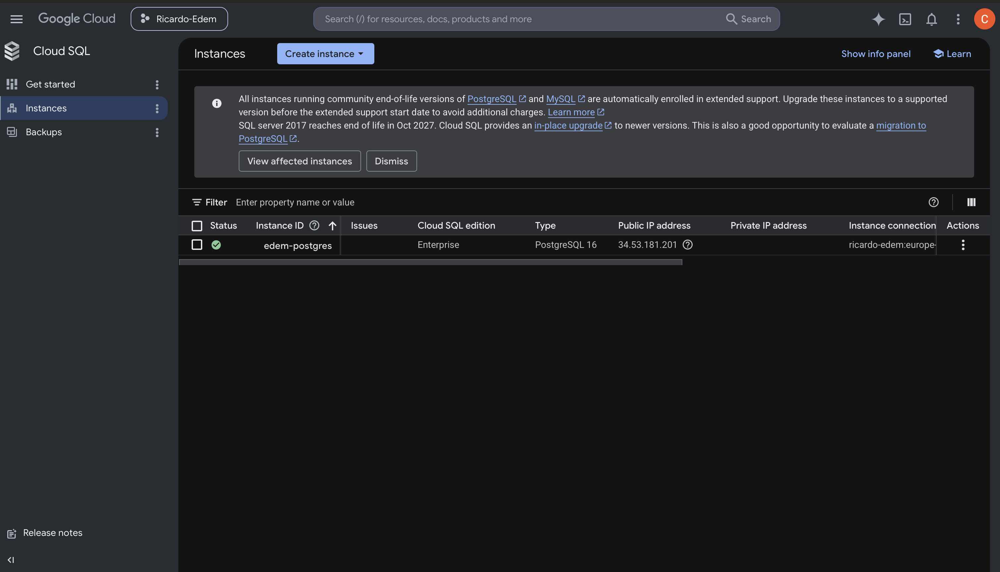
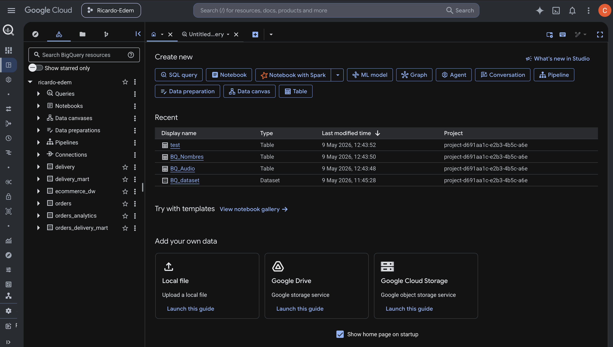
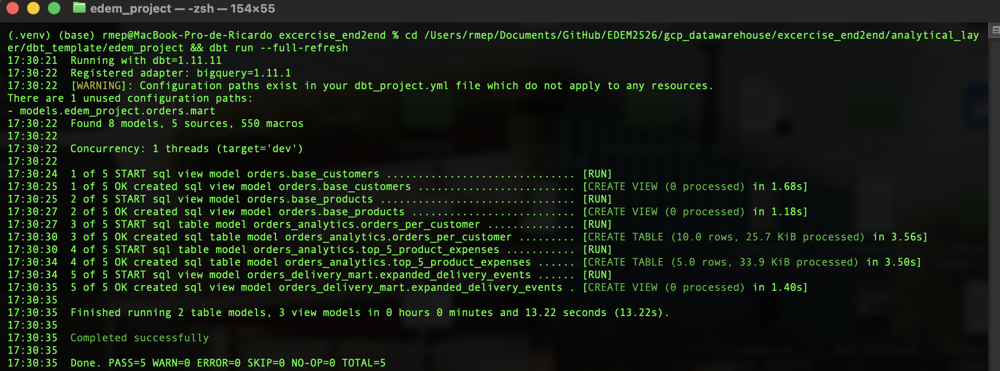
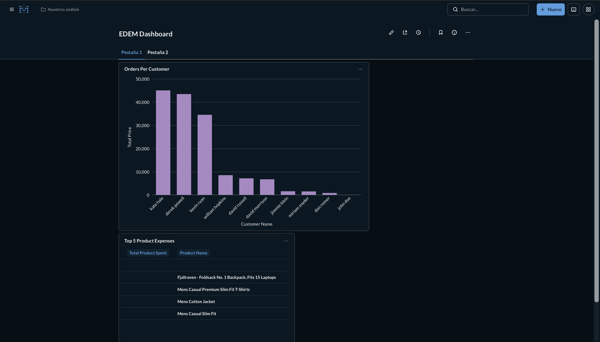

# Entregable End2End GCP Almacenamiento

Despliegue de una arquitectura end2end en Google Cloud Platform.

---

## 1. Orders App y Delivery App — Compute Engine

Despliegue de las dos aplicaciones como instancias de VM en Compute Engine (`delivery-app` y `orders-app`).

---

## 2. Pub/Sub

Creacion de los topicos `delivery-events` y `order-events` con sus suscriptores.

---

## 3. Cloud SQL

Instancia PostgreSQL 16 (`edem-postgres`) desplegada en Cloud SQL.

---

## 4. BigQuery

Data Warehouse con los datasets de la capa analitica: `orders`, `orders_analytics`, `delivery`, `delivery_mart`, `orders_delivery_mart`.

---

## 5. DBT

Ejecucion de `dbt run --full-refresh` con los 5 modelos completados correctamente.

---

## 6. Metabase

Dashboard desplegado en local con Docker Compose, conectado a BigQuery, mostrando pedidos por cliente y top 5 productos por gasto.

---

## Autor

Ricardo Edreira Penas — EDEM MDA 2025/26
