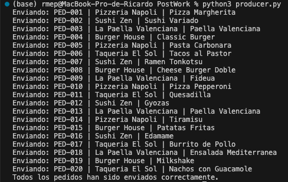
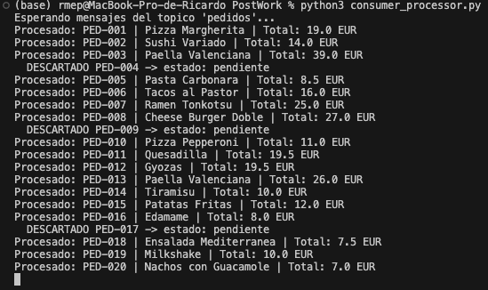
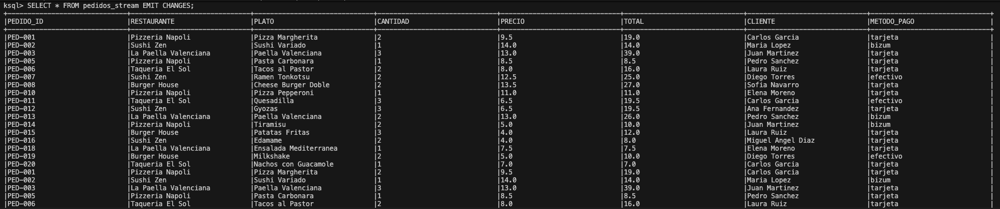
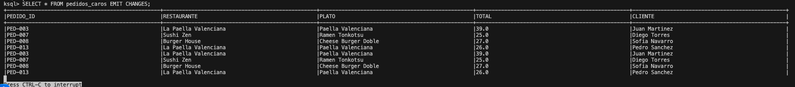
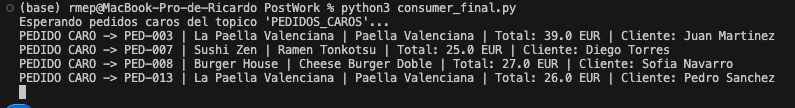

## Producer
Se envian los 20 pedidos del archivo pedidos.txt al topic `pedidos`, uno por segundo.

## Consumer Processor
Lee del topic `pedidos`, descarta los pendientes (PED-004, PED-009, PED-017) y calcula el total de los confirmados. Los envia al topic `pedidos_procesados`.

## Consultas KSQL
Se crea un stream sobre `pedidos_procesados` y se filtra por total > 20 EUR.

`SELECT * FROM pedidos_stream EMIT CHANGES;` - muestra todos los pedidos procesados:

`SELECT * FROM pedidos_caros EMIT CHANGES;` - muestra solo los pedidos de mas de 20 EUR:

## Consumer Final
Lee del topic `PEDIDOS_CAROS` (creado por KSQL) y muestra los 4 pedidos caros por pantalla.

