1. Creación de los Topics

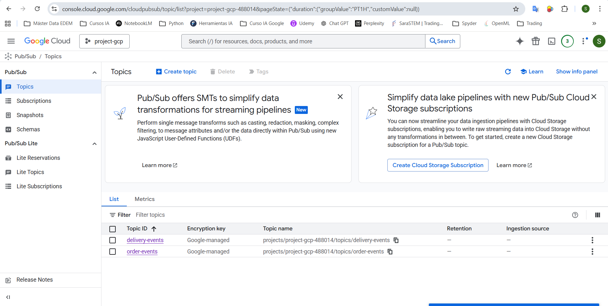

2. Creación de la instancia orders-app-semaiz y delivery-app-semaiz

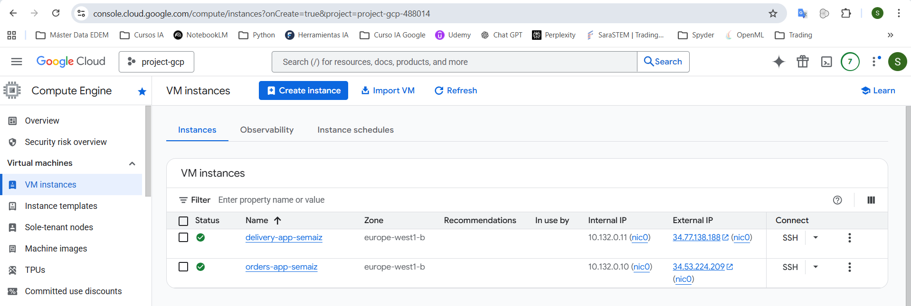

3. Creación de la instancia de Cloud SQL

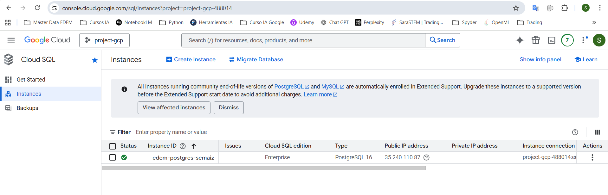

4. Creamos la database ecommerce

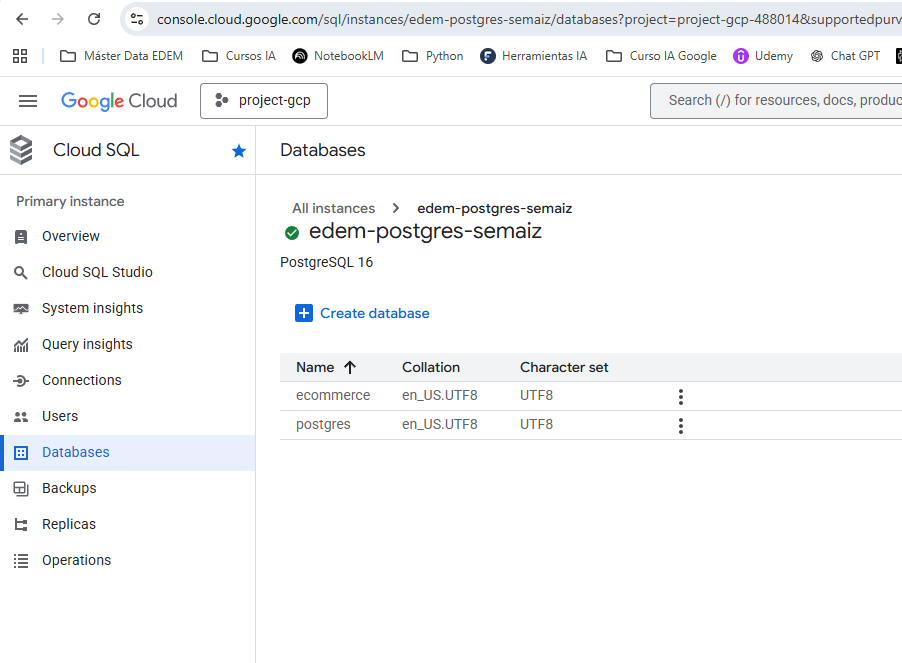

5. Nos conectamos ambas instancias, hacemos un pull del repositorio e instalamos los requirements en un entorno virtual

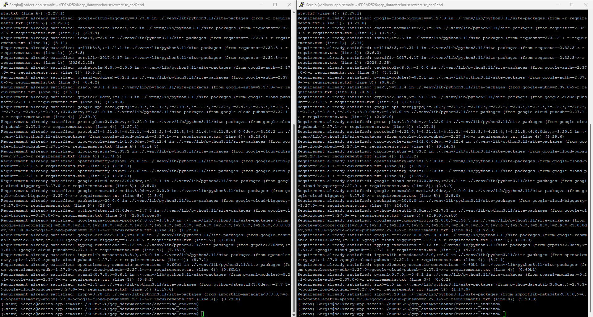

6. Creamos los datasets en big query con sus respectivas tablas

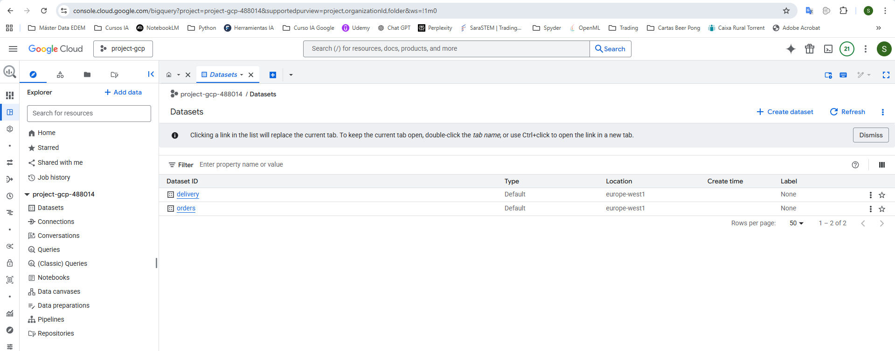

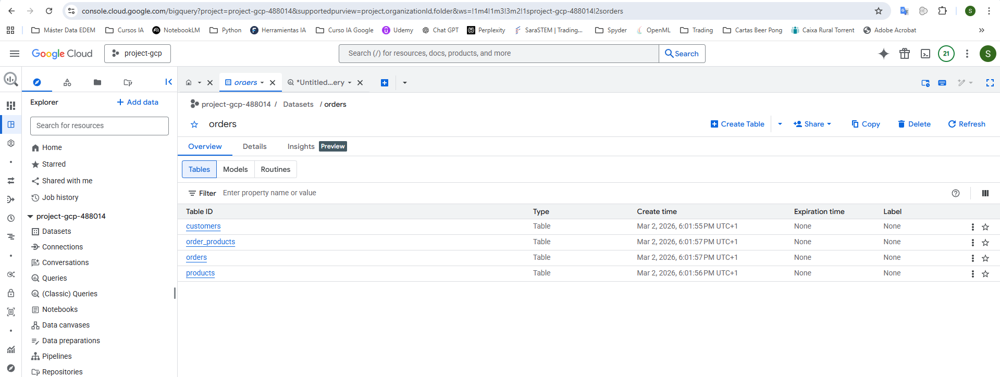

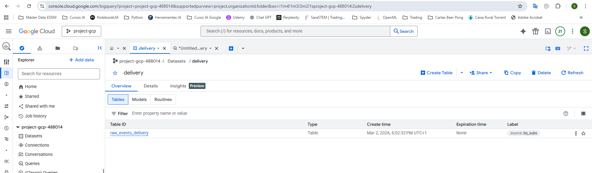

7. Creamos la suscripción de pub/sub para el topic delivery-events

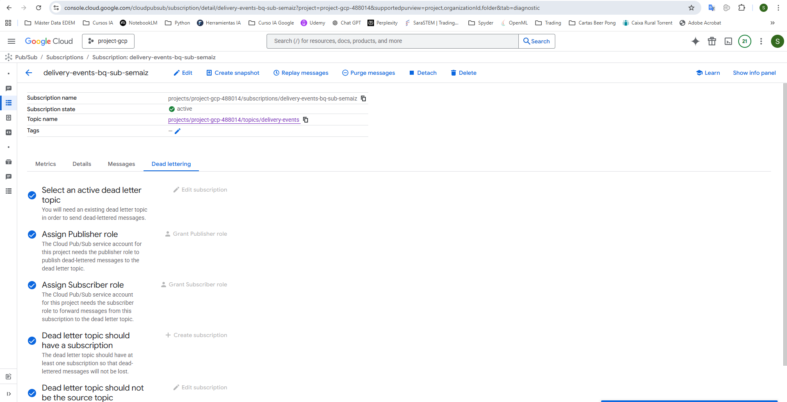

8. Sincronizamos la bd postgres en cloud sql con el dataset en big query

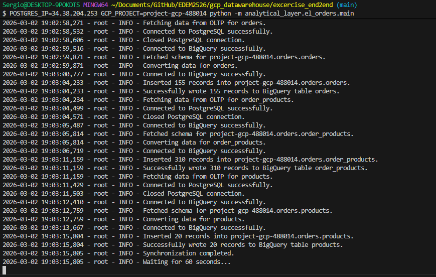

9. Creamos la carpeta dbt e iniciamos el proyecto

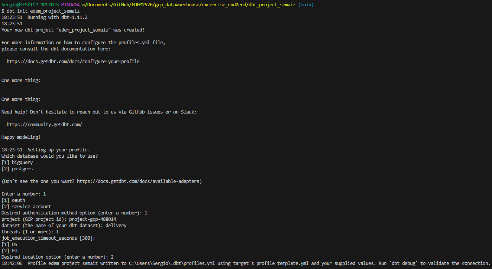

10. Generamos las visualizaciones de los delivery events

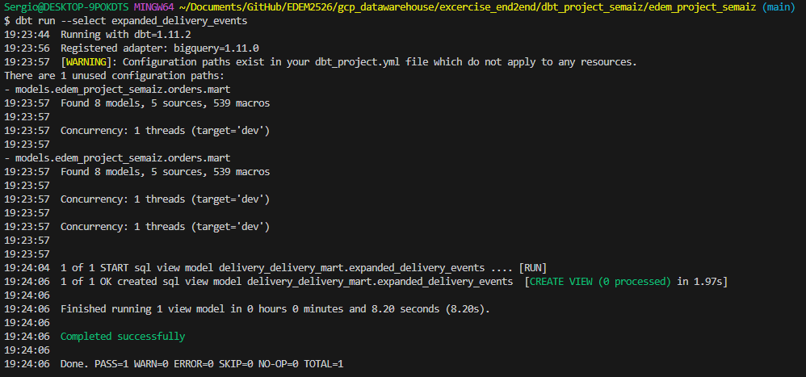

11. Generamos las tablas

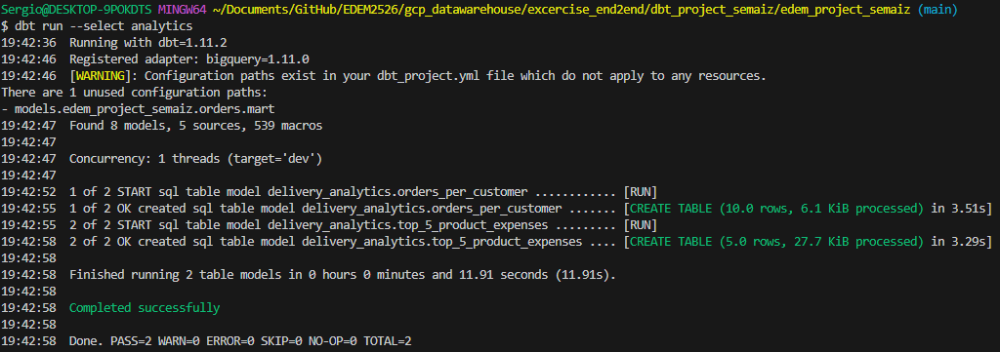

12. Generamos el dashboard con las visualizaciones

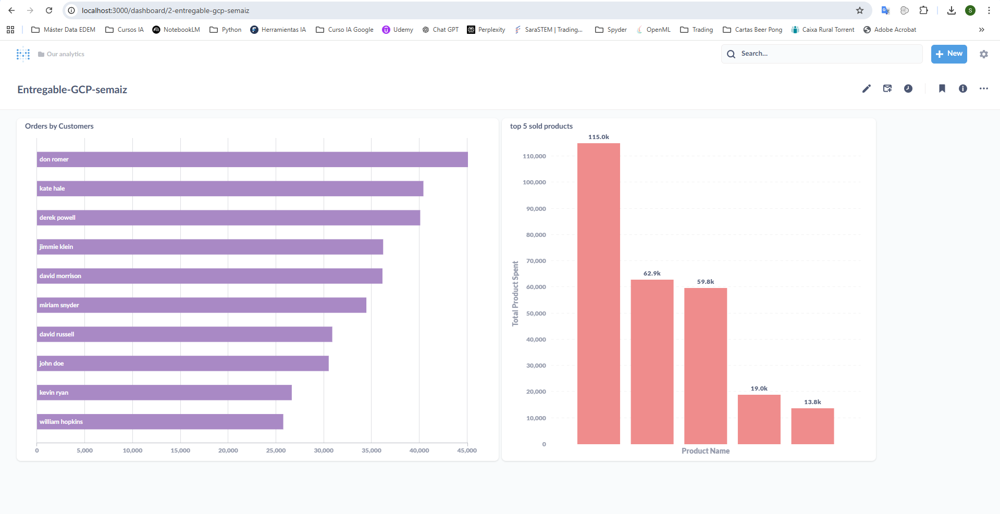

