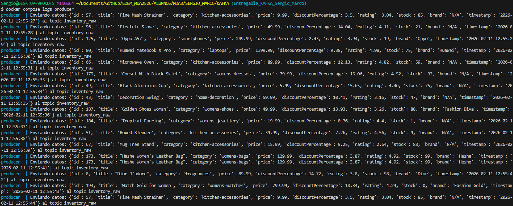
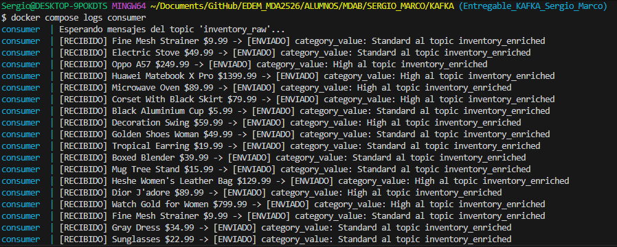
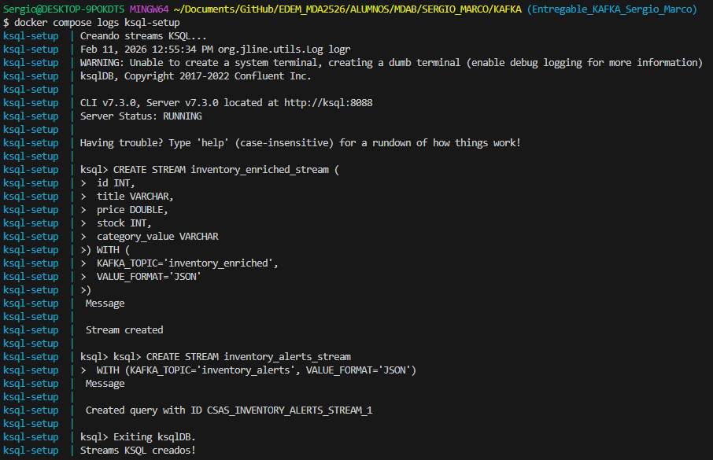
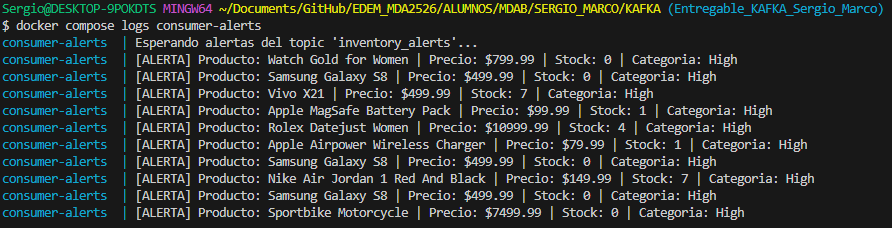

# Sistema de Alertas de Inventario


## 1. Caso de uso

Sistema de monitorizacion de inventario en tiempo real que detecta productos criticos: aquellos con precio alto (> 50$) y stock bajo (< 10 unidades). El objetivo es generar alertas automaticas para estos productos, simulando un caso real de gestion de inventario en e-commerce.

El flujo completo es:

1. Un **Producer** consulta productos de la API [DummyJSON](https://dummyjson.com/products) y los envia al topic inventory_raw.
2. Un **Consumer** lee los productos, los enriquece con una clasificacion de precio y los reenvia al topic inventory_enriched. 
3. **KSQL** filtra en streaming los productos criticos (precio alto + stock bajo).
4. Un **Consumer de alertas** lee los productos filtrados del topic inventory_alerts y los muestra por pantalla.

---

## 2. Dataset

Se utiliza la API publica [DummyJSON](https://dummyjson.com/products) que proporciona 194 productos ficticios con datos como nombre, categoria, precio, stock, marca, rating, etc.

El Producer consulta `https://dummyjson.com/products/{id}` cada segundo con un ID aleatorio (1-194).

---

## 3. Arquitectura

```
DummyJSON API
     |
     | (cada 1 segundo)
     v
+-----------+     +----------------+     +------------+     +-----------+     +------------------+
| Producer  | --> | inventory_raw  | --> |  Consumer  | --> | inventory | --> |     ksqlDB       |
| (Python)  |     | (topic)        |     |  (Python)  |     | _enriched |     | (streaming SQL)  |
+-----------+     +----------------+     +------------+     | (topic)   |     +------------------+
                                                            +-----------+            |
                                                                              Filtra: stock < 10
                                                                              AND category = High
                                                                                     |
                                                                                     v
                                                                            +-----------------+
                                                                            | inventory_alerts|
                                                                            | (topic)         |
                                                                            +-----------------+
                                                                                     |
                                                                                     v
                                                                            +------------------+
                                                                            | Consumer Alerts  |
                                                                            | (Python)         |
                                                                            | Imprime alertas  |
                                                                            +------------------+
```

## 4. Modelo de datos JSON

### Topic: `inventory_raw` (datos crudos del Producer)

```json
{
  "id": 5,
  "title": "Red Nail Polish",
  "category": "beauty",
  "price": 8.99,
  "discountPercentage": 11.44,
  "rating": 4.32,
  "stock": 79,
  "brand": "Nail Couture",
  "timestamp": "2026-02-11 10:30:45"
}
```

### Topic: `inventory_enriched` (datos enriquecidos por el Consumer)

Regla de enriquecimiento:
- `price > 50` --> `category_value: "High"`
- `price <= 50` --> `category_value: "Standard"`

```json
{
  "id": 5,
  "title": "Red Nail Polish",
  "price": 8.99,
  "stock": 79,
  "category_value": "Standard"
}
```

### Topic: `inventory_alerts` (filtrado por KSQL)

Solo contiene productos con `category_value = 'High'` AND `stock < 10`:

```json
{
  "TITLE": "Wireless Bluetooth Speaker",
  "PRICE": 89.99,
  "STOCK": 3,
  "CATEGORY_VALUE": "High"
}
```

---

## 5. Evidencias

### Ingestion - Producer enviando datos a `inventory_raw`

```bash
docker compose logs producer
```



### Procesamiento con Consumer - Enriquecimiento de datos y envío a a `inventory_enriched`

```bash
docker compose logs consumer
```



### Procesamiento con KSQL - Creacion de streams

```bash
docker compose logs ksql-setup
```



### Resultado final - Alertas por pantalla

```bash
docker compose logs consumer-alerts
```


