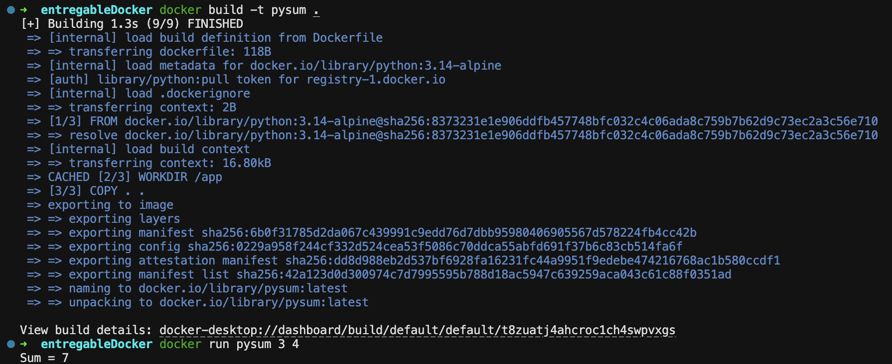

# Entregable Docker

## Objetivo

Construir una imagen docker que acepte como parámetro dos números e imprima la suma de ambos

## Script Python

```python 
# Importamos la biblioteca sys para poder usar argv
import sys

# Esta función convierte los argumentos a y b en números enteros y devuelve su suma.
# Si no se pueden convertir a enteros muestra un error.
def sum(a, b):
    try:
        suma = int(a) + int(b)
        return f"Sum = {suma}"
    except:
        return "Introduce 2 números"

# Comprueba que haya solo 3 argumentos (el nombre de la imagen, el primer sumando y el segundo) e imprime el resultado.
if len(sys.argv) != 3:
    print("Sigue este formato al crear el contenedor: docker run pysum <número1> <número2>")
else:
    print(sum(sys.argv[1], sys.argv[2]))
```

## Archivo Dockerfile

```Dockerfile
FROM python:3.14-alpine

WORKDIR /app

COPY . .

ENTRYPOINT ["python", "main.py"]
```

## Captura de pantalla donde se muestra la invocación al contenedor docker y el resultado de la ejecución

<p align="center">
  
</p>

## (Opcional) Link a la imagen docker generada y subida a Docker Hub

[Link pysum](https://hub.docker.com/r/claudiasalgado/pysum)