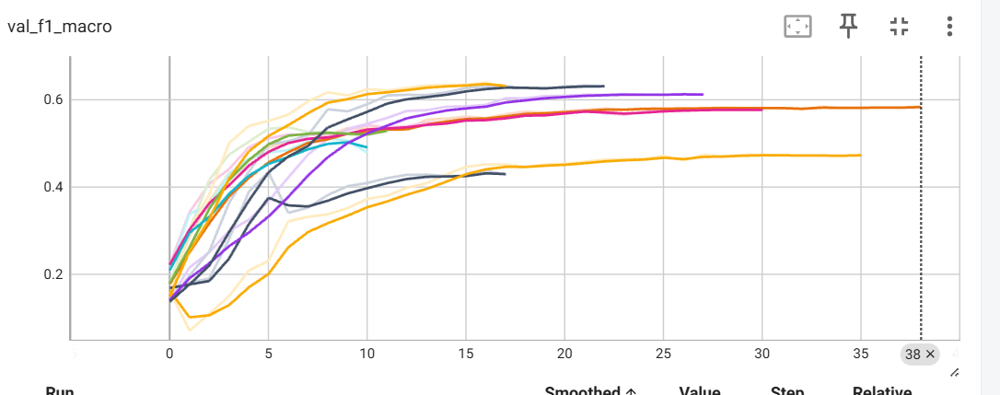

---

# 🐦 NER en Twitter: Reconocimiento de Entidades Nombradas con RNN

Reconocimiento de entidades nombradas (*Named Entity Recognition*) en tweets informales mediante arquitecturas bidireccionales LSTM/GRU con CRF y embeddings GloVe pre-entrenados.

## ⚙️ Contexto sobre los datos

* **Fuente:** [Broad Twitter Corpus – Sección G](https://github.com/GateNLP/broad_twitter_corpus) (`g.conll`).
* **Volumen:** 2.138 tweets en inglés (2011-2014), de Reino Unido, EEUU, Australia, Canadá, Irlanda y Nueva Zelanda.
* **Etiquetado:** Esquema BIO con 3 tipos de entidad: `PER`, `ORG`, `LOC`.
* **Partición:** estratificada 70/15/15 (1.496 / 321 / 321 tweets).
* **Embeddings:** [GloVe Twitter 27B 100d](https://www.kaggle.com/datasets/bertcarremans/glovetwitter27b100dtxt) — 6.734 palabras del vocabulario cubiertos.

### Desafíos del corpus
- **Desbalance severo:** >85% de los tokens son etiqueta `O` (no-entidad).
- **Ruido lingüístico:** jerga, menciones `@usuario`, URLs, errores ortográficos.

## 🧠 Iteraciones experimentales (9 experimentos)

| Exp. | Arquitectura | Novedades |
| --- | --- | --- |
| E01 | BiLSTM (1L-32u) | Embedding propio, sin pesos |
| E02 | BiLSTM (1L-32u) | + GloVe 100d |
| E03 | BiLSTM (1L-32u) | + GloVe + **Weighted Loss** (×10 entidades) |
| E04 | BiGRU (1L-32u) | GRU vs LSTM, weighted loss |
| E05 | BiGRU (2L-64u) | 2 capas RNN, más capacidad |
| E06 | BiGRU (1L-64u) | Dropout alto (0.7) |
| E07 | BiGRU + **CRF** | Decodificación estructurada |
| E08 | **CharCNN + BiGRU + CRF** | Rama de caracteres para morfología |
| E09 | CharCNN + BiGRU + CRF | + **Data augmentation** por entity swap |

## 🏆 Arquitectura final (E08 — Modelo Híbrido)

El modelo ganador combina tres fuentes de representación:

1. **Embeddings de palabras** (`GloVe Twitter 100d`, fine-tuneados).
   * *Decisión:* Aportan semántica general. Cubren el 86% del vocabulario del corpus.

2. **CNN de caracteres** (Conv1D, 32 filtros, kernel 3).
   * *Decisión:* Captura morfología sub-léxica (prefijos, sufijos, mayúsculas) crítica para NER en texto informal con OOV frecuente.

3. **Decodificador Bi-GRU + CRF** (32 unidades).
   * *Decisión:* CRF garantiza secuencias BIO válidas (e.g., `I-LOC` no puede seguir a `B-PER`), resolviendo errores de decodificación locales del softmax estándar.

> La combinación de las tres ramas fue motivada por la complementariedad de señales: semántica global (GloVe) + forma morfológica (CharCNN) + coherencia de secuencia (CRF).

## 📉 Resultados

Los modelos fueron monitorizados por **`val_f1_macro`** sobre validación mediante TensorBoard (`logs/fit/`). El gráfico siguiente muestra la evolución de todos los experimentos:

| Modelo | val F1-macro (aprox.) |
| --- | --- |
| E01 — BiLSTM base (benchmark) | ~0.47 |
| E08 — Híbrido CharCNN + BiGRU + CRF | **~0.64** |

## 💡 Conclusión Principal

La arquitectura simple BiLSTM + embedding estático es insuficiente para NER en Twitter dado el alto ruido y el vocabulario OOV. La combinación **CharCNN + BiGRU + CRF** resultó ser la más robusta: el componente de caracteres aportó cobertura morfológica en tokens no vistos, y el CRF eliminó predicciones incoherentes. El weighted loss fue crítico para equilibrar el fuerte desbalance de la etiqueta `O`. Aunque el F1-macro absoluto de E08 (~0.64) es aún insuficiente para un sistema de producción, la progresión desde el benchmark E01 (~0.47) fue notablemente positiva, validando la dirección experimental adoptada.

## 🔭 Líneas futuras

El cuello de botella principal sigue siendo el volumen de datos (~2.000 tweets); ampliar el corpus o incorporar datos de otros dominios similares, reduciría el ruido en los límites de entidad. Como línea arquitectónica, cabría evaluar si reemplazar GloVe por embeddings contextuales ligeros (e.g. DistilBERT fine-tuneado) supera al modelo actual, aunque solo estaría justificado si el coste adicional se traduce en mejora.
