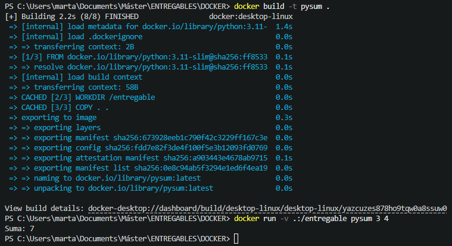

# ENTREGABLE DOCKER

## Objetivo

#### Construir una imagen docker que acepte como parámetro **dos números** e imprima la **suma de ambos**.

## Dockerfile

```
FROM python:3.11-slim
WORKDIR /entregable
COPY . .
ENTRYPOINT ["python", "main.py"]
````

## Archivo main.py

````
import sys

def suma(a,b):
    try:
        a=int(a)
        b=int(b)
        print(f"Suma: {a+b}")
    except ValueError:
        print("Debes introducir números.")
    
if __name__=="__main__":
    if len(sys.argv)!=3:
        print("Solo puedes pasar dos argumentos.")
    else:
        suma(sys.argv[1], sys.argv[2])
````
## Comandos para construir y ejecutar

#### Construir la imagen:
````
docker build -t martasolerebri/pysum .
````
#### Subir la imagen a Docker Hub:
````
docker push martasolerebri/pysum
````
#### Ejecutar el contenedor:
````
docker run -v .:/entregable pysum 3 4
````
## Recursos adicionales:

#### Link a la imagen en Docker Hub: 
[Imagen Docker](https://hub.docker.com/r/martasolerebri/pysum)

#### Captura de pantalla del resultado: 

